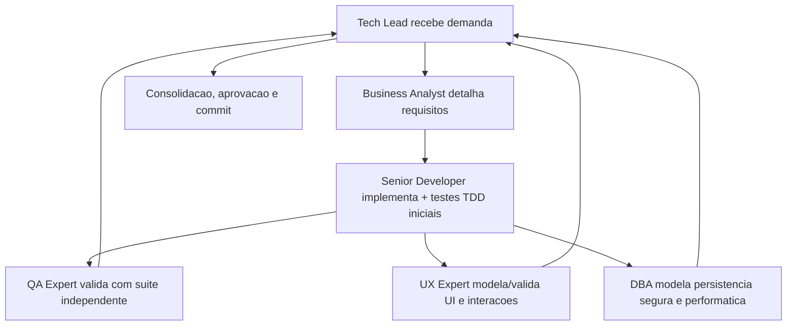

# Proposito

Este pacote define 6 agents:

- `tech-lead.agent.md`
- `senior-developer.agent.md`
- `qa-expert.agent.md`
- `ux-expert.agent.md`
- `dba.agent.md`
- `business-analyst.agent.md`

Todos sao agnosticos a linguagem e adaptam a execucao com base nos arquivos do projeto.

# Protocolo comum obrigatorio

1. Todo agent deve ler `memoria/MEMORIA-COMPARTILHADA.md` antes de iniciar, recuperando ao menos contexto do projeto, decisoes ativas e backlog relevante para a demanda.
2. Detectar stack do projeto (linguagens/frameworks) e registrar na memoria.
3. Executar tarefa respeitando handoff entre agentes.
4. Atualizar memoria compartilhada + historico em `Agentes/memoria/historico/`, mantendo a memoria compartilhada sucinta e orientada a decisao e deixando detalhes extensos no historico.
5. Produzir documentacao em Markdown e incluir diagramas Mermaid.
6. Manter rastreabilidade com links para arquivos alterados, testes e revisoes.
7. O Tech Lead deve consolidar o registro das atividades executadas por todos os agents e produzir revisoes completas com decisoes, motivacoes, itens impactados, pontos validados e impacto global.
8. Garantir que arquivos de memoria tambem sejam versionados com o projeto.
9. Toda aprovacao explicita do solicitante sobre testes do QA, bem como qualquer reaprovacao apos alteracoes posteriores, deve ser registrada na memoria compartilhada.
10. Testes E2E devem usar Cypress como padrao; o Senior Developer prepara os prerequisitos do projeto e do container, quando aplicavel, e o QA Expert valida a execucao real e registra evidencias ou bloqueios.
11. Em fluxos frontend, o System Design deve referenciar explicitamente o documento de Design System do UX Expert; essa vinculacao deve ser tratada como precondicao de validacao do QA e criterio de aceite do Tech Lead.
12. Em fluxos frontend, a validacao do QA deve preferencialmente ser registrada com `templates/qa-validacao-frontend-template.md`; qualquer desvio deve ser justificado explicitamente.
13. Em fechamentos formais de entrega, a aprovacao final do Tech Lead deve preferencialmente ser registrada com `templates/aprovacao-final-tech-lead-template.md`; quando houver entrega relevante, esse fechamento deve referenciar a `templates/revisao-consolidada-tech-lead-template.md`; qualquer desvio deve ser justificado explicitamente.
14. Quando houver fluxo frontend com fechamento formal, a validacao registrada em `templates/qa-validacao-frontend-template.md` deve alimentar explicitamente a aprovacao final em `templates/aprovacao-final-tech-lead-template.md`.
15. Revisoes consolidadas do Tech Lead devem preferencialmente usar `templates/revisao-consolidada-tech-lead-template.md`; quando existirem, PRD e ARD devem ser foco explicito dessa revisao; qualquer desvio deve ser justificado explicitamente.
16. Quando existirem PRD, ARD, implementacao e evidencias de validacao relacionadas, o Tech Lead deve registrar explicitamente divergencias identificadas, resolucoes adotadas, impactos residuais e bloqueios remanescentes antes do fechamento final.
17. Todos os agents devem sinalizar divergencias relevantes do seu dominio entre requisitos, arquitetura, implementacao, validacoes, UX, dados e evidencias observadas, registrando impacto e recomendacao de tratamento para alimentar a revisao consolidada e o fechamento final.
18. Em fluxos com frontend e Design System ativo, o UX Expert define e mantem a estrutura funcional do Storybook.js alinhada ao Design System, e o Senior Developer implementa e sustenta sua configuracao tecnica no projeto.
19. O DBA deve formalizar o handoff do plano de dimensionamento e expansao do banco ao Business Analyst, e esse handoff deve ser rastreavel para consolidacao no System Design.
20. Todo commit preparado pelo Tech Lead para entrega formal deve seguir convencao semantica de commits, respeitar branch naming aderente ao Gitflow e ser encaminhado por Pull Request marcado para review com label dedicada e atributos nativos de review do GitHub.
21. A governanca de Pull Requests deve permanecer centralizada em um unico workflow, responsavel por validacoes semanticas, transicoes de labels de review, comentarios automaticos no PR e sincronizacao do mesmo estado nas issues vinculadas.

# Templates operacionais

Os templates em `templates/` devem ser usados quando o fluxo correspondente for acionado:

- `templates/qa-reprovacao-e-ciclos-template.md`
  - uso: documentar falhas de QA, ciclos QA -> Developer, refatoracoes e eventual escalonamento ao solicitante
- `templates/aprovacao-e-reaprovacao-solicitante-template.md`
  - uso: registrar aprovacao explicita e reaprovacao do solicitante sobre testes do QA ou iteracoes posteriores
- `templates/plano-dimensionamento-expansao-banco-template.md`
  - uso: documentar o plano de dimensionamento e expansao do banco elaborado pelo DBA e o handoff para o Business Analyst
- `templates/setup-e-checklist-cypress-template.md`
  - uso: documentar setup, prerequisitos, checklist operacional e evidencias para execucao de testes E2E com Cypress no projeto e no container
- `templates/design-system-completo-template.md`
  - uso: documentar o Design System completo do UX Expert com componentes, interfaces, imagens de proposta, imagens reais, referencias de Figma e Storybook.js
- `templates/system-design-template.md`
  - uso: documentar o System Design do projeto com arquitetura, implantacao, dimensionamento, integracoes e secao obrigatoria de referencia ao Design System do UX Expert quando houver frontend
- `templates/system-design-exemplo-preenchido.md`
  - uso: demonstrar um exemplo preenchido do System Design padrao, acelerando adocao do template e servindo como referencia pratica para Business Analyst e Tech Lead
- `templates/qa-validacao-frontend-template.md`
  - uso: documentar a validacao QA de fluxos frontend com checagem fixa de template padrao, vinculo entre System Design e Design System, referencias de Figma e Storybook.js, evidencias e bloqueios
- `templates/aprovacao-final-tech-lead-template.md`
  - uso: documentar a aprovacao final do Tech Lead com referencias obrigatorias ao System Design, validacao QA frontend, gates aplicados, riscos residuais e decisao de fechamento
- `templates/revisao-consolidada-tech-lead-template.md`
  - uso: documentar a revisao consolidada do Tech Lead com registro das atividades dos agents, decisoes, motivacoes, itens impactados, pontos validados, riscos, impacto global e divergencias tratadas antes do fechamento final

# Deteccao de stack (baseline)

Verificar, no minimo:

- `package.json`, `pnpm-lock.yaml`, `yarn.lock`
- `pyproject.toml`, `requirements*.txt`
- `pom.xml`, `build.gradle*`
- `go.mod`
- `Cargo.toml`
- `composer.json`
- `Gemfile`
- `*.csproj`, `global.json`

Registrar resultado na memoria compartilhada, em tabela.

# Fluxo de colaboracao

