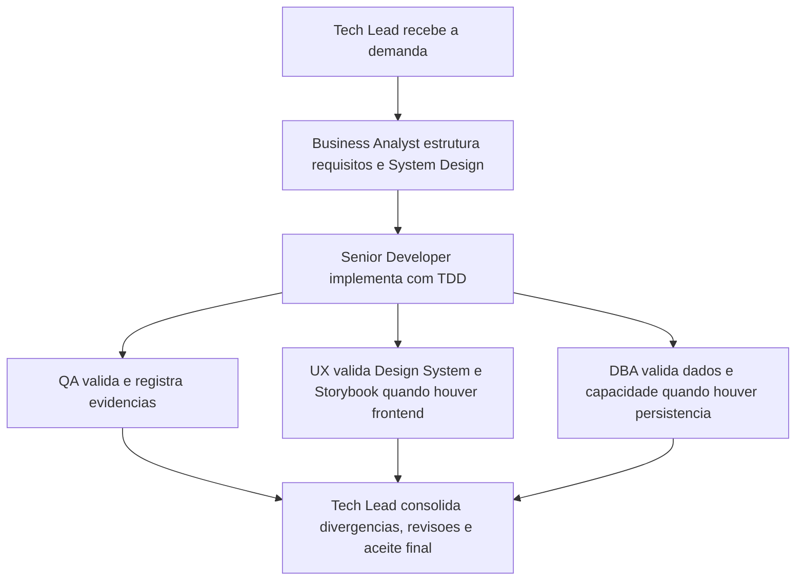

# Memoria Compartilhada dos Agents

> Arquivo versionavel e obrigatorio para todos os agents deste pacote.

## Regras de persistencia

- Todo agent deve ler este arquivo antes de atuar.
- Este arquivo deve manter apenas contexto estrutural, decisoes permanentes, ownerships criticos, riscos recorrentes e backlog ainda ativo.
- Detalhes extensos, cronologia de mudancas e evidencias completas devem ficar em `memoria/historico/`.
- Toda mudanca estrutural deve atualizar esta memoria e gerar registro no historico.
- O conteudo deve ser curto, consolidado e sem duplicacao textual.
- Diagramas Mermaid so devem ser mantidos quando ajudarem a explicar um fluxo estrutural do pacote.

## Contexto do pacote

| Campo | Valor |
|---|---|
| Projeto | Pacote de agents reutilizaveis (Agentes) |
| Objetivo atual | Manter o baseline estabilizado de governanca, templates, skills e memoria para os 6 agents |
| Stack detectada | Markdown (documentacao e configuracao de agents) |
| Frameworks detectados | N/A no workspace atual |
| Estado do baseline | Estabilizado e portavel |
| Responsavel de consolidacao | Tech Lead |

## Decisoes estruturais ativas

| ID | Decisao | Impacto permanente | Dono | Status |
|---|---|---|---|---|
| DEC-STR-01 | O pacote opera com protocolo comum, memoria compartilhada concisa e historico versionado. | Garante continuidade, rastreabilidade e baixo acoplamento entre iteracoes. | Tech Lead | Ativa |
| DEC-STR-02 | Os 6 agents devem manter persona operacional explicita e agir com handoffs rastreaveis, detectando stack antes de executar. | Preserva consistencia de comportamento, especializacao por papel e adaptacao ao projeto-alvo. | Tech Lead | Ativa |
| DEC-STR-03 | Gates especializados permanecem obrigatorios: QA para validacao independente, UX para frontend/experiencia e DBA para persistencia/dados. | Evita fechamento de demanda sem revisao adequada do dominio afetado. | Tech Lead | Ativa |
| DEC-STR-04 | O Business Analyst e dono do System Design; o DBA fornece plano de dimensionamento/expansao; o handoff DBA -> BA deve ser explicito e rastreavel. | Mantem coerencia entre requisitos, arquitetura, dados e planejamento de capacidade. | Tech Lead | Ativa |
| DEC-STR-05 | O Senior Developer deve trabalhar com TDD, avaliar no minimo 3 abordagens, aplicar Clean Architecture e priorizar reutilizacao. | Estabelece o baseline de engenharia esperado pelo pacote. | Tech Lead | Ativa |
| DEC-STR-06 | Toda implementacao passa por QA; reprovacoes exigem registro, retorno ao desenvolvimento e escalonamento ao solicitante apos mais de 3 ciclos. | Formaliza o ciclo de qualidade e cria criterio objetivo para destravar impasses. | Tech Lead | Ativa |
| DEC-STR-07 | Testes definidos pelo QA exigem aprovacao explicita do solicitante, e alteracoes posteriores exigem reaprovacao explicita. | Preserva governanca de aceite e trilha auditavel de validacoes. | Tech Lead | Ativa |
| DEC-STR-08 | Cypress e o padrao de E2E; o Senior Developer prepara prerequisitos tecnicos e o QA Expert valida a execucao real com evidencias ou bloqueios. | Clarifica ownership operacional e padroniza a stack de E2E. | Tech Lead | Ativa |
| DEC-STR-09 | Em frontend, o System Design deve referenciar explicitamente o Design System; o QA valida esse vinculo; o Tech Lead o trata como criterio de aceite. | Conecta arquitetura, UX e validacao no fluxo padrao de entrega frontend. | Tech Lead | Ativa |
| DEC-STR-10 | O UX Expert define a estrutura funcional do Storybook alinhada ao Design System, e o Senior Developer sustenta sua implementacao tecnica quando houver frontend. | Evita ambiguidade de ownership entre UX e desenvolvimento. | Tech Lead | Ativa |
| DEC-STR-11 | O Tech Lead deve consolidar atividades, revisoes, PRD/ARD quando existirem, divergencias, evidencias e impacto global antes do fechamento final. | Garante fechamento executivo consistente e auditavel. | Tech Lead | Ativa |
| DEC-STR-12 | Todos os agents devem sinalizar divergencias do proprio dominio entre requisitos, arquitetura, implementacao, UX, dados e evidencias. | Antecipа inconsistencias e alimenta a revisao consolidada e o aceite final. | Tech Lead | Ativa |
| DEC-STR-13 | Templates e skills do pacote devem permanecer reutilizaveis, agnosticos ao projeto e alinhados aos papeis dos agents. | Mantem portabilidade do pacote e reduz acoplamento a repositorios especificos. | Tech Lead | Ativa |
| DEC-STR-14 | A governanca de Pull Requests fica centralizada em um unico workflow, com validacao semantica, Gitflow, labels de review granulares, comentarios automaticos no PR e sincronizacao do mesmo estado nas issues vinculadas. | Reduz sobreposicao de automacoes, preserva rastreabilidade unica do ciclo de review e mantem PR/issue coerentes durante abertura, revisao, dismiss e merge. | Tech Lead | Ativa |
| DEC-STR-15 | Skills transversais devem concentrar detalhamento operacional reutilizavel, enquanto agents preservam obrigacoes, gates e ownerships sem repetir instrucoes extensas ja formalizadas em skills e templates. | Reduz redundancia entre agents, melhora descoberta das skills e mantem o pacote reutilizavel em qualquer projeto. | Tech Lead | Ativa |

## Ownerships criticos

| Tema | Ownership principal | Apoio obrigatorio |
|---|---|---|
| Consolidacao final | Tech Lead | Todos os agents alimentam evidencias, divergencias e handoffs |
| System Design | Business Analyst | DBA para capacidade e dados; UX para referencia ao Design System em frontend |
| Design System | UX Expert | Senior Developer para implementacao tecnica de Storybook quando houver frontend |
| Implementacao | Senior Developer | QA para validacao independente |
| E2E com Cypress | QA Expert na validacao | Senior Developer nos prerequisitos tecnicos |
| Plano de banco e expansao | DBA | Business Analyst para consolidacao no System Design |

## Artefatos padrao permanentes

| Artefato | Uso estrutural |
|---|---|
| `templates/system-design-template.md` | Base padrao do System Design |
| `templates/system-design-exemplo-preenchido.md` | Referencia de preenchimento do System Design |
| `templates/design-system-completo-template.md` | Base padrao do Design System |
| `templates/qa-validacao-frontend-template.md` | Validacao QA de fluxos frontend |
| `templates/aprovacao-final-tech-lead-template.md` | Fechamento formal do Tech Lead |
| `templates/revisao-consolidada-tech-lead-template.md` | Revisao consolidada do Tech Lead |
| `templates/qa-reprovacao-e-ciclos-template.md` | Registro de reprovacoes QA e ciclos de refatoracao |
| `templates/aprovacao-e-reaprovacao-solicitante-template.md` | Registro de aprovacao e reaprovacao do solicitante |
| `templates/plano-dimensionamento-expansao-banco-template.md` | Plano de capacidade e expansao do banco |
| `templates/setup-e-checklist-cypress-template.md` | Setup e checklist operacional do Cypress |

## Estado do backlog

| Item | Estado |
|---|---|
| Baseline estrutural do pacote | Concluido e sem backlog estrutural ativo no momento |
| OBS Pro Bot v5.0.1 — hardening de dados (governanca inicial DBA) | Ativo: alinhar desenho x implementacao (transacoes atomicas financeiras, segredo/env, trilha de auditoria, plano de backup/expansao) |
| OBS Pro Bot v5.0.1 — convergencia de gates para fechamento Tech Lead | Ativo: QA, UX, DBA e SD reprovados; fechamento final bloqueado ate plano corretivo e nova validacao |

## Sintese decisoria curta (OBS - governanca UX)

- Contexto: avaliacao de governanca UX do repositorio OBS (frontend Streamlit), sem alteracao de codigo.
- Stack detectada no alvo: Python 3.11 + Streamlit (frontend web), SQLite e Docker.
- Decisao UX gate: **Reprovado**.
- Motivos chave:
  - ausencia de referencia explicita ao Design System em `docs/system-design.md`;
  - ausencia de referencia explicita ao Design System em `docs/declaracao-escopo-aplicacao.md`;
  - inexistencia de evidencias visuais (proposta/real), Storybook e Figma vinculados ao fluxo oficial;
  - falta de criterios objetivos de acessibilidade, responsividade e estados de interface.
- Recomendacao:
  - criar e vincular Documento Completo de Design System;
  - preencher `templates/qa-validacao-frontend-template.md`;
  - estabelecer baseline de acessibilidade e evidencias visuais para novo gate.

## Sintese decisoria curta (OBS - consolidacao Tech Lead inicial)

- Contexto: consolidacao multidisciplinar inicial executada pelo Tech Lead, sem implementacao de codigo.
- Referencia da revisao consolidada: `review/2026-03-22-0328-revisao-consolidada-tech-lead.md`.
- Resultado dos gates:
  - BA: aprovado com ressalvas;
  - SD: reprovado;
  - QA: reprovado;
  - UX: reprovado;
  - DBA: reprovado.
- Decisao: **nao aprovar fechamento final** nesta rodada.
- Condicao de destravamento: executar plano corretivo P0/P1 e repetir validacoes independentes.

## Sintese decisoria curta (OBS - aprovacao final da rodada)

- Contexto: fechamento formal da rodada inicial de governanca via template de aprovacao final do Tech Lead.
- Referencia: `review/2026-03-22-0331-aprovacao-final-tech-lead.md`.
- Decisao final: **Reprovado**.
- Fundamentacao:
  - gates obrigatorios sem convergencia (QA, UX, DBA e SD reprovados);
  - divergencias PRD/ARD/implementacao/evidencias sem tratamento conclusivo;
  - requisitos obrigatorios de frontend (Design System + QA frontend) sem evidencia formal.
- Proxima condicao de aceite: executar plano corretivo P0/P1 e revalidar todos os gates.

## Sintese decisoria curta (OBS - plano UX executavel para destravar gate)

- Contexto: frontend Streamlit sem baseline UX formal para aceite no fechamento Tech Lead.
- Decisao: manter gate UX em **Reprovado condicional** ate concluir pacote minimo P0.
- Pacote minimo P0 definido: Documento Completo de Design System preenchido, evidencias visuais de proposta e implementacao real, matriz de estados de interface, baseline de acessibilidade/responsividade e validacao QA frontend no template oficial.
- Condicao documental obrigatoria: `docs/system-design.md` deve referenciar explicitamente o Design System, Storybook e Figma (ou N/A com justificativa), com regra de sincronizacao quando houver mudanca de UI.
- DoD UX do gate: todos os itens P0 concluidos, sem bloqueio UX/QA frontend aberto sem owner e prazo, com rastreabilidade requisito -> fluxo -> componente -> evidencia.
- Handoff: UX + QA revalidam e Tech Lead consolida novo fechamento formal apos evidencias.

## Sintese decisoria curta (OBS - plano hardening dados P0/P1)

- Contexto: definicao do plano minimo de hardening de dados para destravar gate DBA no fechamento tecnico.
- Decisao DBA:
  - exigir atomicidade transacional em deposito/saque (status + ledger no mesmo commit);
  - exigir trilha de auditoria financeira append-only com actor, before/after e correlation_id;
  - exigir backup/restore com RPO/RTO definidos e teste periodico de restauracao com conciliacao;
  - exigir plano de capacidade com baseline de crescimento e gatilhos de migracao SQLite -> PostgreSQL.
- Gate DBA permanece **reprovado** ate evidencias objetivas de execucao.
- Handoff formal ao BA: atualizar `docs/system-design.md` com contrato de atomicidade, auditoria, recuperacao e expansao.

## Sintese decisoria curta (OBS - validacao gate DBA P0 integridade transacional)

- Contexto: validacao tecnica na branch `feature/p0-hardening-core` com foco exclusivo em integridade transacional financeira (deposito/saque).
- Evidencias de implementacao:
  - `admin_review_deposit` e `admin_review_withdrawal` com `BEGIN IMMEDIATE`, `UPDATE status` e `INSERT ledger` no mesmo commit;
  - `create_withdrawal` com leitura/validacao de saldo dentro da secao critica transacional;
  - helper `_add_ledger_tx` para reuse do lancamento no mesmo cursor/transacao.
- Evidencias de teste:
  - `tests/test_p0_hardening.py` cobre rollback atomico de deposito/saque quando ledger falha;
  - valida que saldo de saque e verificado na secao critica (sem dependencia de cache externo).
- Decisao DBA para escopo P0 (integridade transacional): **Aprovado com ressalvas**.
- Ressalvas remanescentes: ausencia de trilha de auditoria append-only completa, ausencia de evidencia executavel local de backup/restore e ausencia de plano formal de capacidade com gatilhos operacionais.
- Handoff ao BA: consolidar no `docs/system-design.md` o status P0 aprovado com ressalvas e registrar backlog P1 de auditoria + recuperacao + capacidade.

## Sintese decisoria curta (OBS - plano corretivo integrado P0/P1)

- Contexto: consolidacao integrada dos pareceres BA/SD/QA/UX/DBA para destravar fechamento reprovado.
- Referencia principal: `review/2026-03-22-0336-plano-corretivo-p0-p1-convergencia-gates.md`.
- Decisao: executar backlog corretivo em ondas com dependencia explicita (CR-01 a CR-10).
- Criterio de sucesso: convergencia dos gates obrigatorios apos conclusao dos P0 (CR-01..CR-08).
- Status de fechamento: permanece **reprovado** ate nova revisao consolidada e nova aprovacao final.

## Sintese decisoria curta (OBS - execucao CR-01)

- Contexto: inicio da execucao do plano corretivo integrado na branch `feature/p0-hardening-core`.
- Referencia da execucao: `review/2026-03-22-0349-execucao-cr01-prd-ard-rastreabilidade.md`.
- Resultado: CR-01 executado em nivel documental com atualizacao de PRD e ARD.
- Efeito:
  - PRD recebeu gates formais, dependencias e matriz de rastreabilidade;
  - ARD foi alinhado ao template padrao, incluindo secao obrigatoria de Design System e divergencias consolidadas.
- Pendencias remanescentes: evidencias de QA/UX/DBA continuam abertas para convergencia dos gates.

## Sintese decisoria curta (OBS - execucao CR-02 a CR-05)

- Contexto: execucao tecnica do hardening core na branch `feature/p0-hardening-core`.
- Referencia: `review/2026-03-22-0404-execucao-cr02-cr05-hardening-core.md`.
- Resultado:
  - segredos e configuracoes sensiveis movidos para env;
  - autenticacao com bcrypt e migracao legacy;
  - revisoes financeiras atomicas e saque com reserva de pendentes;
  - suite P0 expandida para 11 testes com gate explicito no CI.
- Evidencias:
  - `py_compile` OK;
  - `pytest` suite P0: 11 passed, cobertura 24.14% (threshold 20);
  - `pytest` suite completa: 11 passed.
- Status de gates desta etapa:
  - QA: aprovado com ressalvas;
  - DBA: aprovado com ressalvas.
- Pendencias residuais: cobertura global mais alta, estresse de concorrencia ampliado, trilha de auditoria append-only e capacidade (P1).

## Sintese decisoria curta (OBS - revalidacao P0 pendente reserve)

- Contexto: revalidacao tecnica na branch `feature/p0-hardening-core` apos ajuste de pending reserve, com foco em risco transacional P0 de saque/deposito.
- Evidencias de implementacao:
  - `create_withdrawal` calcula `available = SUM(ledger) - SUM(withdrawals PENDING)` dentro de `BEGIN IMMEDIATE` e com rollback no mesmo bloco transacional;
  - `admin_review_deposit` e `admin_review_withdrawal` executam `UPDATE status` + `_add_ledger_tx` no mesmo commit, com `except -> rollback`.
- Evidencias de teste relevantes: suite `tests/test_p0_hardening.py` contem cenarios de sucesso, rollback e concorrencia com duas threads (`Barrier` + 2 workers).
- Execucao local objetiva (harness equivalente aos testes P0): 6/6 testes relevantes aprovados.
- Decisao DBA para risco transacional P0 apos ajuste pending reserve: **Aprovado com ressalvas**.
- Ressalvas P1: cobertura de concorrencia limitada a duas threads no mesmo processo (lock global) e ausencia de prova automatizada multiprocesso/instancias.

## Sintese decisoria curta (OBS - execucao CR-06 Design System frontend)

- Contexto: formalizacao do baseline UX para frontend Streamlit na branch `feature/p0-hardening-core`.
- Decisao: publicar `docs/design-system.md` com contratos reais de componentes, fluxos por aba, estados criticos e criterios minimos de acessibilidade/responsividade.
- Vinculo arquitetural: `docs/system-design.md` atualizado para referenciar explicitamente `docs/design-system.md` e refletir status **parcial** (documento publicado; governanca visual completa pendente).
- Pendencias mantidas: ausencia de Figma, Storybook e evidencias visuais versionadas no repositorio.

## Sintese decisoria curta (OBS - revalidacao CR-07 frontend)

- Contexto: revalidacao QA frontend apos publicacao de `docs/design-system.md` e sincronizacao do ARD.
- Referencia principal: `review/2026-03-22-2358-qa-validacao-frontend-cr07-revalidacao.md`.
- Resultado QA frontend: **Reprovado (mantido)**.
- Fundamentacao objetiva:
  - ausencia de Cypress E2E com evidencias de execucao;
  - ausencia de referencias rastreaveis de Figma e Storybook;
  - ausencia de pacote visual versionado (capturas/videos).
- Efeito na governanca:
  - CR-06 permanece concluido parcial (documental);
  - CR-07 bloqueia convergencia de gate frontend para fechamento final.
- Consolidacao Tech Lead da rodada: `review/2026-03-22-2353-execucao-cr06-cr07-consolidacao-tech-lead.md`.

## Sintese decisoria curta (OBS - revalidacao UX CR-08)

- Contexto: revalidacao do gate UX da convergencia CR-08 na branch `feature/p0-hardening-core`, usando apenas artefatos internos do repositorio.
- Referencias principais: `docs/design-system.md`, `docs/system-design.md`, `review/2026-03-22-2358-qa-validacao-frontend-cr07-revalidacao.md`, `review/2026-03-21-2359-ux-revalidacao-gate-cr08.md`.
- Objetivo ativo UX: confirmar coerencia SD <-> DS e verificar se a governanca visual minima permite fechamento do gate CR-08.
- Decisao UX CR-08: **Reprovado**.
- Fundamentacao objetiva:
  - vinculo SD <-> DS esta presente, mas parcial;
  - ausencia de Figma e Storybook rastreaveis;
  - ausencia de evidencias visuais de proposta e implementacao real no repositorio;
  - contrato de estados (especialmente loading) e baseline de acessibilidade ainda incompletos para auditoria.
- Backlog de interface para destravamento:
  1. publicar referencia Figma (ou excecao formal aprovada);
  2. estruturar Storybook versionado com estados criticos;
  3. versionar pacote minimo de evidencias visuais reais/propostas;
  4. formalizar checklist auditavel de acessibilidade e contrato de loading;
  5. revalidar CR-07 frontend e repetir CR-08 apos evidencias.

## Sintese decisoria curta (OBS - revalidacao DBA CR-08)

- Contexto: revalidacao do gate DBA na branch `feature/p0-hardening-core` frente ao estado atual de codigo e documentacao.
- Referencias principais: `review/2026-03-23-0012-parecer-dba-cr08-revalidacao-gate.md` e atualizacao do ARD em `docs/system-design.md`.
- Decisao: gate DBA **Aprovado com ressalvas** (mantido).
- Fundamentacao objetiva: integridade transacional P0 permanece atendida; pendencias P1 abertas para trilha append-only, backup/restore executavel e validacao operacional do plano de capacidade.
- Handoff ao BA: plano de dimensionamento/expansao formalizado no parecer DBA e referenciado no ARD; manter pendencias P1 rastreadas no System Design ate aceite pleno.

## Sintese decisoria curta (OBS - consolidacao CR-08 e fechamento Tech Lead)

- Contexto: rodada CR-08 de convergencia de gates na branch `feature/p0-hardening-core`, com regra operacional de validacao de testes via container.
- Referencias principais:
  - `review/2026-03-22-0009-revisao-consolidada-tech-lead-cr08.md`
  - `review/2026-03-22-0010-aprovacao-final-tech-lead-cr08.md`
- Evidencias tecnicas executadas em container via `docker-compose.yml`:
  - `py_compile` OK;
  - `pytest tests/test_p0_hardening.py --cov=dashboard --cov-fail-under=20`: 11 passed, 24.14%;
  - `pytest -q`: 11 passed.
- Resultado dos gates:
  - BA: condicional;
  - SD: aprovado com ressalvas;
  - QA: reprovado;
  - UX: reprovado;
  - DBA: aprovado com ressalvas.
- Decisao final CR-08: **Reprovado**.
- Bloqueio central: ausencia de convergencia de QA/UX frontend (Cypress, Figma, Storybook e evidencias visuais).

## Sintese decisoria curta (OBS - operacao de PR CR-08)

- Contexto: operacionalizacao da entrega em GitHub apos consolidacao CR-08 na branch `feature/p0-hardening-core`.
- Evidencias:
  - PR aberto: `https://github.com/hefestox/OBS/pull/3`;
  - labels ativas: `enhancement`, `needs-review`;
  - review request ativo para `hefestox`.
- Restricao observada: tentativa de solicitar review para o autor (`salesadriano`) foi rejeitada pela API com `HTTP 422`, mantendo conformidade com regra da plataforma.
- Decisao: manter PR aberto para review formal, sem alterar status executivo da entrega (permanece **Reprovado** ate convergencia dos gates).

## Riscos permanentes

| Risco | Mitigacao permanente | Owner |
|---|---|---|
| Agents perderem especificidade operacional ao longo do tempo | Preservar personas explicitas, handoffs e metricas por papel | Tech Lead |
| Divergencia entre protocolo, templates, skills e agents | Atualizar memoria principal de forma consolidada e detalhar ajustes no historico | Tech Lead |
| Fechamentos ocorrerem sem rastreabilidade suficiente | Exigir revisao consolidada, evidencias e registros de aprovacao quando aplicavel | Tech Lead |
| Fluxos financeiros aprovarem operacao sem lancamento atomico em ledger (deposito/saque) | Exigir transacao unica ACID por operacao financeira e validacao de reconciliacao automatica | DBA + Senior Developer |
| Persistencia com segredos hardcoded e criptografia fraca (senha/API key) | Exigir segredo por env/secrets manager, migracao para KDF forte e protecao de dados sensiveis em repouso | DBA + Tech Lead |
| Crescimento sem plano formal de backup/restore e sem trilha de auditoria completa | Instituir politica de backup testado, runbook de recuperacao e trilha imutavel de eventos financeiros | DBA + Business Analyst |

## Historico de referencia

- O historico foi reduzido para manter apenas registros estruturais e reutilizaveis para o futuro dos agents.
- O saneamento desta memoria foi registrado em `memoria/historico/2026-03-21-1245-limpeza-memoria-estrutural.md`.
- A consolidacao da governanca de PR, labels de review e sincronizacao com issues foi registrada em `memoria/historico/2026-03-21-1315-consolidacao-governanca-pr-issue-review.md`.
- O alinhamento entre skills e agents, com genericizacao de referencias especificas e reducao de redundancias, foi registrado em `memoria/historico/2026-03-21-1345-alinhamento-skills-agents-portabilidade.md`.
- A avaliacao inicial de governanca de dados do OBS Pro Bot (sem mudanca de schema), incluindo riscos de concorrencia, recuperacao, auditoria e capacidade, foi registrada em `memoria/historico/2026-03-22-1010-avaliacao-inicial-governanca-dados-obs.md`.
- A consolidacao inicial dos gates obrigatorios do OBS Pro Bot, com bloqueio de fechamento final e trilha de divergencias PRD/ARD/implementacao/evidencias, foi registrada em `memoria/historico/2026-03-22-0329-consolidacao-gates-iniciais-obs.md`.
- O fechamento formal da rodada inicial (status reprovado) foi registrado em `memoria/historico/2026-03-22-0332-fechamento-formal-rodada-inicial-obs.md`.
- O plano de hardening de dados P0/P1 para destravamento do gate DBA foi registrado em `memoria/historico/2026-03-22-1105-plano-hardening-dados-p0-p1-obs.md`.
- A validacao do gate DBA P0 de integridade transacional na branch `feature/p0-hardening-core` foi registrada em `memoria/historico/2026-03-22-1210-validacao-gate-dba-p0-integridade-transacional-obs.md`.
- O plano corretivo integrado P0/P1 para convergencia dos gates obrigatorios foi registrado em `memoria/historico/2026-03-22-0337-plano-corretivo-p0-p1-convergencia-gates-obs.md`.
- A execucao do CR-01 (saneamento PRD/ARD e rastreabilidade) foi registrada em `memoria/historico/2026-03-22-0350-execucao-cr01-prd-ard-rastreabilidade-obs.md`.
- A execucao do hardening core CR-02..CR-05 foi registrada em `memoria/historico/2026-03-22-0405-execucao-cr02-cr05-hardening-core-obs.md`.
- A revalidacao CR-07 e consolidacao CR-06/CR-07 foi registrada em `memoria/historico/2026-03-22-2354-revalidacao-cr07-e-consolidacao-cr06-cr07-obs.md`.
- A revalidacao UX do CR-08 (status reprovado com plano de destravamento) foi registrada em `memoria/historico/2026-03-21-2359-revalidacao-ux-cr08-obs.md`.
- A consolidacao CR-08 e fechamento Tech Lead (status reprovado) foi registrada em `memoria/historico/2026-03-22-0011-consolidacao-cr08-e-fechamento-tech-lead-obs.md`.
- A operacao de PR CR-08 (labels + review request) foi registrada em `memoria/historico/2026-03-22-0039-operacao-pr-cr08-review-request-obs.md`.

## Fluxo estrutural do pacote

