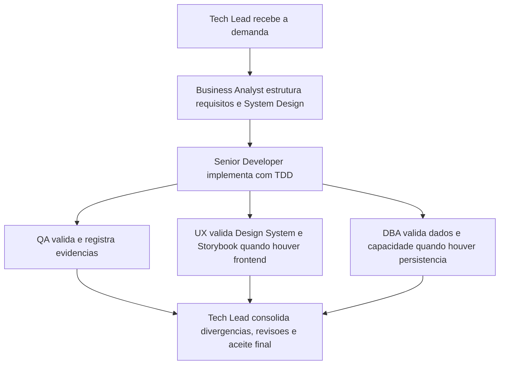

# Memoria Compartilhada dos Agents

> Arquivo versionavel e obrigatorio para todos os agents deste pacote.

## Regras de persistencia

- Todo agent deve ler este arquivo antes de atuar.
- Este arquivo deve manter apenas contexto estrutural, decisoes permanentes, ownerships criticos, riscos recorrentes e backlog ainda ativo.
- Detalhes extensos, cronologia de mudancas e evidencias completas devem ficar em `memoria/historico/`.
- Toda mudanca estrutural deve atualizar esta memoria e gerar registro no historico.
- O conteudo deve ser curto, consolidado e sem duplicacao textual.
- Diagramas Mermaid so devem ser mantidos quando ajudarem a explicar um fluxo estrutural do pacote.

## Contexto do pacote

| Campo | Valor |
|---|---|
| Projeto | Pacote de agents reutilizaveis (Agentes) |
| Objetivo atual | Manter o baseline estabilizado de governanca, templates, skills e memoria para os 6 agents |
| Stack detectada | Markdown (documentacao e configuracao de agents) |
| Frameworks detectados | N/A no workspace atual |
| Estado do baseline | Estabilizado e portavel |
| Responsavel de consolidacao | Tech Lead |

## Decisoes estruturais ativas

| ID | Decisao | Impacto permanente | Dono | Status |
|---|---|---|---|---|
| DEC-STR-01 | O pacote opera com protocolo comum, memoria compartilhada concisa e historico versionado. | Garante continuidade, rastreabilidade e baixo acoplamento entre iteracoes. | Tech Lead | Ativa |
| DEC-STR-02 | Os 6 agents devem manter persona operacional explicita e agir com handoffs rastreaveis, detectando stack antes de executar. | Preserva consistencia de comportamento, especializacao por papel e adaptacao ao projeto-alvo. | Tech Lead | Ativa |
| DEC-STR-03 | Gates especializados permanecem obrigatorios: QA para validacao independente, UX para frontend/experiencia e DBA para persistencia/dados. | Evita fechamento de demanda sem revisao adequada do dominio afetado. | Tech Lead | Ativa |
| DEC-STR-04 | O Business Analyst e dono do System Design; o DBA fornece plano de dimensionamento/expansao; o handoff DBA -> BA deve ser explicito e rastreavel. | Mantem coerencia entre requisitos, arquitetura, dados e planejamento de capacidade. | Tech Lead | Ativa |
| DEC-STR-05 | O Senior Developer deve trabalhar com TDD, avaliar no minimo 3 abordagens, aplicar Clean Architecture e priorizar reutilizacao. | Estabelece o baseline de engenharia esperado pelo pacote. | Tech Lead | Ativa |
| DEC-STR-06 | Toda implementacao passa por QA; reprovacoes exigem registro, retorno ao desenvolvimento e escalonamento ao solicitante apos mais de 3 ciclos. | Formaliza o ciclo de qualidade e cria criterio objetivo para destravar impasses. | Tech Lead | Ativa |
| DEC-STR-07 | Testes definidos pelo QA exigem aprovacao explicita do solicitante, e alteracoes posteriores exigem reaprovacao explicita. | Preserva governanca de aceite e trilha auditavel de validacoes. | Tech Lead | Ativa |
| DEC-STR-08 | Cypress e o padrao de E2E; o Senior Developer prepara prerequisitos tecnicos e o QA Expert valida a execucao real com evidencias ou bloqueios. | Clarifica ownership operacional e padroniza a stack de E2E. | Tech Lead | Ativa |
| DEC-STR-09 | Em frontend, o System Design deve referenciar explicitamente o Design System; o QA valida esse vinculo; o Tech Lead o trata como criterio de aceite. | Conecta arquitetura, UX e validacao no fluxo padrao de entrega frontend. | Tech Lead | Ativa |
| DEC-STR-10 | O UX Expert define a estrutura funcional do Storybook alinhada ao Design System, e o Senior Developer sustenta sua implementacao tecnica quando houver frontend. | Evita ambiguidade de ownership entre UX e desenvolvimento. | Tech Lead | Ativa |
| DEC-STR-11 | O Tech Lead deve consolidar atividades, revisoes, PRD/ARD quando existirem, divergencias, evidencias e impacto global antes do fechamento final. | Garante fechamento executivo consistente e auditavel. | Tech Lead | Ativa |
| DEC-STR-12 | Todos os agents devem sinalizar divergencias do proprio dominio entre requisitos, arquitetura, implementacao, UX, dados e evidencias. | Antecipа inconsistencias e alimenta a revisao consolidada e o aceite final. | Tech Lead | Ativa |
| DEC-STR-13 | Templates e skills do pacote devem permanecer reutilizaveis, agnosticos ao projeto e alinhados aos papeis dos agents. | Mantem portabilidade do pacote e reduz acoplamento a repositorios especificos. | Tech Lead | Ativa |
| DEC-STR-14 | A governanca de Pull Requests fica centralizada em um unico workflow, com validacao semantica, Gitflow, labels de review granulares, comentarios automaticos no PR e sincronizacao do mesmo estado nas issues vinculadas. | Reduz sobreposicao de automacoes, preserva rastreabilidade unica do ciclo de review e mantem PR/issue coerentes durante abertura, revisao, dismiss e merge. | Tech Lead | Ativa |
| DEC-STR-15 | Skills transversais devem concentrar detalhamento operacional reutilizavel, enquanto agents preservam obrigacoes, gates e ownerships sem repetir instrucoes extensas ja formalizadas em skills e templates. | Reduz redundancia entre agents, melhora descoberta das skills e mantem o pacote reutilizavel em qualquer projeto. | Tech Lead | Ativa |

## Ownerships criticos

| Tema | Ownership principal | Apoio obrigatorio |
|---|---|---|
| Consolidacao final | Tech Lead | Todos os agents alimentam evidencias, divergencias e handoffs |
| System Design | Business Analyst | DBA para capacidade e dados; UX para referencia ao Design System em frontend |
| Design System | UX Expert | Senior Developer para implementacao tecnica de Storybook quando houver frontend |
| Implementacao | Senior Developer | QA para validacao independente |
| E2E com Cypress | QA Expert na validacao | Senior Developer nos prerequisitos tecnicos |
| Plano de banco e expansao | DBA | Business Analyst para consolidacao no System Design |

## Artefatos padrao permanentes

| Artefato | Uso estrutural |
|---|---|
| `templates/system-design-template.md` | Base padrao do System Design |
| `templates/system-design-exemplo-preenchido.md` | Referencia de preenchimento do System Design |
| `templates/design-system-completo-template.md` | Base padrao do Design System |
| `templates/qa-validacao-frontend-template.md` | Validacao QA de fluxos frontend |
| `templates/aprovacao-final-tech-lead-template.md` | Fechamento formal do Tech Lead |
| `templates/revisao-consolidada-tech-lead-template.md` | Revisao consolidada do Tech Lead |
| `templates/qa-reprovacao-e-ciclos-template.md` | Registro de reprovacoes QA e ciclos de refatoracao |
| `templates/aprovacao-e-reaprovacao-solicitante-template.md` | Registro de aprovacao e reaprovacao do solicitante |
| `templates/plano-dimensionamento-expansao-banco-template.md` | Plano de capacidade e expansao do banco |
| `templates/setup-e-checklist-cypress-template.md` | Setup e checklist operacional do Cypress |

## Estado do backlog

| Item | Estado |
|---|---|
| Baseline estrutural do pacote | Concluido e sem backlog estrutural ativo no momento |
| OBS Pro Bot v5.0.1 — hardening de dados (governanca inicial DBA) | Ativo: alinhar desenho x implementacao (transacoes atomicas financeiras, segredo/env, trilha de auditoria, plano de backup/expansao) |

## Sintese decisoria curta (OBS - governanca UX)

- Contexto: avaliacao de governanca UX do repositorio OBS (frontend Streamlit), sem alteracao de codigo.
- Stack detectada no alvo: Python 3.11 + Streamlit (frontend web), SQLite e Docker.
- Decisao UX gate: **Reprovado**.
- Motivos chave:
  - ausencia de referencia explicita ao Design System em `docs/system-design.md`;
  - ausencia de referencia explicita ao Design System em `docs/declaracao-escopo-aplicacao.md`;
  - inexistencia de evidencias visuais (proposta/real), Storybook e Figma vinculados ao fluxo oficial;
  - falta de criterios objetivos de acessibilidade, responsividade e estados de interface.
- Recomendacao:
  - criar e vincular Documento Completo de Design System;
  - preencher `templates/qa-validacao-frontend-template.md`;
  - estabelecer baseline de acessibilidade e evidencias visuais para novo gate.

## Riscos permanentes

| Risco | Mitigacao permanente | Owner |
|---|---|---|
| Agents perderem especificidade operacional ao longo do tempo | Preservar personas explicitas, handoffs e metricas por papel | Tech Lead |
| Divergencia entre protocolo, templates, skills e agents | Atualizar memoria principal de forma consolidada e detalhar ajustes no historico | Tech Lead |
| Fechamentos ocorrerem sem rastreabilidade suficiente | Exigir revisao consolidada, evidencias e registros de aprovacao quando aplicavel | Tech Lead |
| Fluxos financeiros aprovarem operacao sem lancamento atomico em ledger (deposito/saque) | Exigir transacao unica ACID por operacao financeira e validacao de reconciliacao automatica | DBA + Senior Developer |
| Persistencia com segredos hardcoded e criptografia fraca (senha/API key) | Exigir segredo por env/secrets manager, migracao para KDF forte e protecao de dados sensiveis em repouso | DBA + Tech Lead |
| Crescimento sem plano formal de backup/restore e sem trilha de auditoria completa | Instituir politica de backup testado, runbook de recuperacao e trilha imutavel de eventos financeiros | DBA + Business Analyst |

## Historico de referencia

- O historico foi reduzido para manter apenas registros estruturais e reutilizaveis para o futuro dos agents.
- O saneamento desta memoria foi registrado em `memoria/historico/2026-03-21-1245-limpeza-memoria-estrutural.md`.
- A consolidacao da governanca de PR, labels de review e sincronizacao com issues foi registrada em `memoria/historico/2026-03-21-1315-consolidacao-governanca-pr-issue-review.md`.
- O alinhamento entre skills e agents, com genericizacao de referencias especificas e reducao de redundancias, foi registrado em `memoria/historico/2026-03-21-1345-alinhamento-skills-agents-portabilidade.md`.
- A avaliacao inicial de governanca de dados do OBS Pro Bot (sem mudanca de schema), incluindo riscos de concorrencia, recuperacao, auditoria e capacidade, foi registrada em `memoria/historico/2026-03-22-1010-avaliacao-inicial-governanca-dados-obs.md`.

## Fluxo estrutural do pacote

