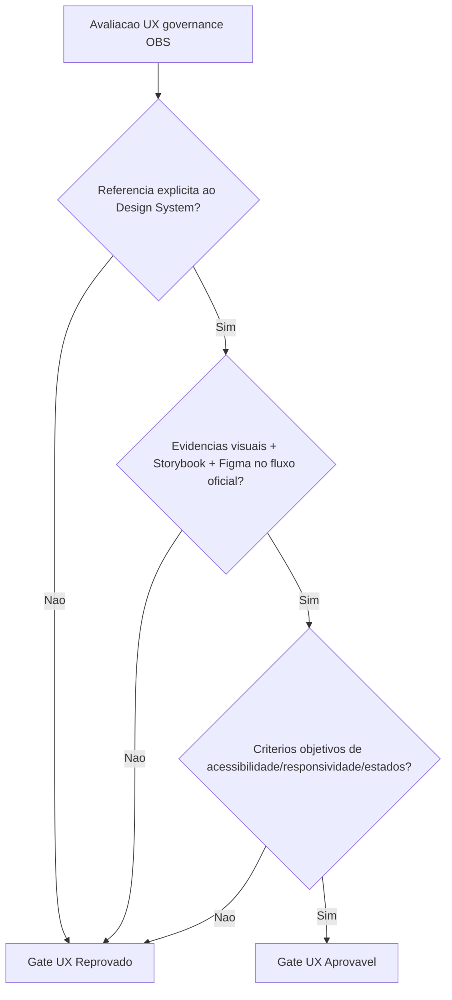

# Registro de Historico — Sintese decisoria UX gate (OBS)

## Contexto

- Avaliacao de governanca UX do repositorio OBS (frontend Streamlit), sem alteracao de codigo.

## Sintese orientada a decisao

- Decisao UX gate: **Reprovado**.
- Motivos chave:
  - ausencia de referencia explicita ao Design System em `docs/system-design.md`;
  - ausencia de referencia explicita ao Design System em `docs/declaracao-escopo-aplicacao.md`;
  - inexistencia de evidencias visuais (proposta/real), Storybook e Figma vinculados ao fluxo oficial;
  - falta de criterios objetivos de acessibilidade, responsividade e estados de interface.
- Recomendacao:
  - criar e vincular Documento Completo de Design System;
  - preencher `templates/qa-validacao-frontend-template.md`;
  - estabelecer baseline de acessibilidade e evidencias visuais para novo gate.

## Rastreabilidade

- Memoria compartilhada atualizada em:
  - `.github/agents/memoria/MEMORIA-COMPARTILHADA.md`
- Evidencias documentais analisadas:
  - `docs/system-design.md`
  - `docs/declaracao-escopo-aplicacao.md`

## Diagrama de decisao (Mermaid)

