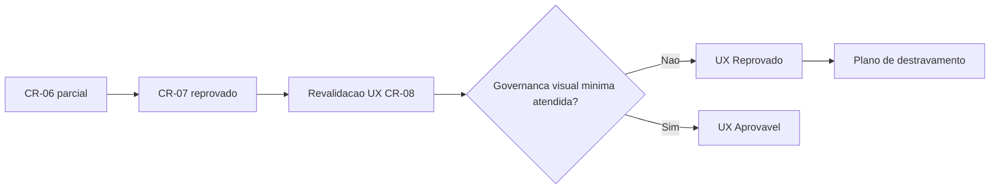

# Registro de Historico — Revalidacao UX CR-08 (OBS)

- Data: 2026-03-21
- Branch: `feature/p0-hardening-core`
- Escopo: revalidacao do gate UX para CR-08 com base somente em artefatos internos do repositorio

## Contexto

- A rodada anterior consolidou:
  - CR-06 como concluido parcial (Design System publicado);
  - CR-07 como reprovado (QA frontend), mantendo bloqueios de governanca visual.
- Esta revalidacao UX teve foco em coerencia documental e condicoes de convergencia para CR-08.

## Decisao tomada

- **Gate UX CR-08: Reprovado**.

Motivos objetivos:
1. vinculo SD <-> DS existe, mas com status parcial;
2. sem referencia oficial de Figma no repositorio;
3. sem estrutura Storybook versionada;
4. sem evidencias visuais reais/propostas versionadas;
5. contratos de loading/acessibilidade ainda incompletos para auditoria visual.

## Impacto

- Mantem bloqueio de convergencia frontend no CR-08 ate fechamento da governanca visual minima.
- Preserva coerencia com DEC-STR-09/10 e com o estado do CR-07 revalidado.

## Proximos passos

1. Vincular Figma (ou excecao formal aprovada).
2. Estruturar Storybook com estados criticos.
3. Versionar evidencias visuais (proposta e implementacao real).
4. Fechar contrato de interacao para loading + checklist de acessibilidade auditavel.
5. Revalidar CR-07 e repetir CR-08 apos evidencias.

## Rastreabilidade

- Parecer UX emitido em: `review/2026-03-21-2359-ux-revalidacao-gate-cr08.md`.
- Memoria principal atualizada em: `.github/agents/memoria/MEMORIA-COMPARTILHADA.md`.

