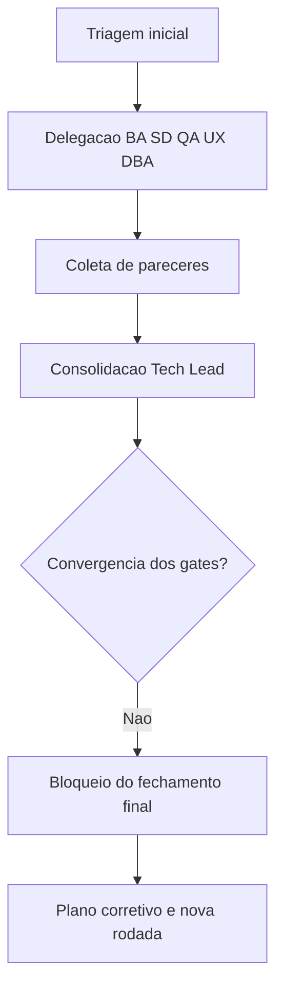

# Consolidacao dos gates iniciais - OBS Pro Bot

## Objetivo

Registrar de forma cronologica e rastreavel a consolidacao inicial de governanca executada pelo Tech Lead no repositorio OBS, incluindo pareceres dos agents especializados, decisoes e bloqueios para fechamento final.

## Contexto

- Demanda: "execute" apos leitura de memoria persistente.
- Escopo: triagem inicial, sem alteracao de codigo de produto.
- Artefato principal gerado: `review/2026-03-22-0328-revisao-consolidada-tech-lead.md`.

## Cronologia consolidada

1. Tech Lead validou memoria compartilhada e estado da branch.
2. Delegacao paralela para BA, SD, QA, UX e DBA.
3. Recebimento de pareceres independentes por gate.
4. Consolidacao das divergencias entre PRD, ARD, implementacao e evidencias.
5. Publicacao da revisao consolidada com decisao de nao aprovar fechamento final.

## Resultado por gate

| Gate | Resultado | Justificativa resumida |
|---|---|---|
| BA | Aprovado com ressalvas | Coerencia macro entre PRD e ARD, com lacunas de rastreabilidade |
| SD | Reprovado | Risco de seguranca (hardcoded/sha256) e ausencia de readiness de testes |
| QA | Reprovado | Ausencia de suite de testes independentes e evidencias de validacao |
| UX | Reprovado | Ausencia de vinculo formal com Design System e QA frontend |
| DBA | Reprovado | Risco de integridade/concorrencia e trilha de auditoria insuficiente |

## Decisao registrada

- Decisao do Tech Lead: **nao aprovar fechamento final** nesta rodada.
- Condicao para nova rodada de aceite: convergencia de plano corretivo P0/P1 e nova validacao independente dos gates obrigatorios.

## Itens impactados

- `review/2026-03-22-0328-revisao-consolidada-tech-lead.md`
- `.github/agents/memoria/MEMORIA-COMPARTILHADA.md`
- `docs/declaracao-escopo-aplicacao.md` (referencia de PRD)
- `docs/system-design.md` (referencia de ARD)

## Impacto global

- Positivo: aumento da previsibilidade e rastreabilidade do ciclo de entrega.
- Restritivo: fechamento formal bloqueado ate tratamento das divergencias criticas.

