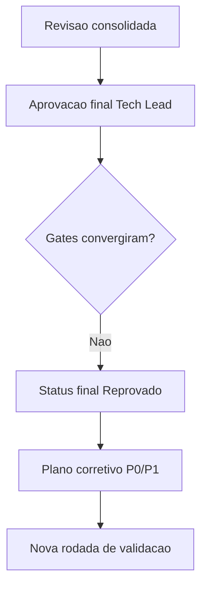

# Fechamento formal da rodada inicial - OBS Pro Bot

## Objetivo

Registrar o fechamento formal da rodada inicial de governanca, com decisao final do Tech Lead, criterios de aceite aplicados e condicoes para nova rodada.

## Referencias

- Revisao consolidada: `review/2026-03-22-0328-revisao-consolidada-tech-lead.md`
- Aprovacao final: `review/2026-03-22-0331-aprovacao-final-tech-lead.md`
- Memoria compartilhada: `.github/agents/memoria/MEMORIA-COMPARTILHADA.md`

## Decisao

- Status final da rodada: **Reprovado**.
- Motivo: gates obrigatorios sem convergencia para aceite e divergencias criticas sem tratamento conclusivo.

## Evidencias chave

- BA: aprovado com ressalvas.
- SD: reprovado.
- QA: reprovado.
- UX: reprovado.
- DBA: reprovado.

## Impacto

- Positivo: trilha de auditoria completa para a rodada.
- Restritivo: bloqueio de fechamento final ate plano corretivo e revalidacao.

## Condicao de destravamento

1. Executar plano corretivo P0/P1.
2. Revalidar gates BA, SD, QA, UX e DBA.
3. Atualizar revisao consolidada e emitir nova aprovacao final.

