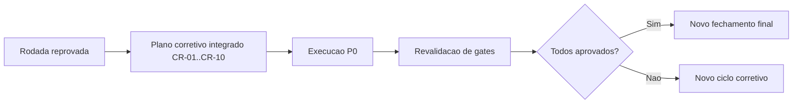

# Plano corretivo integrado P0/P1 - convergencia de gates (OBS)

## Objetivo

Registrar a decisao de execucao do plano corretivo integrado P0/P1 apos fechamento formal reprovado, com rastreabilidade entre owners, dependencias e criterio de sucesso.

## Referencias

- `review/2026-03-22-0328-revisao-consolidada-tech-lead.md`
- `review/2026-03-22-0331-aprovacao-final-tech-lead.md`
- `review/2026-03-22-0336-plano-corretivo-p0-p1-convergencia-gates.md`

## Decisao consolidada

- O Tech Lead consolida backlog CR-01..CR-10 com prioridade P0/P1.
- A rodada permanece com status **reprovado** ate convergencia dos gates.
- O aceite depende da conclusao dos itens P0 e nova rodada de validacao cruzada.

## Efeito observado

- Ambiguidade de proxima acao reduzida.
- Ownership e criterio de aceite explicitados por item.
- Trilha de auditoria expandida para fase corretiva.

## Proxima condicao de fechamento

1. Concluir CR-01..CR-08 com evidencias executaveis.
2. Reabrir revisao consolidada Tech Lead.
3. Emitir nova aprovacao final com resultado convergente.

