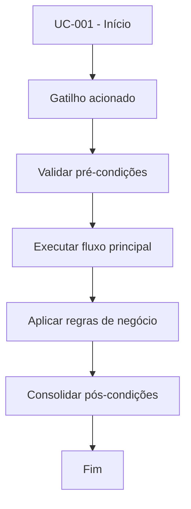

# UC-001 - Criar conta

## Título / ID
UC-001 - Criar conta

## Objetivo
Permitir que um visitante registre uma nova conta para acessar a plataforma.

## Atores
- Visitante

## Pré-condições
- Visitante não autenticado.
- Tabela `users` disponível.

## Gatilho
Clique em **Criar conta** com usuário e senha preenchidos.

## Fluxo principal
1. Visitante informa usuário, senha e (opcionalmente) código de indicação.
2. Sistema valida obrigatoriedade da senha e unicidade do usuário.
3. Sistema valida código de indicação quando informado.
4. Sistema persiste o novo usuário com perfil `user`.
5. Sistema confirma o cadastro.

## Fluxos alternativos
- A1. Código de indicação não informado: sistema segue cadastro sem benefício de indicação.
- A2. Usuário informado já existe: sistema solicita outro identificador.

## Exceções
- E1. Falha de persistência no banco: cadastro é cancelado e evento é registrado em log.

## Regras de negócio
- RN-001: Usuário deve ser único.
- RN-002: Senha é obrigatória no cadastro.
- RN-003: Código de indicação é opcional, porém validado quando informado.

## Pós-condições
- Conta criada na tabela `users`.
- Usuário apto a executar UC-002 (login).

## Critérios de aceitação (Given/When/Then)
| Cenário | Given | When | Then |
|---|---|---|---|
| Cadastro válido | Given visitante não autenticado e dados válidos | When solicita criação de conta | Then o sistema cria usuário com `role=user` |
| Usuário duplicado | Given que o usuário já existe | When visitante tenta cadastrar novamente | Then o sistema bloqueia o cadastro e apresenta mensagem de duplicidade |

## Rastreabilidade (histórias/épicos)
| Tipo | Referência |
|---|---|
| História | US-001 |
| Épico | Autenticação |
| Relacionados | UC-002 |
