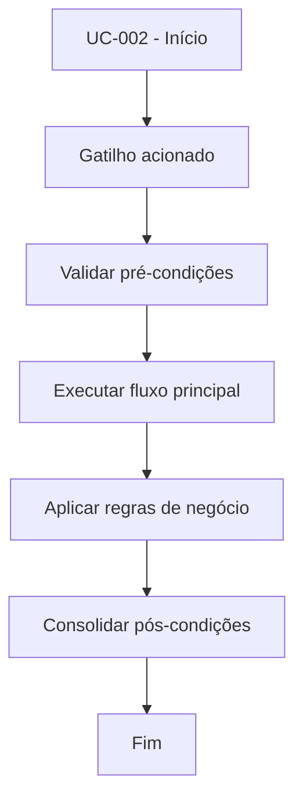

# UC-002 - Fazer login

## Título / ID
UC-002 - Fazer login

## Objetivo
Autenticar usuário cadastrado para liberar funcionalidades protegidas.

## Atores
- Usuário cadastrado

## Pré-condições
- Conta existente e ativa.
- Usuário não autenticado.

## Gatilho
Clique em **Entrar** com credenciais preenchidas.

## Fluxo principal
1. Usuário informa credenciais.
2. Sistema calcula hash SHA-256 da senha informada.
3. Sistema valida credenciais na base `users`.
4. Sistema cria sessão com token em `sessions`.
5. Sistema redireciona para área autenticada.

## Fluxos alternativos
- A1. Sessão prévia expirada: sistema solicita novo login e segue fluxo normal.

## Exceções
- E1. Credenciais inválidas: autenticação negada.
- E2. Erro ao persistir sessão: acesso não é concedido.

## Regras de negócio
- RN-001: Senha é validada por hash SHA-256.
- RN-002: Sessão deve possuir expiração configurada (30 dias).

## Pós-condições
- Sessão ativa associada ao usuário.
- Token disponível para recuperação de sessão.

## Critérios de aceitação (Given/When/Then)
| Cenário | Given | When | Then |
|---|---|---|---|
| Login válido | Given usuário com credenciais corretas | When clica em Entrar | Then o sistema cria sessão e libera acesso |
| Login inválido | Given senha incorreta | When tenta autenticar | Then o sistema nega acesso e informa erro |

## Rastreabilidade (histórias/épicos)
| Tipo | Referência |
|---|---|
| História | US-002 |
| Épico | Autenticação |
| Relacionados | UC-003 |
