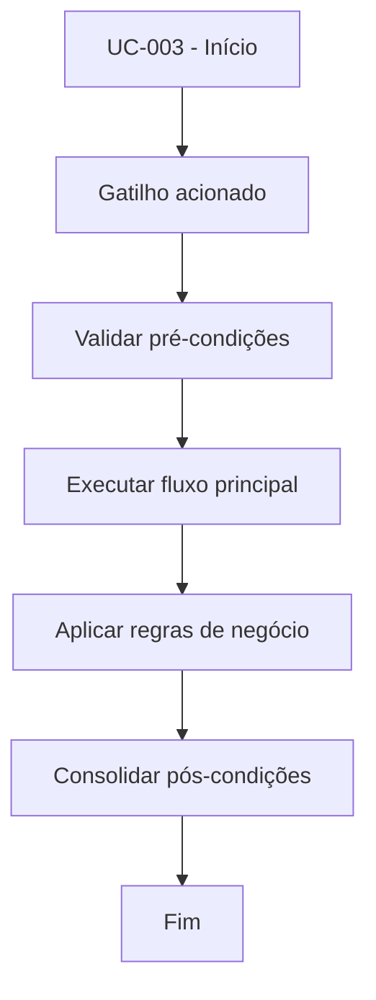

# UC-003 - Encerrar sessão

## Título / ID
UC-003 - Encerrar sessão

## Objetivo
Finalizar sessão autenticada com revogação de token.

## Atores
- Usuário autenticado

## Pré-condições
- Sessão ativa.
- Token disponível no contexto da UI.

## Gatilho
Clique em **Sair**.

## Fluxo principal
1. Usuário solicita logout.
2. Sistema remove token em `sessions`.
3. Sistema limpa dados de autenticação da UI.
4. Sistema retorna para estado público.

## Fluxos alternativos
- A1. Token já expirado: sistema finaliza estado local e conclui logout.

## Exceções
- E1. Falha de comunicação com banco: logout é concluído localmente e pendência é logada.

## Regras de negócio
- RN-001: Logout deve invalidar sessão persistida.
- RN-002: Sessões expiram automaticamente após 30 dias.

## Pós-condições
- Sessão encerrada no servidor e no cliente.
- Usuário precisa autenticar novamente para acessar áreas protegidas.

## Critérios de aceitação (Given/When/Then)
| Cenário | Given | When | Then |
|---|---|---|---|
| Logout com sessão ativa | Given usuário autenticado | When clica em Sair | Then o token é removido e a interface retorna ao estado público |

## Rastreabilidade (histórias/épicos)
| Tipo | Referência |
|---|---|
| História | US-003 |
| Épico | Autenticação |
| Relacionados | UC-002 |
