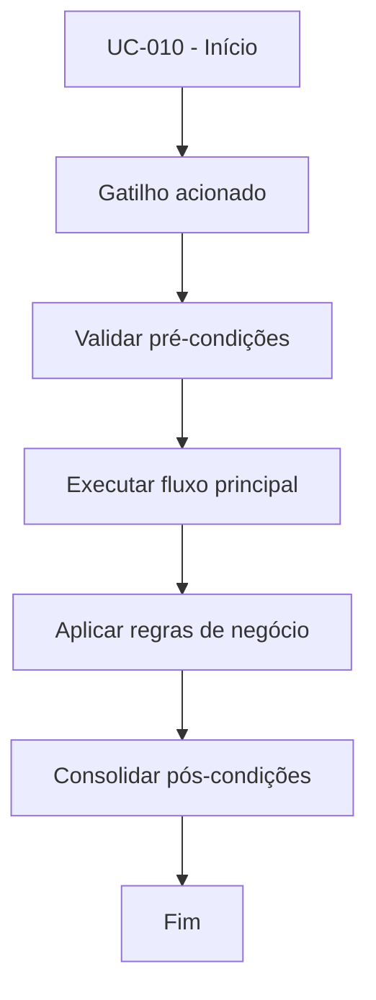

# UC-010 - Cadastrar chaves API

## Título / ID
UC-010 - Cadastrar chaves API

## Objetivo
Registrar API Key e API Secret do usuário para habilitar integração com exchange.

## Atores
- Usuário autenticado

## Pré-condições
- Usuário autenticado.
- Acesso à área Carteira/API.

## Gatilho
Ação de salvar formulário de chaves API.

## Fluxo principal
1. Usuário informa API Key, API Secret e opção de testnet.
2. Sistema valida obrigatoriedade dos campos.
3. Sistema grava/atualiza dados em `user_keys`.
4. Sistema confirma o salvamento.

## Fluxos alternativos
- A1. Atualização de chaves existentes: sistema sobrescreve credenciais anteriores do usuário.

## Exceções
- E1. Campos obrigatórios ausentes: operação bloqueada.
- E2. Falha no banco: chaves não são persistidas.

## Regras de negócio
- RN-001: API Key e API Secret são obrigatórias.
- RN-002: Flag de testnet deve ser persistida junto às chaves.

## Pós-condições
- Credenciais do usuário registradas.
- Usuário apto a operar UC-020 e UC-062.

## Critérios de aceitação (Given/When/Then)
| Cenário | Given | When | Then |
|---|---|---|---|
| Salvar chaves válidas | Given usuário autenticado com campos preenchidos | When salva o formulário | Then o sistema persiste os dados em `user_keys` |
| Salvar sem secret | Given formulário com API Secret vazio | When tenta salvar | Then o sistema bloqueia e informa obrigatoriedade |

## Rastreabilidade (histórias/épicos)
| Tipo | Referência |
|---|---|
| História | US-010 |
| Épico | Chaves API |
| Relacionados | UC-020, UC-062 |
