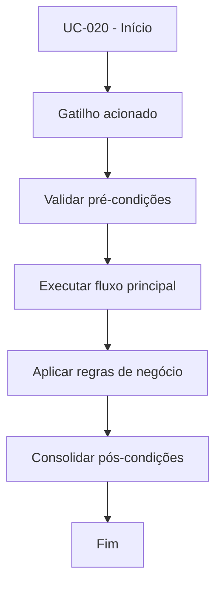

# UC-020 - Ativar/desativar bot

## Título / ID
UC-020 - Ativar/desativar bot

## Objetivo
Controlar se o bot do usuário está habilitado para operar.

## Atores
- Usuário autenticado

## Pré-condições
- Usuário autenticado.
- Chaves API cadastradas (UC-010).

## Gatilho
Alteração do toggle de operação do bot.

## Fluxo principal
1. Sistema verifica se há chaves cadastradas.
2. Usuário altera estado do toggle.
3. Sistema atualiza `bot_state.enabled`.
4. Sistema exibe status operacional atualizado.

## Fluxos alternativos
- A1. Bot já no estado desejado: sistema mantém estado e apenas confirma.

## Exceções
- E1. Usuário sem chaves API: sistema impede ativação.
- E2. Falha ao persistir estado: alteração não é aplicada.

## Regras de negócio
- RN-001: Sem chaves API válidas o bot não pode ser ativado.
- RN-002: Estado do bot deve ser persistido por usuário.

## Pós-condições
- Bot habilitado ou desabilitado conforme escolha do usuário.

## Critérios de aceitação (Given/When/Then)
| Cenário | Given | When | Then |
|---|---|---|---|
| Ativar bot com chaves | Given usuário com chaves válidas | When ativa o toggle do bot | Then o sistema persiste `enabled=1` |
| Ativar sem chaves | Given usuário sem chaves cadastradas | When tenta ativar o bot | Then o sistema bloqueia a operação |

## Rastreabilidade (histórias/épicos)
| Tipo | Referência |
|---|---|
| História | US-020 |
| Épico | Bot Trading |
| Relacionados | UC-010, UC-021 |
