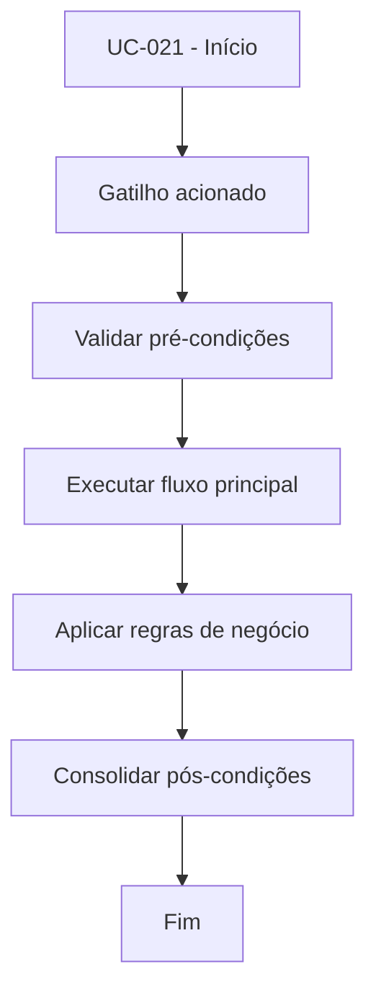

# UC-021 - Comprar por sinal de entrada

## Título / ID
UC-021 - Comprar por sinal de entrada

## Objetivo
Executar compra somente quando regras técnicas de entrada forem satisfeitas.

## Atores
- Bot de trading

## Pré-condições
- Bot habilitado para o usuário.
- Sem posição aberta.
- Conectividade com exchange disponível.

## Gatilho
Execução de ciclo do bot com avaliação de entrada.

## Fluxo principal
1. Bot coleta preço e indicadores (EMA200 H1, EMA9/EMA21, RSI 5m).
2. Bot valida condições de entrada da estratégia.
3. Bot calcula quantidade com base em fração de saldo e precisão do ativo.
4. Bot envia ordem BUY.
5. Sistema registra trade e atualiza estado da posição.

## Fluxos alternativos
- A1. Sinal não confirmado: bot não compra e segue monitoramento.
- A2. Quantidade arredondada para zero por precisão: ciclo é encerrado sem ordem.

## Exceções
- E1. Cooldown pós-stop-loss ativo: entrada bloqueada até expirar janela.
- E2. Falha de API/exchange no envio da ordem: compra não é executada e erro é registrado.

## Regras de negócio
- RN-001: Entrada exige preço > EMA200 H1.
- RN-002: Entrada exige EMA9 > EMA21 no timeframe de sinal.
- RN-003: RSI deve permanecer entre 40 e 65.
- RN-004: Cooldown pós-SL bloqueia novas entradas.
- RN-005: Quantidade mínima deve respeitar precisão de mercado.

## Pós-condições
- Posição aberta e estado atualizado quando condições são atendidas.
- Sem alteração de posição quando condições não são atendidas.

## Critérios de aceitação (Given/When/Then)
| Cenário | Given | When | Then |
|---|---|---|---|
| Entrada válida | Given bot habilitado e sinais de entrada válidos | When o ciclo de avaliação é executado | Then o sistema envia ordem BUY e registra operação |
| Entrada bloqueada por cooldown | Given último fechamento foi por stop-loss recente | When o ciclo tenta nova entrada | Then o sistema bloqueia a compra por cooldown |

## Rastreabilidade (histórias/épicos)
| Tipo | Referência |
|---|---|
| História | US-021 |
| Épico | Bot Trading |
| Relacionados | UC-060, UC-061, UC-063, UC-064 |
