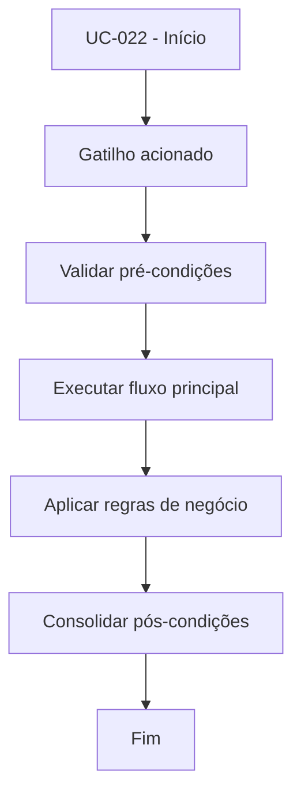

# UC-022 - Vender por TP/SL/sinais

## Título / ID
UC-022 - Vender por TP/SL/sinais

## Objetivo
Encerrar posição automaticamente por take-profit, stop-loss ou sinais técnicos de saída.

## Atores
- Bot de trading

## Pré-condições
- Posição aberta no `bot_state`.
- Bot em execução com dados de mercado disponíveis.

## Gatilho
Execução de ciclo do bot com posição aberta.

## Fluxo principal
1. Sistema calcula variação da posição aberta.
2. Sistema avalia regras de TP/SL.
3. Sistema avalia sinais técnicos de saída (RSI/EMA).
4. Se alguma condição for verdadeira, envia ordem SELL.
5. Sistema grava trade de saída e limpa posição.

## Fluxos alternativos
- A1. Nenhuma regra de saída atendida: posição permanece aberta.
- A2. Janela mínima de hold ativa: sistema posterga saída por sinal até tempo mínimo.

## Exceções
- E1. Falha na execução de SELL: posição é mantida e erro registrado para nova tentativa.
- E2. Inconsistência de saldo/posição: operação é abortada e sinalizada em log.

## Regras de negócio
- RN-001: Take-profit padrão de +1%.
- RN-002: Stop-loss padrão de -0,5%.
- RN-003: Saída por RSI >= 70 ou EMA9 < EMA21, conforme configuração.
- RN-004: `MIN_HOLD_SECONDS` pode postergar saída por sinal.

## Pós-condições
- Posição encerrada quando alguma regra de saída dispara.
- Métricas de performance atualizadas com o trade de saída.

## Critérios de aceitação (Given/When/Then)
| Cenário | Given | When | Then |
|---|---|---|---|
| Saída por take-profit | Given posição aberta e preço atingindo alvo de TP | When o ciclo avalia as regras | Then o sistema executa SELL e encerra a posição |
| Saída adiada por hold mínimo | Given posição aberta em hold mínimo ativo | When ocorre sinal técnico de saída | Then o sistema adia o SELL até expirar o hold |

## Rastreabilidade (histórias/épicos)
| Tipo | Referência |
|---|---|
| História | US-022 |
| Épico | Bot Trading |
| Relacionados | UC-021, UC-023 |
