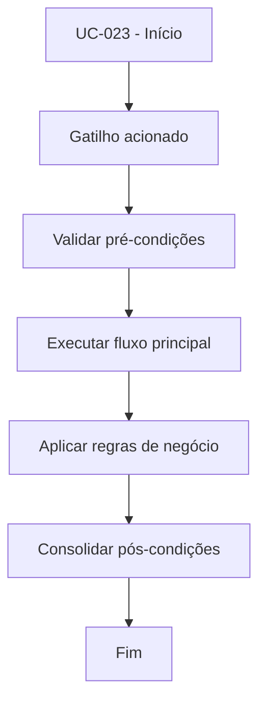

# UC-023 - Visualizar performance

## Título / ID
UC-023 - Visualizar performance

## Objetivo
Apresentar indicadores de desempenho operacional do bot para tomada de decisão.

## Atores
- Usuário operador

## Pré-condições
- Usuário autenticado.
- Dados de trades disponíveis (ou ausência tratada).

## Gatilho
Acesso ao painel de performance do bot.

## Fluxo principal
1. Sistema consulta histórico de trades do usuário.
2. Sistema calcula métricas (wins, losses, winrate, PnL).
3. Interface renderiza cards e histórico de operações.
4. Usuário analisa resultado e decide ajustes operacionais.

## Fluxos alternativos
- A1. Sem trades no período: sistema exibe métricas zeradas e orientação ao usuário.

## Exceções
- E1. Falha ao consultar histórico: UI exibe erro controlado e mantém navegação.

## Regras de negócio
- RN-001: Métricas devem ser calculadas exclusivamente a partir de `bot_trades` do usuário.
- RN-002: Apenas operações do usuário autenticado podem ser exibidas.

## Pós-condições
- Usuário obtém visão atualizada da performance de trading.

## Critérios de aceitação (Given/When/Then)
| Cenário | Given | When | Then |
|---|---|---|---|
| Exibir métricas com trades | Given usuário com operações registradas | When abre painel de performance | Then o sistema mostra winrate e PnL corretos |
| Exibir métricas sem trades | Given usuário sem operações registradas | When abre painel de performance | Then o sistema apresenta métricas zeradas |

## Rastreabilidade (histórias/épicos)
| Tipo | Referência |
|---|---|
| História | US-023 |
| Épico | Bot Trading |
| Relacionados | UC-061 |
