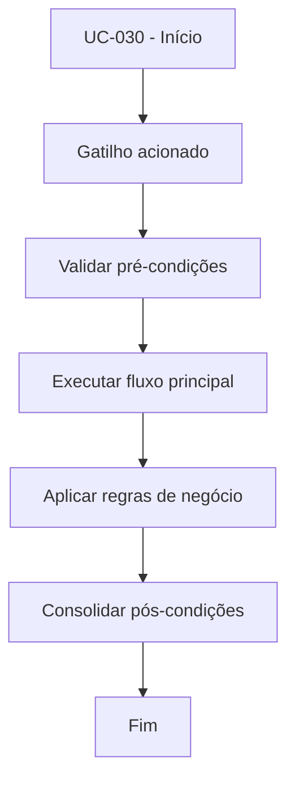

# UC-030 - Solicitar aporte

## Título / ID
UC-030 - Solicitar aporte

## Objetivo
Registrar solicitação de depósito para crédito interno na conta do usuário.

## Atores
- Usuário autenticado

## Pré-condições
- Usuário autenticado.
- Valor e TXID disponíveis para submissão.

## Gatilho
Envio do formulário de aporte.

## Fluxo principal
1. Usuário informa valor e TXID.
2. Sistema valida valor positivo e TXID obrigatório.
3. Sistema cria registro de depósito com status `PENDING`.
4. Sistema confirma envio para revisão administrativa.

## Fluxos alternativos
- A1. Solicitação repetida para o mesmo TXID: sistema sinaliza possível duplicidade para revisão.

## Exceções
- E1. Valor <= 0: solicitação rejeitada.
- E2. TXID vazio: solicitação bloqueada.

## Regras de negócio
- RN-001: Valor do aporte deve ser maior que zero.
- RN-002: TXID é obrigatório para auditoria.

## Pós-condições
- Depósito pendente criado para revisão do administrador.

## Critérios de aceitação (Given/When/Then)
| Cenário | Given | When | Then |
|---|---|---|---|
| Aporte válido | Given usuário autenticado com valor positivo e TXID | When envia solicitação de aporte | Then o sistema registra depósito como `PENDING` |
| Aporte sem TXID | Given formulário sem TXID | When envia solicitação | Then o sistema bloqueia criação do depósito |

## Rastreabilidade (histórias/épicos)
| Tipo | Referência |
|---|---|
| História | US-030 |
| Épico | Aportes e Saques |
| Relacionados | UC-031 |
