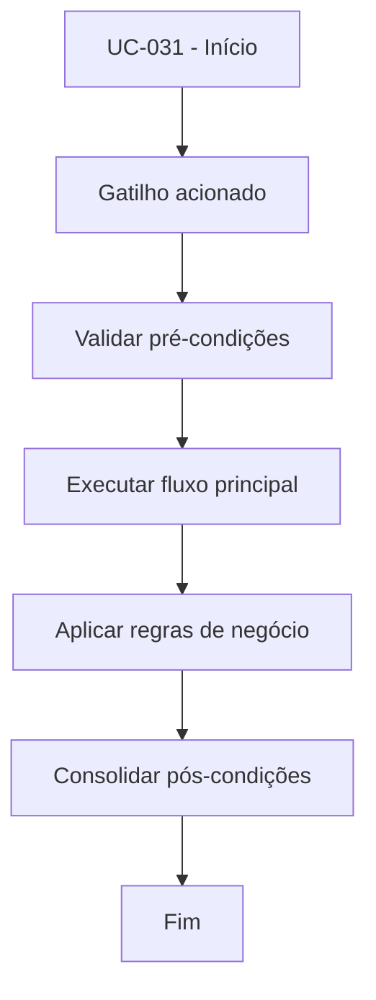

# UC-031 - Revisar aporte (admin)

## Título / ID
UC-031 - Revisar aporte (admin)

## Objetivo
Permitir ao administrador aprovar ou rejeitar depósitos pendentes.

## Atores
- Administrador

## Pré-condições
- Administrador autenticado.
- Depósito com status `PENDING`.

## Gatilho
Ação de revisão (aprovar/rejeitar) em depósito pendente.

## Fluxo principal
1. Admin lista depósitos pendentes.
2. Admin seleciona depósito e decide aprovação ou rejeição.
3. Sistema atualiza status e metadados de revisão.
4. Se aprovado, sistema lança crédito no `ledger`.
5. Sistema confirma resultado da revisão.

## Fluxos alternativos
- A1. Rejeição de depósito: status final definido sem crédito no ledger.

## Exceções
- E1. Depósito não está `PENDING`: revisão bloqueada.
- E2. Segunda tentativa de revisão: operação recusada.

## Regras de negócio
- RN-001: Cada depósito pode ser revisado somente uma vez.
- RN-002: Aprovação gera lançamento `DEPOSIT` no ledger.

## Pós-condições
- Depósito finalizado como `APPROVED` ou `REJECTED`.
- Saldo interno atualizado quando aprovado.

## Critérios de aceitação (Given/When/Then)
| Cenário | Given | When | Then |
|---|---|---|---|
| Aprovar depósito pendente | Given depósito em `PENDING` | When admin aprova | Then o sistema atualiza status e cria lançamento `DEPOSIT` |
| Revisão duplicada | Given depósito já revisado | When admin tenta revisar novamente | Then o sistema bloqueia a operação |

## Rastreabilidade (histórias/épicos)
| Tipo | Referência |
|---|---|
| História | US-031 |
| Épico | Aportes e Saques |
| Relacionados | UC-030, UC-035 |
