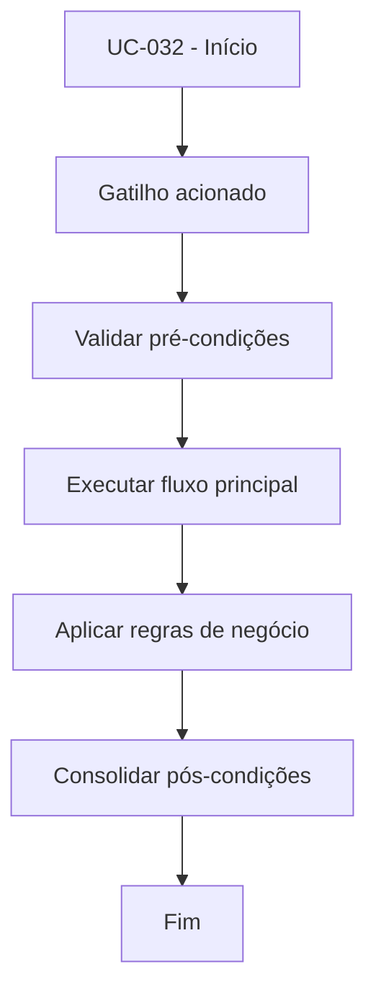

# UC-032 - Solicitar saque

## Título / ID
UC-032 - Solicitar saque

## Objetivo
Permitir ao usuário solicitar retirada de saldo interno para carteira externa.

## Atores
- Usuário autenticado

## Pré-condições
- Usuário autenticado.
- Saldo disponível em ledger.
- Rede e endereço de destino informados.

## Gatilho
Envio do formulário de saque.

## Fluxo principal
1. Usuário informa valor, rede e endereço.
2. Sistema calcula taxa com base em `WITHDRAW_FEE_RATE`.
3. Sistema valida se há saldo suficiente.
4. Sistema cria solicitação de saque com status `PENDING`.
5. Sistema envia solicitação para revisão administrativa.

## Fluxos alternativos
- A1. Usuário ajusta valor após alerta de taxa e reenviа solicitação válida.

## Exceções
- E1. Saldo insuficiente: solicitação rejeitada.
- E2. Rede/endereço inválidos ou vazios: solicitação bloqueada.

## Regras de negócio
- RN-001: Saldo deve cobrir valor solicitado e regras de taxa configuradas.
- RN-002: Rede e endereço são obrigatórios para rastreabilidade da transferência.

## Pós-condições
- Saque pendente criado para análise administrativa.

## Critérios de aceitação (Given/When/Then)
| Cenário | Given | When | Then |
|---|---|---|---|
| Saque válido | Given saldo suficiente e dados de destino válidos | When usuário solicita saque | Then o sistema cria saque em `PENDING` |
| Saque sem saldo | Given saldo insuficiente | When usuário solicita saque | Then o sistema rejeita a solicitação |

## Rastreabilidade (histórias/épicos)
| Tipo | Referência |
|---|---|
| História | US-032 |
| Épico | Aportes e Saques |
| Relacionados | UC-033, UC-034 |
