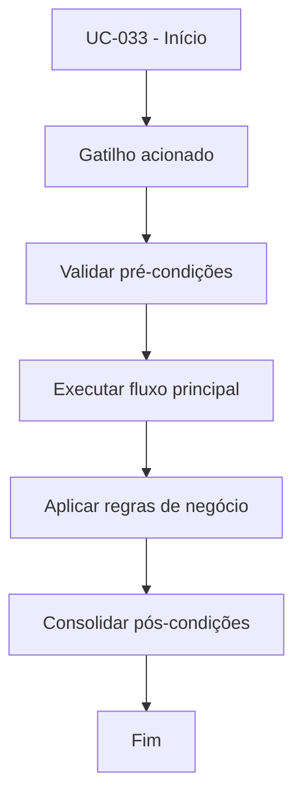

# UC-033 - Revisar saque (admin)

## Título / ID
UC-033 - Revisar saque (admin)

## Objetivo
Permitir ao administrador aprovar ou rejeitar solicitações de saque pendentes.

## Atores
- Administrador

## Pré-condições
- Administrador autenticado.
- Saque com status `PENDING`.

## Gatilho
Ação de revisão de saque na área administrativa.

## Fluxo principal
1. Admin lista saques pendentes.
2. Admin seleciona saque e define aprovação/rejeição.
3. Sistema atualiza status da revisão.
4. Se aprovado, sistema registra débito `WITHDRAWAL` no ledger.
5. Sistema confirma desfecho da revisão.

## Fluxos alternativos
- A1. Rejeição de saque: sistema mantém saldo e encerra solicitação como rejeitada.

## Exceções
- E1. Saque não está `PENDING`: revisão bloqueada.
- E2. Segunda revisão para o mesmo saque: operação recusada.

## Regras de negócio
- RN-001: Apenas saques `PENDING` podem ser revisados.
- RN-002: Aprovação gera lançamento `WITHDRAWAL` no ledger.

## Pós-condições
- Saque finalizado como `APPROVED` ou `REJECTED`.

## Critérios de aceitação (Given/When/Then)
| Cenário | Given | When | Then |
|---|---|---|---|
| Aprovar saque pendente | Given saque em `PENDING` | When admin aprova | Then o sistema atualiza status e lança `WITHDRAWAL` no ledger |
| Revisão de saque já tratado | Given saque já revisado | When admin tenta revisar novamente | Then o sistema bloqueia a operação |

## Rastreabilidade (histórias/épicos)
| Tipo | Referência |
|---|---|
| História | US-033 |
| Épico | Aportes e Saques |
| Relacionados | UC-032, UC-034 |
