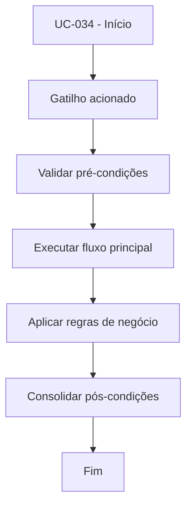

# UC-034 - Marcar saque como pago

## Título / ID
UC-034 - Marcar saque como pago

## Objetivo
Concluir saque aprovado com registro de TXID de pagamento externo.

## Atores
- Administrador

## Pré-condições
- Administrador autenticado.
- Saque com status `APPROVED`.
- TXID de pagamento disponível.

## Gatilho
Ação de marcar saque aprovado como pago.

## Fluxo principal
1. Admin seleciona saque aprovado.
2. Admin informa TXID de pagamento.
3. Sistema valida status e obrigatoriedade do TXID.
4. Sistema atualiza status para `PAID` e registra TXID.

## Fluxos alternativos
- A1. Correção de TXID antes da confirmação: admin altera valor e conclui marcação.

## Exceções
- E1. Saque sem status `APPROVED`: marcação bloqueada.
- E2. TXID vazio: operação rejeitada.

## Regras de negócio
- RN-001: Somente saques `APPROVED` podem ser marcados como pagos.
- RN-002: TXID de pagamento é obrigatório para auditoria.

## Pós-condições
- Saque registrado como `PAID` com trilha de pagamento.

## Critérios de aceitação (Given/When/Then)
| Cenário | Given | When | Then |
|---|---|---|---|
| Marcar saque pago | Given saque aprovado e TXID válido | When admin confirma pagamento | Then o sistema atualiza o saque para `PAID` |
| Marcar sem TXID | Given saque aprovado sem TXID informado | When admin tenta concluir | Then o sistema bloqueia a operação |

## Rastreabilidade (histórias/épicos)
| Tipo | Referência |
|---|---|
| História | US-034 |
| Épico | Aportes e Saques |
| Relacionados | UC-033 |
