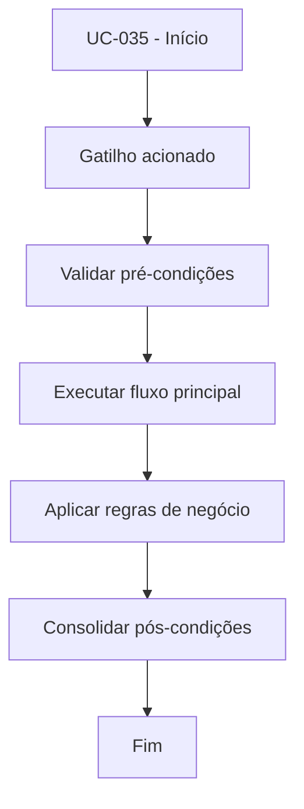

# UC-035 - Exportar extrato CSV

## Título / ID
UC-035 - Exportar extrato CSV

## Objetivo
Disponibilizar download do extrato financeiro do usuário autenticado.

## Atores
- Usuário autenticado

## Pré-condições
- Usuário autenticado.
- Acesso à área de extrato.

## Gatilho
Clique em **Baixar CSV**.

## Fluxo principal
1. Sistema consulta `ledger` filtrado por usuário.
2. Sistema monta estrutura do arquivo CSV.
3. Sistema disponibiliza arquivo para download.

## Fluxos alternativos
- A1. Sem lançamentos: sistema gera arquivo vazio com cabeçalho padronizado.

## Exceções
- E1. Falha na geração do arquivo: sistema informa erro e sugere nova tentativa.

## Regras de negócio
- RN-001: Exportação deve considerar apenas dados do usuário autenticado.
- RN-002: Formato deve ser CSV consumível por auditoria externa.

## Pós-condições
- Arquivo de extrato entregue ao usuário ou erro controlado exibido.

## Critérios de aceitação (Given/When/Then)
| Cenário | Given | When | Then |
|---|---|---|---|
| Exportação com dados | Given usuário com lançamentos no ledger | When solicita download do extrato | Then o sistema entrega arquivo CSV com os registros |
| Exportação sem dados | Given usuário sem lançamentos | When solicita download do extrato | Then o sistema disponibiliza CSV sem registros |

## Rastreabilidade (histórias/épicos)
| Tipo | Referência |
|---|---|
| História | US-035 |
| Épico | Aportes e Saques |
| Relacionados | UC-031, UC-033 |
