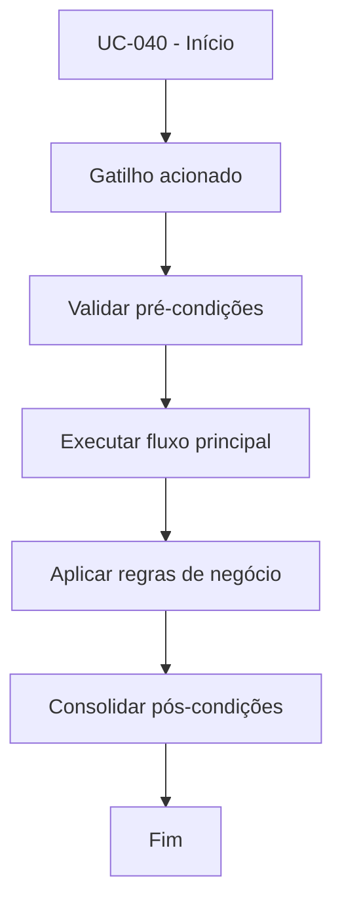

# UC-040 - Usar painel administrativo

## Título / ID
UC-040 - Usar painel administrativo

## Objetivo
Habilitar supervisão operacional por usuários com perfil administrador.

## Atores
- Administrador

## Pré-condições
- Usuário autenticado com `role=admin`.

## Gatilho
Acesso à aplicação com sessão administrativa ativa.

## Fluxo principal
1. Sistema valida perfil do usuário autenticado.
2. Sistema renderiza aba de Administração.
3. Admin visualiza usuários, pendências financeiras e status de bots.
4. Admin executa ações de governança conforme permissões.

## Fluxos alternativos
- A1. Usuário comum autenticado: sistema oculta recursos administrativos.

## Exceções
- E1. Sessão sem permissão adequada: acesso administrativo negado.

## Regras de negócio
- RN-001: Recursos administrativos são exclusivos para `role=admin`.
- RN-002: Ações administrativas devem manter rastreabilidade por usuário revisor.

## Pós-condições
- Acesso administrativo concedido somente a perfis autorizados.

## Critérios de aceitação (Given/When/Then)
| Cenário | Given | When | Then |
|---|---|---|---|
| Acesso admin | Given usuário admin autenticado | When abre a aplicação | Then o sistema exibe aba de Administração |
| Acesso usuário comum | Given usuário não-admin autenticado | When abre a aplicação | Then o sistema não exibe recursos administrativos |

## Rastreabilidade (histórias/épicos)
| Tipo | Referência |
|---|---|
| História | US-040 |
| Épico | Administração |
| Relacionados | UC-031, UC-033, UC-034 |
