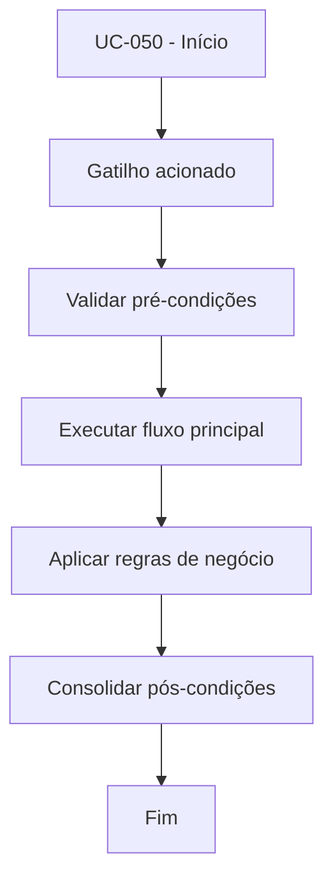

# UC-050 - Subir web+bot via Docker

## Título / ID
UC-050 - Subir web+bot via Docker

## Objetivo
Inicializar e manter a stack operacional com serviços web e bot em contêineres.

## Atores
- Operador técnico

## Pré-condições
- Docker e Docker Compose instalados.
- Arquivos `Dockerfile` e `docker-compose.yml` válidos.

## Gatilho
Execução de `docker compose up --build -d`.

## Fluxo principal
1. Operador executa comando de subida.
2. Compose builda imagem e inicia serviços `web` e `bot`.
3. Serviços compartilham volume de dados persistentes.
4. Operador valida estado dos contêineres em execução.

## Fluxos alternativos
- A1. Serviços já iniciados: compose reconcilia estado e mantém stack ativa.

## Exceções
- E1. Falha de build da imagem: stack não sobe.
- E2. Falha de montagem de volume: persistência comprometida.

## Regras de negócio
- RN-001: Dados operacionais devem persistir em volume compartilhado (`/app/data`).
- RN-002: Serviços devem utilizar política de restart para continuidade operacional.

## Pós-condições
- Serviços web e bot disponíveis para uso e monitoramento.

## Critérios de aceitação (Given/When/Then)
| Cenário | Given | When | Then |
|---|---|---|---|
| Subida bem-sucedida da stack | Given ambiente Docker configurado | When operador executa `docker compose up --build -d` | Then os serviços `web` e `bot` ficam em execução |
| Falha de build | Given dependências inconsistentes de imagem | When operador sobe a stack | Then o compose retorna erro e não inicia os serviços |

## Rastreabilidade (histórias/épicos)
| Tipo | Referência |
|---|---|
| História | US-050 |
| Épico | Operação e Observabilidade |
| Relacionados | UC-051 |
