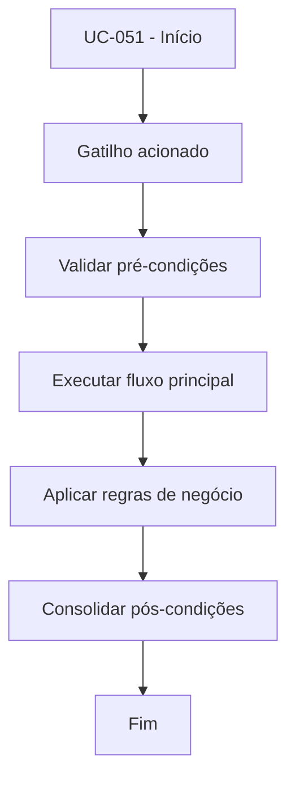

# UC-051 - Monitorar logs e ciclos

## Título / ID
UC-051 - Monitorar logs e ciclos

## Objetivo
Permitir monitoramento da saúde operacional por meio de logs e ciclos do bot.

## Atores
- Operador técnico
- Administrador

## Pré-condições
- Serviço `bot` em execução.
- `BOT_LOG_PATH` configurado.

## Gatilho
Execução contínua do loop do bot e consulta de logs.

## Fluxo principal
1. Bot registra eventos em arquivo e stdout.
2. Cada ciclo grava informações de decisão e execução.
3. Operador acompanha logs via interface e/ou `docker compose logs`.
4. Operador identifica anomalias e aciona tratativas operacionais.

## Fluxos alternativos
- A1. Auto-refresh desativado na UI: operador acompanha logs manualmente.

## Exceções
- E1. Falha de escrita em arquivo de log: somente stdout permanece disponível.
- E2. Bot interrompido: novos ciclos deixam de ser registrados.

## Regras de negócio
- RN-001: Eventos críticos devem ser registrados em arquivo e stdout.
- RN-002: Logs devem suportar investigação operacional e auditoria básica.

## Pós-condições
- Evidências de execução disponíveis para diagnóstico e suporte.

## Critérios de aceitação (Given/When/Then)
| Cenário | Given | When | Then |
|---|---|---|---|
| Registro de ciclos | Given bot em execução | When ocorre novo ciclo | Then o sistema registra evento no log |
| Consulta operacional | Given operador acessando ambiente | When executa comando de logs | Then visualiza eventos recentes do bot |

## Rastreabilidade (histórias/épicos)
| Tipo | Referência |
|---|---|
| História | US-051 |
| Épico | Operação e Observabilidade |
| Relacionados | UC-050, UC-063, UC-064 |
