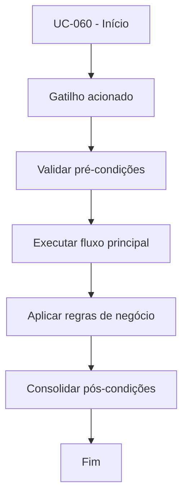

# UC-060 - Aplicar cooldown pós-stop-loss

## Título / ID
UC-060 - Aplicar cooldown pós-stop-loss

## Objetivo
Bloquear novas entradas por período definido após fechamento por stop-loss.

## Atores
- Bot de trading

## Pré-condições
- Bot habilitado.
- Último trade encerrado por stop-loss.

## Gatilho
Novo ciclo de entrada durante janela de cooldown.

## Fluxo principal
1. Sistema identifica timestamp do último stop-loss.
2. Sistema calcula tempo decorrido versus `COOLDOWN_AFTER_SL`.
3. Se cooldown ativo, sistema bloqueia sinal de compra.
4. Sistema registra motivo de bloqueio e aguarda próximo ciclo.

## Fluxos alternativos
- A1. Cooldown expirado: sistema libera UC-021 normalmente.

## Exceções
- E1. Timestamp do último SL indisponível: sistema aplica modo conservador e bloqueia entrada no ciclo atual.

## Regras de negócio
- RN-001: Cooldown padrão de 300 segundos após stop-loss.
- RN-002: Enquanto cooldown ativo, nenhuma ordem BUY deve ser enviada.

## Pós-condições
- Entradas protegidas contra reentrada imediata após perda.

## Critérios de aceitação (Given/When/Then)
| Cenário | Given | When | Then |
|---|---|---|---|
| Bloqueio dentro da janela | Given stop-loss recente e cooldown ativo | When bot avalia nova entrada | Then o sistema não envia ordem BUY |
| Liberação após janela | Given cooldown expirado | When bot avalia nova entrada válida | Then o sistema permite execução da UC-021 |

## Rastreabilidade (histórias/épicos)
| Tipo | Referência |
|---|---|
| História | US-060 |
| Épico | Bot Trading |
| Relacionados | UC-021 |
