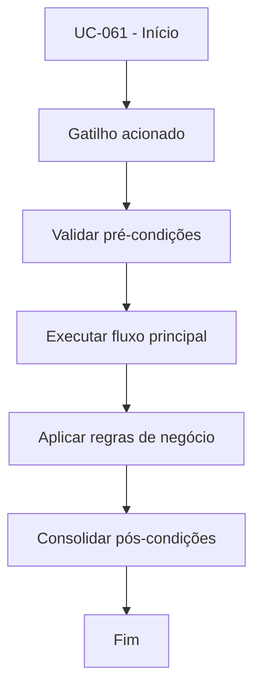

# UC-061 - Controlar contador de losses

## Título / ID
UC-061 - Controlar contador de losses

## Objetivo
Atualizar e disponibilizar contador de perdas para análise de risco operacional.

## Atores
- Bot de trading
- Usuário operador

## Pré-condições
- Bot executando operações de saída.
- Histórico de trades acessível.

## Gatilho
Fechamento de trade com resultado negativo.

## Fluxo principal
1. Sistema identifica resultado financeiro do trade encerrado.
2. Sistema incrementa contador de perdas quando PnL < 0.
3. Sistema mantém contador para cálculo de métricas da UC-023.
4. Interface exibe losses acumulados ao usuário.

## Fluxos alternativos
- A1. Trade vencedor: contador de losses não é incrementado.

## Exceções
- E1. Falha no registro de trade: contador não é atualizado e evento é logado para reconciliação.

## Regras de negócio
- RN-001: Loss é considerado quando PnL líquido da saída é negativo.
- RN-002: Contador deve refletir apenas operações do usuário autenticado.

## Pós-condições
- Indicador de perdas atualizado para métricas e monitoramento.

## Critérios de aceitação (Given/When/Then)
| Cenário | Given | When | Then |
|---|---|---|---|
| Incremento de loss | Given trade encerrado com PnL negativo | When sistema processa resultado | Then contador de losses é incrementado |
| Trade com lucro | Given trade encerrado com PnL positivo | When sistema processa resultado | Then contador de losses permanece inalterado |

## Rastreabilidade (histórias/épicos)
| Tipo | Referência |
|---|---|
| História | US-061 |
| Épico | Bot Trading |
| Relacionados | UC-022, UC-023 |
