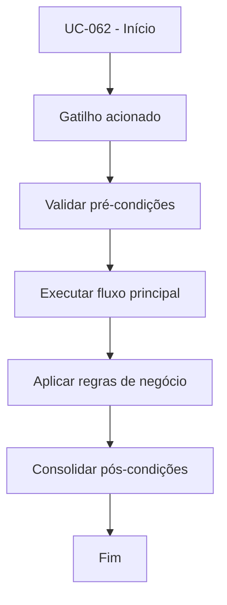

# UC-062 - Testar conectividade API da exchange

## Título / ID
UC-062 - Testar conectividade API da exchange

## Objetivo
Validar chaves API informadas pelo usuário antes da operação do bot.

## Atores
- Usuário autenticado

## Pré-condições
- Usuário com chaves cadastradas (UC-010).

## Gatilho
Ação de teste de conectividade API na interface.

## Fluxo principal
1. Usuário aciona teste de conectividade.
2. Sistema inicializa cliente da exchange com chaves cadastradas.
3. Sistema executa chamada de validação de credenciais.
4. Sistema apresenta resultado de sucesso/erro ao usuário.

## Fluxos alternativos
- A1. Ambiente testnet habilitado: teste executado no endpoint de simulação.

## Exceções
- E1. Credenciais inválidas: teste retorna falha de autenticação.
- E2. Timeout/conectividade externa: teste retorna indisponibilidade temporária.

## Regras de negócio
- RN-001: Teste deve utilizar exatamente as chaves do usuário autenticado.
- RN-002: Resultado do teste deve ser explícito (sucesso/falha e motivo).

## Pós-condições
- Usuário confirma se credenciais estão aptas para operação.

## Critérios de aceitação (Given/When/Then)
| Cenário | Given | When | Then |
|---|---|---|---|
| Teste bem-sucedido | Given chaves válidas cadastradas | When usuário executa teste de API | Then o sistema informa conectividade válida |
| Teste com credencial inválida | Given chaves inválidas cadastradas | When usuário executa teste | Then o sistema informa falha de autenticação |

## Rastreabilidade (histórias/épicos)
| Tipo | Referência |
|---|---|
| História | US-062 |
| Épico | Chaves API |
| Relacionados | UC-010, UC-020 |
