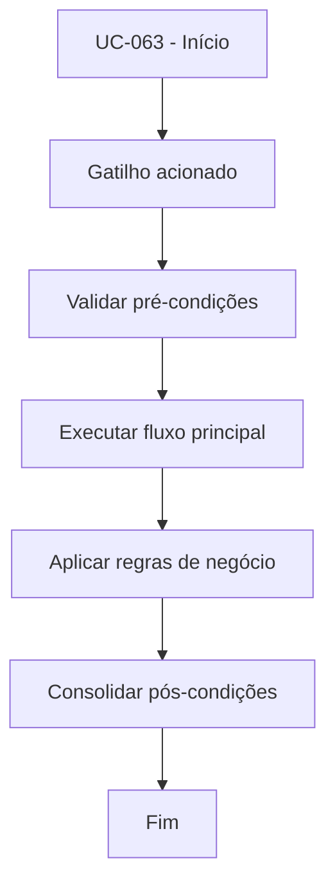

# UC-063 - Aplicar retry de integração com exchange

## Título / ID
UC-063 - Aplicar retry de integração com exchange

## Objetivo
Aumentar resiliência operacional com tentativas automáticas após falhas transitórias de integração.

## Atores
- Bot de trading

## Pré-condições
- Bot em execução.
- Operação de mercado dependente de chamada externa.

## Gatilho
Falha transitória em chamada de API da exchange.

## Fluxo principal
1. Sistema detecta falha transitória na integração.
2. Sistema aplica política de retry configurada.
3. Sistema reexecuta a chamada até limite de tentativas.
4. Ao sucesso, fluxo original continua; ao esgotar tentativas, sistema registra falha final.

## Fluxos alternativos
- A1. Sucesso no primeiro retry: operação segue normalmente sem intervenção manual.

## Exceções
- E1. Limite de retries atingido: ciclo é encerrado com erro controlado.
- E2. Falha classificada como não transitória: sistema não retenta e aborta imediatamente.

## Regras de negócio
- RN-001: Retry só deve ocorrer para erros transitórios elegíveis.
- RN-002: Número máximo de tentativas deve ser limitado para evitar loops infinitos.

## Pós-condições
- Melhor tolerância a falhas temporárias da exchange sem comprometer controle operacional.

## Critérios de aceitação (Given/When/Then)
| Cenário | Given | When | Then |
|---|---|---|---|
| Recuperação por retry | Given falha transitória de conexão | When sistema aplica retry | Then a chamada é reprocessada até sucesso ou limite |
| Falha definitiva | Given erro não recuperável | When sistema processa integração | Then o sistema aborta a operação sem retry adicional |

## Rastreabilidade (histórias/épicos)
| Tipo | Referência |
|---|---|
| História | US-063 |
| Épico | Operação e Observabilidade |
| Relacionados | UC-021, UC-022, UC-051 |
