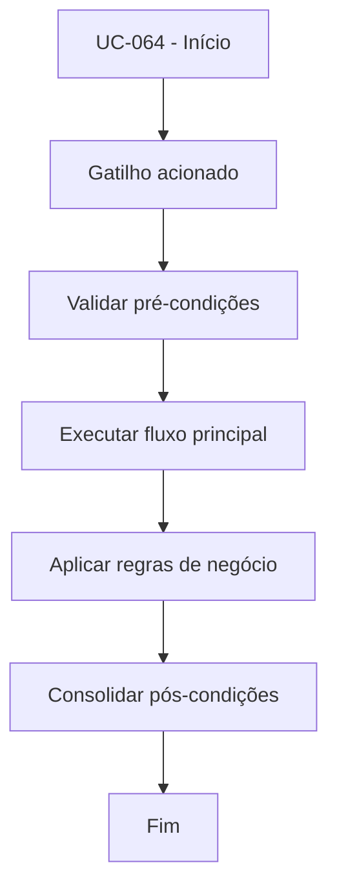

# UC-064 - Sincronizar relógio com exchange

## Título / ID
UC-064 - Sincronizar relógio com exchange

## Objetivo
Sincronizar tempo local com servidor da exchange para reduzir erros de assinatura e janelas de requisição.

## Atores
- Bot de trading

## Pré-condições
- Bot inicializado.
- Conectividade básica com endpoint de tempo da exchange.

## Gatilho
Inicialização do cliente de exchange e/ou detecção de drift de tempo.

## Fluxo principal
1. Sistema consulta horário de referência da exchange.
2. Sistema calcula drift entre relógio local e remoto.
3. Sistema ajusta offset operacional usado nas requisições.
4. Sistema registra status de sincronização.

## Fluxos alternativos
- A1. Drift dentro do limiar aceitável: sistema mantém offset atual.

## Exceções
- E1. Falha ao consultar horário remoto: sistema mantém último offset válido e registra alerta.

## Regras de negócio
- RN-001: Sincronização deve ocorrer antes de operações sensíveis de assinatura.
- RN-002: Offset deve ser recalculado periodicamente ou sob erro de timestamp.

## Pós-condições
- Requisições assinadas com menor risco de rejeição por horário inválido.

## Critérios de aceitação (Given/When/Then)
| Cenário | Given | When | Then |
|---|---|---|---|
| Sincronização inicial | Given bot iniciando com conectividade ativa | When consulta horário da exchange | Then sistema calcula e aplica offset de tempo |
| Falha de sincronização | Given indisponibilidade temporária do endpoint de tempo | When sistema tenta sincronizar | Then mantém último offset válido e registra alerta |

## Rastreabilidade (histórias/épicos)
| Tipo | Referência |
|---|---|
| História | US-064 |
| Épico | Operação e Observabilidade |
| Relacionados | UC-063, UC-051 |
