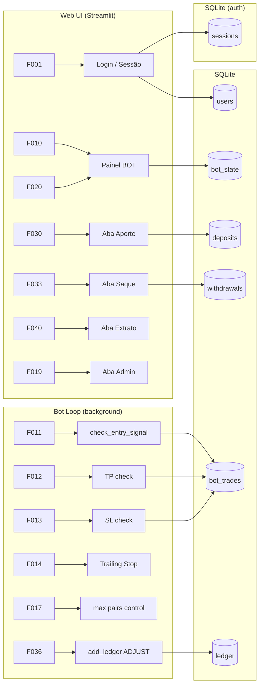

# Declaração de Escopo — OBS Pro Bot

**Versão:** 1.1  
**Data:** 2026-03-21  
**Status:** Revisado  
**Responsável:** Tech Lead  
**Revisão:** Cruzamento com `dashboard.py` v5.0.1 — F-006, F-043, F-057 adicionados; dead code `USE_RSI_EXIT` registrado; restrições de segurança e ERD corrigidos.

---

## 1. Identificação do projeto

| Campo | Valor |
|---|---|
| **Nome do produto** | OBS Pro Bot |
| **Versão atual** | 5.0.1 |
| **Tipo** | Plataforma SaaS de trading algorítmico de criptomoedas |
| **Repositório** | `ghcr.io/hefestox/obs` |
| **Stack principal** | Python 3.11 · Streamlit · ccxt · SQLite · Docker Swarm |

---

## 2. Problema de negócio

Operadores de criptomoedas precisam monitorar mercados e executar ordens manualmente, o que exige atenção contínua, é sujeito a erros emocionais e limita a capacidade de operar múltiplos ativos simultaneamente. O OBS Pro Bot automatiza a execução de estratégias técnicas na Binance, permitindo que o operador defina o capital e os parâmetros de risco uma única vez e delegue ao sistema a operação contínua 24/7.

---

## 3. Objetivos

1. Executar ordens de compra e venda automaticamente na Binance com base em indicadores técnicos configuráveis (MACD, RSI, EMA, ATR).
2. Permitir que múltiplos usuários operem de forma independente, cada um com suas próprias chaves API e capital segregado.
3. Controlar risco por operação via Take Profit, Stop Loss e Trailing Stop parametrizados.
4. Oferecer painel web em tempo real para acompanhar posições, histórico de trades e performance.
5. Prover fluxo financeiro gerenciado (aportes e saques) com aprovação administrativa.
6. Operar em produção via Docker Swarm sem intervenção manual após o deploy.

---

## 4. Atores e perfis

| Ator | Descrição | Permissões |
|---|---|---|
| **Usuário** | Operador que utiliza o bot para trading | Gerencia próprias chaves API, solicita aportes/saques, visualiza seu painel e extrato |
| **Administrador** | Operador com privilégio total | Tudo do usuário + aprova aportes/saques, gerencia usuários, controla bots de todos os usuários, visualiza status global |
| **Bot Loop** | Processo background autônomo | Lê estado e chaves de todos os usuários ativos, executa ordens na exchange, grava trades e atualiza estado |

---

## 5. Escopo funcional

### 5.1 Autenticação e gestão de contas

| ID | Funcionalidade | Perfil |
|---|---|---|
| F-001 | Criar conta com usuário, senha e código de indicação (opcional) | Público |
| F-002 | Login com sessão persistente por 30 dias (token SHA-256 em query param) | Público |
| F-003 | Logout com invalidação de sessão | Usuário / Admin |
| F-004 | Cadastrar/atualizar chaves API da Binance (Key + Secret + flag Testnet) | Usuário / Admin |
| F-005 | Listar todos os usuários | Admin |
| F-006 | Exibir código de indicação próprio (`my_code`) e identificar o indicador (`referrer_code`) na aba "Minha Conta" | Usuário / Admin |

### 5.2 Operação do bot

| ID | Funcionalidade | Perfil |
|---|---|---|
| F-010 | Ativar / desativar bot por par de trading via toggle na UI | Usuário / Admin |
| F-011 | Executar compra por sinal de entrada (MACD, RSI, EMA200 H1, EMA50 4H, ATR) | Bot Loop |
| F-012 | Executar venda por Take Profit | Bot Loop |
| F-013 | Executar venda por Stop Loss | Bot Loop |
| F-014 | Executar venda por Trailing Stop (ativa após +0,45%, distância 0,20%) | Bot Loop |
| F-015 | Aplicar cooldown de 1200s após Stop Loss antes de nova entrada | Bot Loop |
| F-016 | Controlar mínimo de tempo em posição (420s) antes de saída técnica | Bot Loop |
| F-017 | Controlar máximo de pares simultâneos por usuário (2 pares) | Bot Loop |
| F-018 | Detectar e recuperar posição preexistente na exchange ao iniciar | Bot Loop |
| F-019 | Controlar bots de qualquer usuário (ativar/desativar) | Admin |
| F-057 | Saída técnica por cruzamento MACD descendente (linha < sinal) quando `USE_EMA_EXIT=True` — **desabilitado por padrão** | Bot Loop |

> **Feature flags de sinal configuráveis em `★ CONFIG`:**
> `USE_4H_FILTER` (ativo), `USE_RSI_ENTRY` (ativo), `USE_TRAILING_STOP` (ativo), `USE_EMA_EXIT` (inativo — F-057), `USE_TIME_FILTER` (inativo), `USE_ENGULFING_PATTERN` / `USE_DOUBLE_ENGULFING_PATTERN` / `USE_OUTSIDE_BAR_PATTERN` / `USE_CANDLESTICK_CONFIRM` (todos inativos).
>
> ⚠️ **Dead code identificado:** `USE_RSI_EXIT = True` e `RSI_EXIT = 70` estão declarados como constantes mas **não são usados** em nenhuma função de saída (`check_exit_signal`). A saída por RSI está pendente de implementação — ver seção 12.

### 5.3 Performance e visualização

| ID | Funcionalidade | Perfil |
|---|---|---|
| F-020 | Exibir status em tempo real por par (USDT, ativo, status, preço, TP/SL) | Usuário / Admin |
| F-021 | Exibir métricas globais de performance (winrate, PnL realizado, W/L) | Usuário / Admin |
| F-022 | Exibir histórico de trades com filtro por par | Usuário / Admin |
| F-023 | Exibir status global de todos os bots (painel admin) | Admin |
| F-024 | Auto-atualização configurável da UI (5–60s via streamlit-autorefresh) | Usuário / Admin |

### 5.4 Fluxo financeiro

| ID | Funcionalidade | Perfil |
|---|---|---|
| F-030 | Solicitar aporte informando valor e TXID da transação | Usuário / Admin |
| F-031 | Revisar aporte pendente (aprovar / rejeitar com nota) | Admin |
| F-032 | Ativar bot automaticamente após aprovação de aporte (se chaves já cadastradas) | Admin / Sistema |
| F-033 | Solicitar saque informando valor, rede e endereço | Usuário / Admin |
| F-034 | Revisar saque pendente (aprovar / rejeitar com nota) | Admin |
| F-035 | Marcar saque aprovado como pago com TXID do pagamento | Admin |
| F-036 | Cobrar taxa de operação (R$ 0,50) no ledger a cada venda executada | Bot Loop |
| F-037 | Cobrar taxa de saque (5% sobre o valor solicitado) | Sistema |
| F-043 | Exibir endereço de depósito fixo (`DEPOSIT_ADDRESS_FIXED`) na aba Aporte para orientar o envio de fundos | Usuário / Admin |

### 5.5 Extrato e exportação

| ID | Funcionalidade | Perfil |
|---|---|---|
| F-040 | Exibir extrato de movimentações do ledger (500 últimos registros) | Usuário / Admin |
| F-041 | Exportar extrato em CSV | Usuário / Admin |

### 5.6 Infraestrutura e operação

| ID | Funcionalidade | Perfil |
|---|---|---|
| F-050 | Subir web + bot como serviços Docker Compose (local) | DevOps |
| F-051 | Subir web + bot como stack Docker Swarm (produção) | DevOps |
| F-052 | Log rotativo com RotatingFileHandler (5 MB × 2 backups) | Sistema |
| F-053 | Cache de cliente ccxt por usuário (rebuild a cada 1h) para evitar MemoryError | Bot Loop |
| F-054 | Retry de busca de saldo (3 tentativas com delay de 3s) | Bot Loop |
| F-055 | Sincronização de relógio com Binance (offset de timestamp) | Bot Loop |
| F-056 | Validação de sintaxe Python em CI (py_compile) | CI/CD |

---

## 6. Escopo fora (out-of-scope)

Os itens abaixo **não fazem parte** do escopo atual da aplicação:

- Suporte a exchanges além da Binance Spot.
- Ordens limitadas, OCO ou ordens do tipo futures/margin.
- Estratégias de trading personalizáveis por usuário via UI.
- Notificações push, e-mail ou Telegram/Discord.
- Interface mobile nativa (apenas web responsivo via Streamlit).
- Integração com brokers de ações ou outros instrumentos financeiros.
- Dashboard de análise técnica avançada (gráficos de candlestick interativos).
- Backtesting de estratégias.
- Multi-exchange por usuário.
- Autenticação de dois fatores (2FA).
- Gestão de permissões granular (além de `admin` e `user`).
- Banco de dados PostgreSQL (disponível como dependência, mas não utilizado).

---

## 7. Premissas

1. O usuário possui conta ativa na Binance com Spot Trading habilitado.
2. As chaves API da Binance têm permissão **apenas** de leitura e Spot Trading — sem permissão de saque.
3. O ambiente de produção possui Docker Swarm configurado com ao menos 1 nó.
4. As variáveis de ambiente `SESSION_SECRET`, `DEFAULT_ADMIN_USER` e `DEFAULT_ADMIN_PASS` são injetadas no container em produção.
5. O volume `obs_data` é persistente e compartilhado entre os serviços `web` e `bot`.
6. A conectividade com a API da Binance é estável o suficiente para ciclos de 15 segundos.
7. O par BTC/USDT e ETH/USDT têm liquidez suficiente para market orders de no mínimo 10 USDT.

---

## 8. Restrições

| Restrição | Descrição |
|---|---|
| **Técnica** | SQLite como banco — sem suporte a alta concorrência de escrita; exige `_DB_LOCK` em todas as operações |
| **Financeira** | Valor mínimo de order: 10 USDT; cap por par: 20 USDT (`USDT_PER_SYMBOL`) |
| **Operacional** | Máximo de 2 pares simultâneos por usuário (`MAX_PARES_SIMULTANEOS`) |
| **Regulatória** | O sistema não valida a conformidade legal do usuário para trading de criptomoedas |
| **Segurança** | `DEFAULT_ADMIN_PASS` possui valor padrão hardcoded no código — deve ser sobrescrito obrigatoriamente via env var em produção |
| **Infraestrutura** | Deploy limitado a 1 réplica do serviço bot (não suporta escalonamento horizontal do bot loop) |
| **Segurança** | `DEPOSIT_ADDRESS_FIXED` (endereço TRC-20) está hardcoded no código — deve ser configurável via env var para evitar rebuild em caso de troca de carteira |
| **Segurança (débito técnico)** | Senhas armazenadas com SHA-256 puro — não é uma KDF adequada para senhas; bcrypt ou argon2 seriam mais seguros. Migração deve ser tratada como débito técnico prioritário |

---

## 9. Requisitos não funcionais

| ID | Categoria | Requisito |
|---|---|---|
| NF-001 | Disponibilidade | Bot loop deve tolerar erros individuais por usuário sem derrubar o ciclo global |
| NF-002 | Disponibilidade | Após 10 erros consecutivos, aguardar 60s antes de retomar |
| NF-003 | Performance | Ciclo do bot deve completar em menos de 15s para todos os usuários ativos |
| NF-004 | Segurança | Senhas armazenadas como hash SHA-256 — nunca em texto claro |
| NF-005 | Segurança | Tokens de sessão expiram em 30 dias e são invalidados no logout |
| NF-004R | Segurança (risco residual) | SHA-256 não é KDF recomendado para passwords — substituição por bcrypt/argon2 listada como débito técnico pendente |
| NF-006 | Segurança | Chaves API nunca exibidas na UI além dos primeiros 8 caracteres |
| NF-007 | Observabilidade | Log estruturado com nível INFO/ERROR/CRITICAL + rotação automática (5 MB) |
| NF-008 | Manutenibilidade | Toda configuração de negócio centralizada na seção `★ CONFIG` de `dashboard.py` |
| NF-009 | Resiliência | Retry com 3 tentativas e delay de 3s nas chamadas de saldo à exchange |
| NF-010 | Resiliência | Cache de cliente ccxt reconstruído a cada 1h para evitar MemoryError |

---

## 10. Critérios de aceite por funcionalidade chave

### Bot de trading (F-011 a F-018)

- [ ] Bot executa BUY somente quando MACD linha > 0 **E** RSI entre 47–62 **E** preço > EMA200 H1 **E** preço > EMA50 4H **E** ATR% ≥ 0,15%.
- [ ] Bot executa SELL por TP quando preço ≥ entry × 1,0075.
- [ ] Bot executa SELL por SL quando preço ≤ entry × 0,9955.
- [ ] Bot ativa Trailing Stop após ganho ≥ 0,45% do entry.
- [ ] Cooldown de 1200s é respeitado após qualquer SL ou Trailing Stop.
- [ ] Posição não é encerrada por sinal técnico antes de 420s de hold.
- [ ] Taxa de R$ 0,50 é debitada do ledger somente na SELL, nunca na BUY.
- [ ] Máximo de 2 pares em posição simultânea por usuário.
- [ ] Quando `USE_EMA_EXIT=True` habilitado: SELL executado ao detectar MACD linha < sinal após `MIN_HOLD_SECONDS`.
- [ ] Enquanto `USE_RSI_EXIT` não for implementado em `check_exit_signal`: ausência de saída inesperada por RSI deve ser validada.

### Autenticação (F-001 a F-003)

- [ ] Usuário com credenciais válidas recebe sessão com expiração de 30 dias.
- [ ] Sessão é recuperada via `?sid=token` no reload da página.
- [ ] Logout invalida token no banco — reload não recupera sessão.

### Fluxo financeiro (F-030 a F-037)

- [ ] Aporte aprovado gera registro no ledger de kind=DEPOSIT.
- [ ] Saque rejeitado não gera débito no ledger.
- [ ] Admin só pode marcar saque como PAGO se status for APPROVED.
- [ ] Saldo do usuário é sempre a soma dos registros do ledger — não dos depósitos isolados.
- [ ] Endereço `DEPOSIT_ADDRESS_FIXED` é exibido na aba Aporte antes do formulário de solicitação.

---

## 11. Rastreabilidade — Funcionalidades por componente

---

## 12. Marcos e estado atual

| Marco | Status |
|---|---|
| MVP funcional com bot e UI | ✅ Concluído (v1.0) |
| Multi-par (BTC/USDT + ETH/USDT) | ✅ Concluído (v4.0) |
| Cache de exchange (fix MemoryError) | ✅ Concluído (v5.0.0) |
| Taxa cobrada na venda | ✅ Concluído (v5.0.0) |
| Log rotativo | ✅ Concluído (v5.0.0) |
| CI com validação de estrutura e sintaxe Python | ✅ Concluído |
| Testes automatizados (pytest) | 🔲 Pendente |
| Notificações (Telegram/Discord) | 🔲 Pendente |
| Migração para PostgreSQL | 🔲 Pendente |
| Rate limiting no login | 🔲 Pendente |
| Implementar saída por RSI (`USE_RSI_EXIT` em `check_exit_signal`) | 🔲 Pendente (dead code) |
| Migrar hashing de senhas para bcrypt/argon2 | 🔲 Pendente (débito técnico de segurança) |
| Tornar `DEPOSIT_ADDRESS_FIXED` configurável via env var | 🔲 Pendente |
