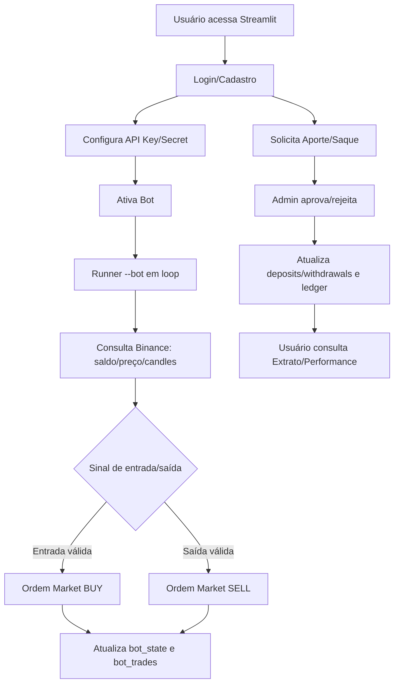

# Declaração de Escopo da Aplicação Atual (AS-IS)

## 1) Visão geral e objetivo do produto

A aplicação atual é uma plataforma **web em Streamlit** com dois processos principais:

- **Web UI** (painel do usuário/admin)
- **Runner do bot** (execução contínua de estratégia de trading)

Ambos compartilham dados em **SQLite**.

**Objetivo observado no código:** permitir que usuários gerenciem conta, chaves de API da Binance, ativem/desativem um bot de trading spot e acompanhem resultados; além de controlar aportes/saques via fluxo administrativo manual.

**Evidências no código:**
- Arquitetura de dois serviços (`web` e `bot`): `README.md`, `docker-compose.yml`
- Execução do bot por argumento `--bot`: `dashboard.py` (detecção `BOT_MODE` e `run_bot_loop()`)
- UI com abas de operação e administração: `dashboard.py` (tabs)

---

## 2) Problema de negócio atendido

Resolver a operação de trading spot com governança mínima de conta e financeiro interno, concentrando em um único painel:

- autenticação/cadastro;
- guarda de chaves de API por usuário;
- execução automática de estratégia (compra/venda);
- trilha de movimentações internas (ledger) para aporte/saque com aprovação.

**Evidências:** funções de autenticação/sessão, gestão de `user_keys`, `bot_state`, `bot_trades`, `deposits`, `withdrawals`, `ledger` em `dashboard.py`.

---

## 3) Stakeholders / personas

- **Usuário operador (`role=user`)**
  - Cadastra-se, faz login, informa API key/secret, ativa bot, solicita aporte/saque e consulta extrato/performance.
- **Administrador (`role=admin`)**
  - Aprova/rejeita aportes e saques, marca saque como pago, acompanha usuários e status dos bots.
- **Operação técnica (infra)**
  - Sobe/monitora containers, volume de dados e logs do bot (inferido de README/compose).

> **Hipótese explícita:** persona de operação técnica não aparece como papel funcional de negócio no código da UI, mas é inferida da forma de deploy.

---

## 4) Escopo funcional (in-scope) e não funcional

### 4.1 Funcional (in-scope)

1. **Cadastro e login de usuários**
   - Criação de conta com código de indicação opcional.
2. **Sessão persistida em banco**
   - Token de sessão com expiração.
3. **Gestão de chaves API Binance**
   - Salvar/atualizar chave/segredo + flag testnet.
4. **Controle de ativação do bot por usuário**
   - Toggle de operação e persistência de estado.
5. **Execução de estratégia automática**
   - Entrada: filtro EMA200 (H1), EMA9>EMA21 e RSI em faixa.
   - Saída: TP, SL, RSI sobrecomprado, cruzamento EMA para baixo.
6. **Registro de trades e métricas**
   - Histórico + winrate + PnL.
7. **Aportes**
   - Solicitação com TXID, status pendente, revisão admin, crédito em ledger na aprovação.
8. **Saques**
   - Validação de saldo, cálculo de taxa, revisão admin, marcação de pagamento com TXID.
9. **Extrato**
   - Visualização e download CSV do ledger.
10. **Painel administrativo**
   - Visão de usuários, pendências financeiras e status dos bots.

### 4.2 Não funcional (in-scope)

- **Stack:** Python 3.11 + Streamlit (`Dockerfile`, `requirements.txt`)
- **Persistência:** SQLite com WAL + volume Docker para durabilidade (`dashboard.py`, `docker-compose.yml`)
- **Operação:** dois serviços com `restart: unless-stopped` (`docker-compose.yml`)
- **Observabilidade:** logging em arquivo e stdout (`BOT_LOG_PATH`, `logging.basicConfig`)
- **Atualização de UI:** auto-refresh opcional (`streamlit-autorefresh`)

---

## 5) Fora de escopo (out-of-scope)

1. **Django e JasperReports**
   - Não há implementação desses frameworks nesta base atual.
2. **Liquidação on-chain automática de depósitos/saques**
   - Fluxo é manual com validação administrativa e lançamento em ledger.
3. **Relatórios Jasper / BI formal**
   - Não identificado.
4. **Múltiplos pares de trading configuráveis**
   - Par fixo `BTC/USDT` no código.
5. **Uso operacional de `paper_trades.csv`**
   - Arquivo existe, mas não há consumo no `dashboard.py`.
6. **Uso ativo de `CookieManager.py` na aplicação principal**
   - Fluxo real de sessão está implementado no próprio `dashboard.py`.

---

## 6) Regras de negócio identificadas

1. Cadastro exige usuário e senha; se houver código de indicação, precisa existir.
2. Sessão expira em 30 dias.
3. Depósito exige TXID e inicia `PENDING`.
4. Depósito só pode ser revisado uma vez; aprovação gera crédito no ledger.
5. Saque exige saldo suficiente, rede e endereço.
6. Taxa de saque = `WITHDRAW_FEE_RATE` (default 5%).
7. Aprovação de saque debita ledger no valor solicitado.
8. Marcar saque como pago requer status `APPROVED` e TXID obrigatório.
9. Entrada do bot só ocorre se:
   - preço > EMA200 (H1),
   - EMA9 > EMA21 (5m),
   - RSI entre 40 e 65.
10. Saída por:
    - TP (+1%),
    - SL (-0,5%),
    - RSI >= 70,
    - EMA9 < EMA21.
11. Após STOP_LOSS há cooldown (`COOLDOWN_AFTER_SL`) antes de nova entrada.
12. Compra usa fração do saldo (`ORDER_USDT_FRAC = 0.95`) e respeita mínimo de ordem.

---

## 7) Dependências e integrações externas

### 7.1 Dependências Python (`requirements.txt`)

- `streamlit`
- `pandas`
- `requests`
- `ccxt`
- `streamlit-autorefresh`
- `extra-streamlit-components`
- `psycopg2-binary` *(presente, sem evidência de uso no fluxo atual)*

### 7.2 Integrações externas

- **Binance API pública (HTTP via requests)**  
  - preço atual e horário do servidor.
- **Binance Spot autenticada (via ccxt)**  
  - candles, saldo, ordens market buy/sell.

---

## 8) Restrições técnicas e operacionais

- Banco local **SQLite** compartilhado por web e bot.
- Estratégia e parâmetros majoritariamente hardcoded.
- Necessidade de manter **runner do bot** ativo separadamente da UI.
- Credenciais/sessão dependentes de variáveis de ambiente (com defaults).
- Processo administrativo financeiro é manual (aprovação e pagamento).

---

## 9) Suposições e riscos

### 9.1 Suposições

- `paper_trades.csv` é artefato histórico/teste (não operacional na aplicação atual).
- `CookieManager.py` é código auxiliar não integrado ao fluxo principal atual.

### 9.2 Riscos

- Senha admin e `SESSION_SECRET` com defaults previsíveis no compose.
- Token de sessão em query param (`sid`) pode ampliar exposição em histórico/log/referer.
- API key/secret armazenadas em banco sem evidência de criptografia em repouso.
- Fluxo manual de aprovação/pagamento pode gerar gargalo operacional.
- Inconsistência potencial entre texto “Binance Brasil” na UI e integração técnica via `ccxt.binance` padrão (avaliar alinhamento operacional).

---

## 10) Critérios de sucesso/aceite de alto nível

| ID | Critério de sucesso | Evidência esperada |
|---|---|---|
| CA-01 | Usuário cria conta e autentica com sucesso | Registro em `users` + sessão válida |
| CA-02 | Sessão persiste e expira corretamente | Registro em `sessions` com `expires_at` |
| CA-03 | Usuário salva chaves API e consegue ativar bot | `user_keys` preenchido + `bot_state.enabled=1` |
| CA-04 | Bot executa ciclos e registra operações | `last_step_ts` atualizado + registros em `bot_trades` |
| CA-05 | Performance e histórico aparecem na UI | métricas calculadas e dataframe de trades |
| CA-06 | Aporte percorre pendência → revisão → crédito | `deposits` + lançamento `ledger` ao aprovar |
| CA-07 | Saque percorre solicitação → aprovação/rejeição → pago | `withdrawals` com transições de status |
| CA-08 | Extrato exportável em CSV | download do ledger na aba Extrato |

---

## 11) Matriz de rastreabilidade (requisito -> evidência no código)

| Requisito | Tipo | Evidência |
|---|---|---|
| RF-01 Cadastro/login | Funcional | `dashboard.py` (`create_user`, `auth`, sidebar login/cadastro) |
| RF-02 Sessão com expiração | Funcional | `create_session`, `get_session_user`, `delete_session` |
| RF-03 Chaves API por usuário | Funcional | `save_user_keys`, `get_user_keys`, aba “🔑 Chaves API” |
| RF-04 Ativar/desativar bot | Funcional | `bot_state.enabled`, toggle na aba Painel |
| RF-05 Estratégia de entrada | Funcional | `check_entry_signal`, `fetch_ema200_h1`, `fetch_indicators_5m` |
| RF-06 Estratégia de saída | Funcional | lógica TP/SL + `check_exit_signal` |
| RF-07 Registro/métricas de trade | Funcional | `insert_bot_trade`, `load_bot_trades`, `compute_metrics` |
| RF-08 Fluxo de aporte | Funcional | `create_deposit`, `admin_review_deposit`, UI aporte/admin |
| RF-09 Fluxo de saque | Funcional | `create_withdrawal`, `admin_review_withdrawal`, `admin_mark_withdraw_paid` |
| RF-10 Extrato CSV | Funcional | consulta `ledger` + `st.download_button` |
| RNF-01 Deploy containerizado | Não funcional | `Dockerfile`, `docker-compose.yml`, `README.md` |
| RNF-02 Persistência em volume | Não funcional | volume `obs_data` e paths `/app/data` |
| RNF-03 Logging operacional do bot | Não funcional | `BOT_LOG_PATH`, `logging.FileHandler` |
| RNF-04 Integração Binance | Integração | `requests` Binance endpoints + `ccxt.binance` |

---

## 12) Diagrama Mermaid (fluxo macro)

---

## Referências de arquivos analisados

- `dashboard.py`
- `README.md`
- `Dockerfile`
- `docker-compose.yml`
- `requirements.txt`
- `CookieManager.py`
- `paper_trades.csv`
