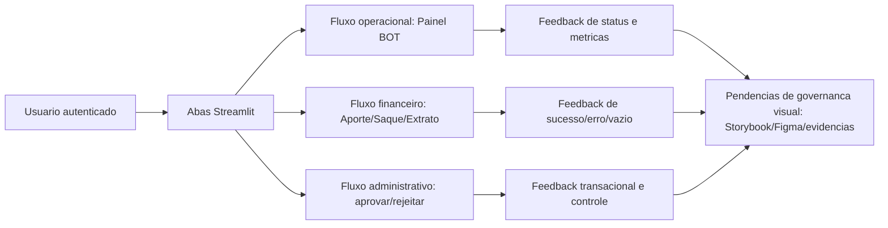

# Design System — OBS Pro Bot (Streamlit)

## Identificacao

- Projeto ou produto: OBS Pro Bot
- Responsavel UX: UX Expert
- Responsavel tecnico Storybook: Senior Developer (sustentacao tecnica prevista), **pendente de estrutura no repositório**
- Data da versao: 2026-03-22
- Fonte principal de referencia: Aplicacao real (`dashboard.py`) + documentos versionados (`docs/declaracao-escopo-aplicacao.md`, `docs/system-design.md`)

## Objetivo do documento

- Escopo do Design System: consolidar contratos visuais e comportamentais do frontend Streamlit existente (abas, componentes, estados e feedbacks de interface).
- Problemas de experiencia que ele resolve:
  - reduzir ambiguidade entre comportamento esperado e implementado;
  - padronizar feedback de sucesso/erro/vazio;
  - explicitar pendencias de governanca visual (Figma/Storybook/evidencias reais).
- Publico consumidor do documento: UX Expert, Senior Developer, QA Expert, Tech Lead e stakeholders de aprovacao.
- Status: **Em implementacao** (baseline documental publicado; governanca visual completa ainda pendente).

## Fundamentos visuais

- Principios de design:
  1. **Feedback imediato ao usuario**: a UI usa mensagens de `st.success`, `st.error`, `st.warning` e `st.info` para confirmar resultado de acao.
  2. **Transparencia de estado operacional**: painel mostra status por par (`COMPRADO`/`FLAT`), metricas e ultimo ciclo.
  3. **Seguranca orientada a tarefa**: mensagens de alerta para uso de API key sem permissao de saque e obrigatoriedade de cadastro de chaves antes de operar.
  4. **Progressive disclosure por perfil**: aba de administracao aparece apenas para `role == "admin"`.
- Tokens de cor:
  - Nao ha dicionario de design tokens versionado no repositório.
  - Cores derivam dos componentes nativos do Streamlit (tema default e sem especificacao de paleta proprietaria no repo).
- Tipografia:
  - Tipografia padrao do Streamlit (sem definicao de familia tipografica custom no repositorio).
- Espacamento e grid:
  - Layout base `st.set_page_config(layout="wide")`.
  - Composicao com `st.columns(...)`, `st.expander(...)`, `st.divider()` e `st.tabs(...)`.
- Iconografia:
  - Predominio de emojis em titulos, abas e acoes (ex.: `📊`, `💰`, `⚙️`, `✅`, `❌`).
- Elevacao e sombras:
  - Nao aplicavel explicitamente (componentes nativos Streamlit, sem camada CSS custom registrada).

## Componentes do sistema

| Componente | Objetivo | Estados | Variacoes | Link Storybook | Referencia Figma | Status |
|---|---|---|---|---|---|---|
| Sidebar de autenticacao (`Login`, `Cadastro`, `Auto atualizacao`) | Entrada no sistema e sessao persistente | Sucesso login, erro credencial, sessao ativa, sessao encerrada | Usuario autenticado vs nao autenticado | Pendente | Pendente | Implementado em `dashboard.py` |
| Navegacao por abas (`st.tabs`) | Organizar fluxos por contexto funcional | Aba visivel, conteudo vazio, conteudo preenchido | Admin inclui aba extra `⚙️ Administração` | Pendente | Pendente | Implementado |
| Toggle de operacao do bot (`st.toggle`) | Ativar/desativar bot por usuario | ON/OFF, desabilitado sem API key | Texto dinamico com limites TP/SL e max pares | Pendente | Pendente | Implementado |
| Cards de metricas (`st.metric`) | Exibir saldo, status, PnL, taxas e KPIs | Valor numerico, valor indisponivel (`—`) | Blocos por aba (Painel, Conta, Saque) | Pendente | Pendente | Implementado |
| Mensageria de feedback (`st.success/error/warning/info`) | Confirmar resultado de acao e orientar recuperacao | Sucesso, erro, alerta, informativo | Mensagens em login, chaves, aporte, saque, admin | Pendente | Pendente | Implementado |
| Tabelas (`st.dataframe`) | Exibir historico operacional e financeiro | Com dados, vazio | Deposits, withdrawals, ledger, usuarios, bots | Pendente | Pendente | Implementado |
| Formularios e inputs (`st.form`, `text_input`, `number_input`, `selectbox`) | Captura de dados transacionais e configuracao | Campo valido, validacao de erro, envio confirmado | Chaves API, aporte, saque, aprovacoes admin | Pendente | Pendente | Implementado |

## Interfaces e padroes de composicao

| Interface ou fluxo | Componentes envolvidos | Objetivo de uso | Status | Observacoes |
|---|---|---|---|---|
| Login e recuperacao de sessao via `sid` | Sidebar login + query params + mensagens de erro/sucesso | Autenticar e persistir sessao por token | Implementado | Sessao por query param exige atencao de seguranca operacional no ARD |
| Painel BOT | Toggle + expanders por simbolo + metricas + historico | Monitorar operacao por par e performance global | Implementado | Mostra `last_error` como `info` (aguardando/cooldown) ou `error` (falha) |
| Gestao de chaves API | Aviso de seguranca + formulario + mensagem de confirmacao | Cadastrar credenciais da Binance | Implementado | Exibe prefixo da key cadastrada |
| Aporte | Endereco fixo + formulario + tabela de solicitacoes | Solicitar deposito e acompanhar status | Implementado | Endereco exibido via `DEPOSIT_ADDRESS_FIXED` |
| Saque | Saldo + simulacao de taxa + formulario + historico | Solicitar saque e acompanhar processamento | Implementado | Mostra taxa e liquido antes do envio |
| Extrato | Tabela + download CSV | Consultar movimentacoes do ledger | Implementado | Limite de 500 linhas |
| Administracao (apenas admin) | Tabelas, botoes de aprovacao/rejeicao, controle de bots | Operar fluxos pendentes e governanca operacional | Implementado | Inclui aprovar/rejeitar deposito e saque, marcar pago |

## Imagens de proposta

| Item | Descricao | Origem da imagem | Caminho ou referencia | Observacoes |
|---|---|---|---|---|
| Baseline visual de componentes e fluxos | **Pendencia**: nao ha mockups/prototipos versionados no repositorio | N/A | N/A | Repositorio nao contem arquivos de proposta visual (Figma export, PNG, JPG, etc.) |

## Imagens reais apos implementacao

| Item | Descricao | Origem da captura | Caminho ou referencia | Diferencas para proposta |
|---|---|---|---|---|
| Capturas da aplicacao Streamlit em execucao | **Pendencia**: nao ha pacote de evidencias visuais anexado no repositorio | N/A | N/A | Nao comparavel sem imagem de proposta e sem screenshot versionado |

## Storybook.js

- URL ou localizacao: **Pendente** (nao ha estrutura `.storybook` nem projeto Storybook no repositório).
- Estrutura de categorias: **Pendente**.
- Convencoes de stories: **Pendente**.
- Cobertura atual de componentes: 0% (nenhum story versionado).
- Pendencias tecnicas:
  1. criar estrutura Storybook e categorias iniciais alinhadas as abas/fluxos do Streamlit;
  2. definir contrato de estados criticos por componente (loading, vazio, erro, sucesso);
  3. integrar manutencao com Senior Developer.

## Referencias de Figma quando disponivel

- Projeto ou arquivo: **Pendente** (nenhuma referencia Figma encontrada no repositório).
- Paginas consultadas: N/A.
- Componentes ou fluxos relevantes: N/A.
- Divergencias encontradas entre Figma e implementacao: N/A (inexistencia de fonte Figma vinculada).

## Criterios de acessibilidade e responsividade

- Regras de acessibilidade aplicadas (evidencia observavel no codigo):
  - labels textuais em inputs e botoes;
  - feedback textual redundante com icone/emoji (nao apenas cor);
  - avisos explicitos para acoes sensiveis (chaves API).
- Comportamento em breakpoints:
  - app usa layout responsivo padrao do Streamlit com `layout="wide"`;
  - blocos em colunas podem empilhar conforme largura de tela (comportamento nativo esperado do Streamlit);
  - nao ha especificacao custom de breakpoints no repositório.
- Estados criticos contemplados (com evidencias em `dashboard.py`):
  - **Sucesso:** confirmacoes de cadastro, envio de aporte/saque, aprovacoes admin, salvamento de chaves.
  - **Erro:** credenciais invalidas, excecoes de operacao, validacoes de formulario.
  - **Vazio:** listas sem registros (`Sem operações`, `Sem aportes`, `Sem saques`, `Sem movimentações`, etc.).
  - **Carregamento:** **parcial** — nao existe padrao explicito com spinner/skeleton; usa auto-atualizacao e renderizacao direta.
- Pendencias conhecidas:
  1. falta baseline formal de contraste, foco de teclado e ordem de navegacao;
  2. ausencia de especificacao WCAG versionada;
  3. ausencia de contrato de loading consistente por fluxo.

## Governanca e manutencao

- Responsavel pela evolucao visual: UX Expert.
- Responsavel pela sustentacao tecnica: Senior Developer (frontend Streamlit e futura estrutura Storybook).
- Frequencia de revisao: a cada alteracao de UI/fluxo critico ou fechamento de CR de frontend.
- Gatilhos para atualizacao:
  - mudanca em abas, formularios, feedbacks ou estados de erro/sucesso;
  - inclusao de novos componentes na interface;
  - publicacao de Storybook/Figma/evidencias visuais reais.

## Proximos passos

1. Publicar pacote minimo de evidencias visuais reais (capturas versionadas da aplicacao em execucao).
2. Estruturar Storybook.js e mapear componentes por aba com estados criticos.
3. Vincular referencia Figma quando existir fonte oficial de proposta visual.
4. Evoluir criterios de acessibilidade para checklist auditavel (contraste, foco, navegacao por teclado e leitura assistiva).

