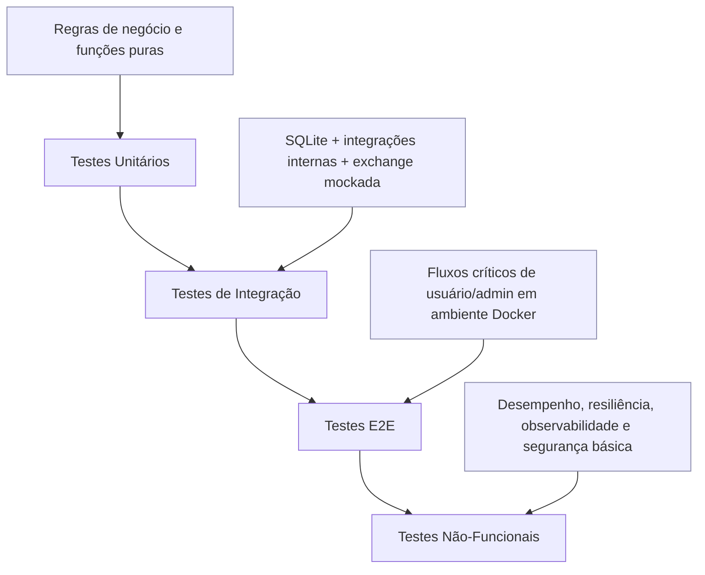

# Plano de Testes — OBS PRO BOT

## 1. Objetivo e escopo

Este documento define a estratégia de qualidade para validar a aplicação **OBS PRO BOT** no estado atual (**AS-IS**), com foco em reduzir risco operacional e prevenir regressões em produção.

### 1.1 Objetivos
- Validar fluxos críticos: autenticação, chaves API, operação do bot, aportes/saques, administração, operação em Docker e observabilidade.
- Estruturar testes por níveis (unitário, integração, E2E e não-funcionais).
- Garantir **rastreabilidade US/UC → testes**.
- Estabelecer critérios de entrada/saída, gestão de defeitos e execução contínua.
- Definir caminho para atingir **>= 90% de cobertura** em código Python crítico.

### 1.2 Escopo funcional coberto
Baseado nos artefatos:
- `README.md`
- `docs/user-stories.md`
- `docs/cases/*.md` (UC-001..064)
- `SUMARIO_EXECUTIVO.md`
- `RELATORIO_ANALISE_AS-IS.md`

Módulos cobertos no plano:
1. Autenticação e sessão
2. Chaves API e conectividade
3. Bot trading (entrada, saída, cooldown, retry, sincronismo de tempo)
4. Financeiro interno (aportes/saques/ledger)
5. Administração
6. Operação (Docker) e observabilidade (logs)

### 1.3 Fora de escopo (neste ciclo)
- Refatorações de arquitetura.
- Alterações funcionais de negócio.
- Testes em Django/JasperReports (não há implementação desses frameworks na base atual).

> **Suposição S1:** a aplicação permanece AS-IS (Streamlit + Python + SQLite + bot em processo separado), sem migração de stack durante este plano.

---

## 2. Estratégia de testes por nível

A estratégia segue a pirâmide de testes, priorizando automação nos níveis de maior estabilidade.



### 2.1 Testes unitários (base de cobertura)
**Objetivo:** validar regras de negócio isoladas, sem I/O externo.

Escopo prioritário:
- Regras de autenticação/sessão
- Validações de entrada (cadastro, saque, aporte)
- Cálculos financeiros (taxas, PnL, métricas)
- Regras da estratégia (entrada/saída, cooldown)
- Transições válidas de status (PENDING → APPROVED/REJECTED → PAID)

Abordagem:
- `unittest` (stdlib Python) + `unittest.mock`
- Mocks para integrações com exchange e relógio
- Casos positivos, negativos e borda

Meta:
- Cobertura mínima de linhas por módulo crítico >= 90%

### 2.2 Testes de integração
**Objetivo:** validar interação entre componentes locais.

Escopo prioritário:
- Persistência em SQLite (`users`, `sessions`, `user_keys`, `deposits`, `withdrawals`, `ledger`, `bot_state`, `bot_trades`)
- Fluxos completos com transação lógica (ex.: aprovação de depósito gera ledger)
- Runner do bot com dependências mockadas
- Leitura/escrita de logs (`BOT_LOG_PATH`)

Abordagem:
- Banco de teste isolado por execução
- Seed determinística de dados
- Testes idempotentes

### 2.3 Testes E2E
**Objetivo:** validar jornadas ponta a ponta orientadas às histórias de usuário.

Escopo prioritário:
- Login/cadastro/logout
- Cadastro de chaves e ativação/desativação do bot
- Solicitação/revisão de aporte e saque
- Marcação de saque como pago
- Exportação de extrato
- Subida e operação web+bot em Docker

Abordagem:
- Execução em ambiente dockerizado com volume temporário
- Evidências por logs, snapshots de banco e artefatos CSV

### 2.4 Testes não-funcionais
1. **Performance**
   - Tempo de resposta dos fluxos críticos de UI e operações de banco.
   - Tempo de ciclo do bot e impacto de retry.
2. **Resiliência**
   - Queda transitória de exchange (retry)
   - Indisponibilidade temporária de horário de servidor
3. **Segurança básica**
   - Credenciais default ativas
   - Gestão de sessão e exposição de token
4. **Operabilidade/observabilidade**
   - Verificação de logs mínimos por ciclo
   - Integridade de subida/queda via Docker Compose

---

## 3. Matriz de cobertura (US/UC x tipo de teste)

Legenda: **U** Unitário | **I** Integração | **E** E2E | **NF** Não-funcional

| ID | Tema | U | I | E | NF | Criticidade |
|---|---|---|---|---|---|---|
| US/UC-001..003 | Autenticação e sessão | X | X | X | X (segurança) | Alta |
| US/UC-010 | Chaves API | X | X | X | X (segurança) | Alta |
| US/UC-020 | Ativar/desativar bot | X | X | X | X (resiliência) | Alta |
| US/UC-021 | Entrada por sinal | X | X | X | X (performance) | Alta |
| US/UC-022 | Saída por TP/SL/sinais | X | X | X | X (resiliência) | Alta |
| US/UC-023 | Métricas de performance | X | X | X | X (consistência) | Média |
| US/UC-030 | Solicitar aporte | X | X | X |  | Alta |
| US/UC-031 | Revisar aporte (admin) | X | X | X | X (auditoria) | Alta |
| US/UC-032 | Solicitar saque | X | X | X | X (segurança) | Alta |
| US/UC-033 | Revisar saque (admin) | X | X | X | X (auditoria) | Alta |
| US/UC-034 | Marcar saque pago | X | X | X | X (auditoria) | Alta |
| US/UC-035 | Exportar extrato CSV | X | X | X | X (integridade dados) | Média |
| US/UC-040 | Painel administrativo | X | X | X | X (controle de acesso) | Alta |
| US/UC-050 | Subir stack via Docker |  | X | X | X (operação) | Alta |
| US/UC-051 | Monitorar logs |  | X | X | X (observabilidade) | Média |
| US/UC-060 | Cooldown pós-SL | X | X | X | X (resiliência) | Alta |
| US/UC-061 | Contador de losses | X | X | X | X (consistência) | Média |
| US/UC-062 | Teste conectividade API | X | X | X | X (resiliência) | Média |
| US/UC-063 | Retry de exchange | X | X | X | X (resiliência) | Alta |
| US/UC-064 | Sync relógio exchange | X | X | X | X (resiliência) | Média |

### 3.1 Cobertura mínima por área
- Regras críticas (financeiro, autenticação, trading): **>= 90%**
- Demais áreas: **>= 80%**
- Cobertura global alvo da base: **>= 90%**

> **Suposição S2:** caso ferramenta de cobertura ainda não esteja instalada no ambiente de CI, será adicionada como dependência de desenvolvimento sem alterar runtime de produção.

---

## 4. Critérios de entrada e saída

### 4.1 Critérios de entrada
- Documentação funcional atualizada (`docs/user-stories.md`, `docs/cases/*.md`).
- Ambiente de teste provisionado (local e docker).
- Massa de dados mínima disponível.
- Casos de teste priorizados por risco.

### 4.2 Critérios de saída
- 100% dos testes críticos executados.
- 0 defeitos abertos de severidade **Crítica** e **Alta** sem plano de mitigação aprovado.
- Cobertura mínima atingida nos módulos críticos (>= 90%).
- Evidências arquivadas (log de execução, relatório de defeitos, resultado por suíte).

---

## 5. Ambientes e dados de teste

### 5.1 Ambientes
1. **Local Dev QA**
   - Python 3.11
   - SQLite arquivo temporário
2. **Docker Compose QA**
   - Serviços `web` e `bot`
   - Volume isolado para teste
3. **Ambiente de homologação (quando disponível)**
   - Configuração próxima da produção

### 5.2 Dados de teste
Perfis mínimos:
- Usuário comum sem chave API
- Usuário comum com chave API válida (mockada)
- Usuário admin

Estados de dados:
- `deposits` e `withdrawals` em `PENDING`, `APPROVED`, `REJECTED`, `PAID`
- ledger com histórico para extrato
- `bot_state` habilitado/desabilitado
- conjunto de trades com ganho/perda para métricas

Diretrizes:
- Dados sintéticos, sem dados reais de clientes.
- Reset por suíte para garantir reprodutibilidade.

---

## 6. Gestão de defeitos, riscos e priorização

### 6.1 Classificação de severidade
- **S1 Crítica:** risco financeiro, segurança grave, indisponibilidade geral.
- **S2 Alta:** quebra de fluxo principal sem workaround seguro.
- **S3 Média:** falha com workaround ou impacto parcial.
- **S4 Baixa:** impacto cosmético/documental.

### 6.2 Priorização (impacto x urgência)
- **P0:** corrigir antes de release.
- **P1:** corrigir na sprint corrente.
- **P2:** planejar backlog.

### 6.3 Template de bug (Issue Tracking)

**Título:** `[SEV-{Sx}] [Módulo] Resumo curto`

**Descrição:**
- Contexto funcional
- Pré-condições
- Evidência (log, print, saída)

**Passos para reproduzir:**
1. ...
2. ...
3. ...

**Comportamento esperado:** ...

**Comportamento atual:** ...

**Impacto no negócio:** ...

**Criticidade/Prioridade:** `Sx / Px`

**Sugestão de correção:** ...

---

## 7. Plano de automação

### 7.1 Fases
1. **Fase 1 — Base unitária e integração crítica**
   - Priorizar autenticação, financeiro e estratégia do bot.
2. **Fase 2 — E2E dos fluxos Must**
   - UC-001/002/010/020/021/022/030/031/032/033/034/050.
3. **Fase 3 — Não-funcionais e hardening**
   - Resiliência de exchange, performance de ciclo, segurança operacional.

### 7.2 Ferramentas aderentes ao cenário atual
- **Python `unittest` + `unittest.mock`** (nativo).
- **SQLite** com banco de teste temporário.
- **Docker Compose** para execução integrada web+bot.
- Scripts shell para orquestração e coleta de evidências.

> **Suposição S3:** ferramentas adicionais de apoio (ex.: medição de cobertura) podem ser adicionadas apenas como dependência de desenvolvimento, sem impacto no runtime dos containers.

### 7.3 Exemplo de estrutura de suíte (sugestão)
- `tests/unit/`
- `tests/integration/`
- `tests/e2e/`
- `tests/non_functional/`

### 7.4 Snippets de referência (Python)

```python
import unittest
from unittest.mock import patch

class TestCooldownRule(unittest.TestCase):
    def test_should_block_entry_during_cooldown(self):
        last_sl_ts = 1_700_000_000
        now_ts = last_sl_ts + 120  # 2 min
        cooldown_s = 300

        can_enter = (now_ts - last_sl_ts) >= cooldown_s

        self.assertFalse(can_enter)
```

```python
import unittest
import sqlite3

class TestDepositApprovalIntegration(unittest.TestCase):
    def test_approve_deposit_must_create_ledger_entry(self):
        conn = sqlite3.connect(":memory:")
        cur = conn.cursor()
        cur.execute("CREATE TABLE deposits (id INTEGER, status TEXT)")
        cur.execute("CREATE TABLE ledger (id INTEGER, kind TEXT, amount REAL)")

        cur.execute("INSERT INTO deposits VALUES (1, 'PENDING')")
        cur.execute("UPDATE deposits SET status='APPROVED' WHERE id=1")
        cur.execute("INSERT INTO ledger VALUES (1, 'DEPOSIT', 100.0)")

        approved = cur.execute("SELECT status FROM deposits WHERE id=1").fetchone()[0]
        ledger_count = cur.execute("SELECT COUNT(*) FROM ledger").fetchone()[0]

        self.assertEqual(approved, "APPROVED")
        self.assertEqual(ledger_count, 1)
```

---

## 8. Pipeline e execução em CI

### 8.1 Etapas mínimas do pipeline
1. **Validação de ambiente**
   - `python --version`
   - `docker compose version`
2. **Execução de testes unitários/integrados**
3. **Execução E2E smoke**
4. **Gates de qualidade**
   - cobertura mínima em módulos críticos
   - ausência de falhas S1/S2 abertas sem aceite
5. **Publicação de artefatos**
   - log de testes
   - relatório de cobertura
   - sumário de defeitos

### 8.2 Sequência de comandos (referência)
```bash
python -m unittest discover -s tests/unit -p "test_*.py"
python -m unittest discover -s tests/integration -p "test_*.py"
python -m unittest discover -s tests/e2e -p "test_*.py"
docker compose up -d --build
# coleta de evidências

docker compose logs web > artifacts/web.log

docker compose logs bot > artifacts/bot.log

docker compose down -v
```

---

## 9. Checklist de regressão por módulo

### 9.1 Autenticação e sessão
- [ ] Cadastro válido cria usuário único
- [ ] Login válido cria sessão
- [ ] Logout remove sessão
- [ ] Sessão expirada é recusada
- [ ] Acesso admin bloqueado para `role=user`

### 9.2 Chaves API
- [ ] Salvar chave/secret com campos obrigatórios
- [ ] Teste de conectividade retorna status claro (sucesso/falha)
- [ ] Sem chave válida, bot não habilita operação real

### 9.3 Bot trading
- [ ] Entrada só ocorre com sinais válidos
- [ ] Saída por TP/SL/sinal técnico
- [ ] Cooldown pós-SL impede reentrada precoce
- [ ] Retry em falha transitória respeita limite
- [ ] Sincronização de horário não interrompe ciclo em falha temporária
- [ ] Métricas (winrate/PnL/losses) consistentes

### 9.4 Aportes e saques
- [ ] Aporte exige TXID e gera `PENDING`
- [ ] Aprovação/rejeição de aporte é única
- [ ] Saque valida saldo/rede/endereço
- [ ] Revisão de saque só em `PENDING`
- [ ] Marcação `PAID` exige `APPROVED` + TXID
- [ ] Extrato CSV reflete ledger do usuário autenticado

### 9.5 Administração
- [ ] Painel admin visível apenas para admin
- [ ] Pendências financeiras exibidas corretamente
- [ ] Status de bot por usuário consistente com base

### 9.6 Operação e observabilidade
- [ ] `docker compose up` sobe web+bot
- [ ] Persistência em volume compartilhado funcional
- [ ] Logs do bot gerados no arquivo configurado
- [ ] `docker compose down` encerra sem resíduos críticos

---

## 10. Riscos de qualidade e mitigação

| Risco | Impacto | Probabilidade | Mitigação |
|---|---|---|---|
| Inconsistência financeira em ledger | Alto | Médio | Testes de integração transacionais + reconciliação |
| Falha de exchange em runtime | Alto | Alto | Testes de retry/timeouts e fallback |
| Exposição de credenciais/sessão | Alto | Médio | Testes de segurança básica + hardening de configuração |
| Regressão em operação Docker | Médio | Médio | Smoke E2E por release |
| Divergência docs x comportamento real | Médio | Médio | Rastreabilidade US/UC com revisão por sprint |

---

## 11. Evidências e governança

Evidências mínimas por execução:
- ID da suíte e data/hora
- resultado (pass/fail/skipped)
- logs anexos
- bugs abertos/atualizados
- decisão de liberação

Ritos recomendados:
- Daily de defeitos críticos
- Go/No-Go com QA + responsável técnico
- Retro de falhas de produção para aumentar suíte de regressão

---

## 12. Assunções e lacunas mapeadas

1. O projeto atual é **Streamlit/Python**, não Django; o plano foi adaptado ao estado real.
2. JasperReports não está presente na base; não há suíte específica neste ciclo.
3. Ferramenta de coverage pode exigir inclusão de dependência de desenvolvimento para aferição automática.
4. Testes E2E podem iniciar com smoke orientado a evidência de banco/log enquanto automação completa de UI é maturada.
