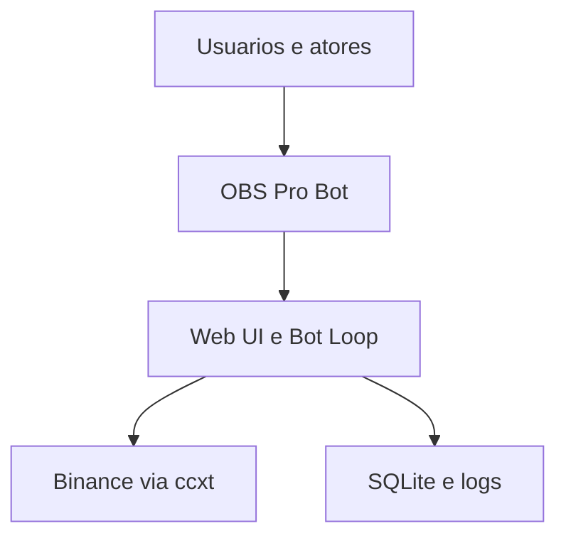
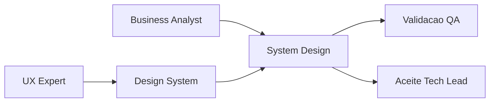
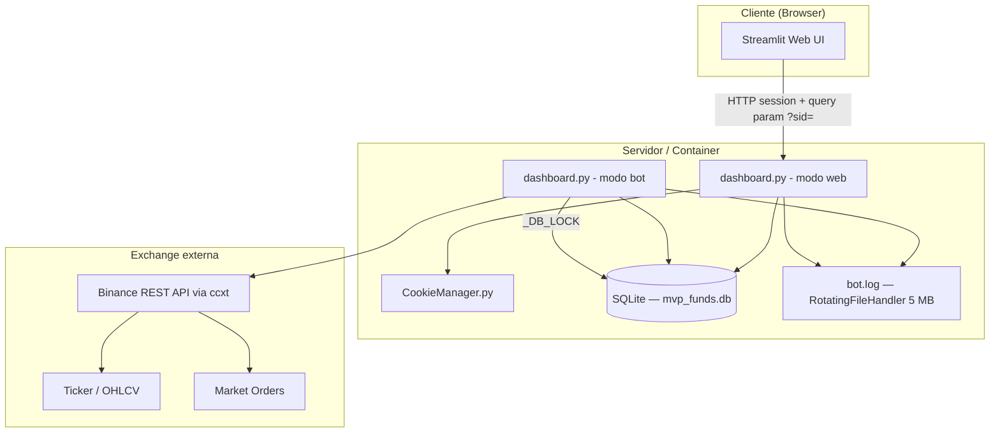
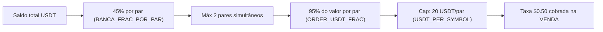
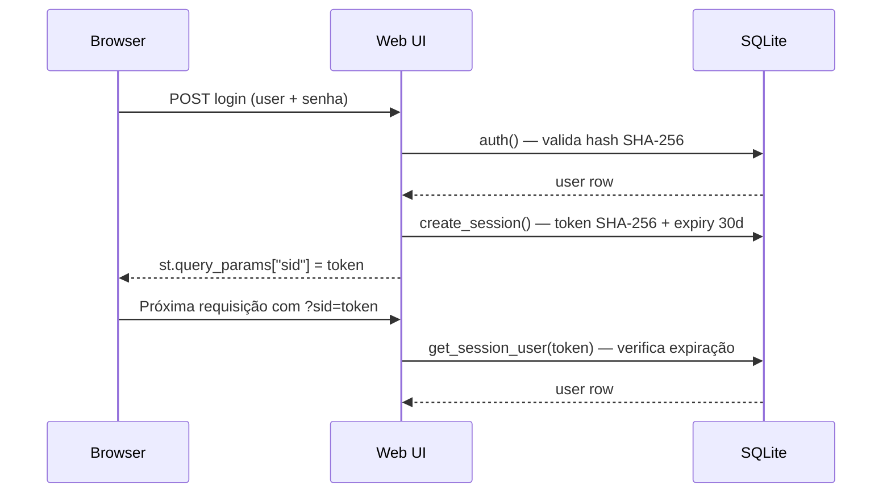
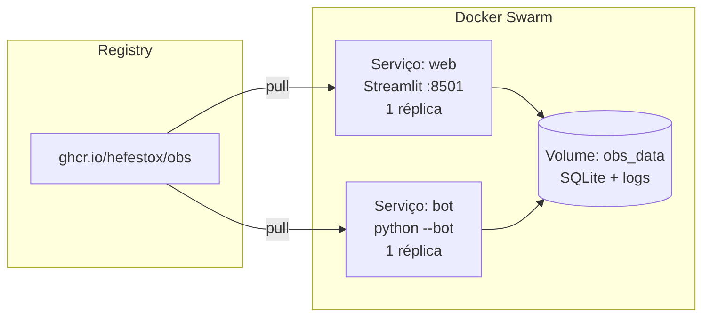
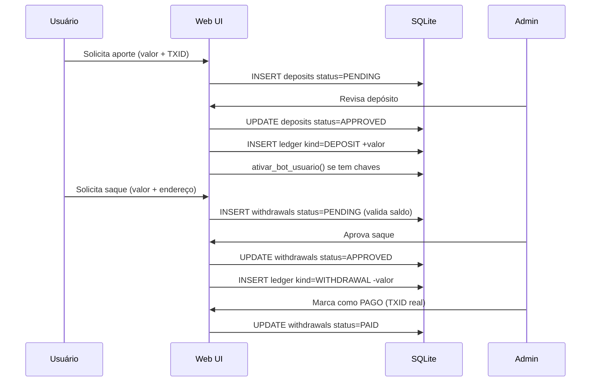

# System Design — OBS Pro Bot v5.0.x

**Data:** 2026-03-21  
**Versão:** 5.0.1  
**Stack:** Python 3.11 · Streamlit · ccxt · SQLite · Docker / Docker Swarm  
**Status:** Em evolução (hardening de documentação e aceite formal)

---

## Identificação

- Projeto ou produto: OBS Pro Bot
- Responsável Business Analyst: **Pendente de nomeação formal no repositório**
- Responsável técnico principal: Tech Lead
- Data da versão: 2026-03-21
- Status: Em evolução

## Objetivo do documento

- Problema de negócio endereçado: automatizar operação de trading spot com controle de risco, fluxo financeiro auditável e operação contínua.
- Escopo contemplado: autenticação/sessão, operação de bot, financeiro (aportes/saques/ledger), implantação Compose/Swarm, observabilidade básica e premissas de capacidade.
- Escopo fora: multi-exchange, futures/margin, ordens avançadas, app mobile nativo, 2FA, backtesting.
- Premissas: Binance disponível, variáveis críticas injetadas por ambiente, volume persistente compartilhado entre web e bot.
- Restrições: SQLite como persistência atual, 1 réplica do bot loop, hardening de segurança ainda pendente em pontos específicos.

## Visão geral da solução

- Resumo executivo da arquitetura: aplicação monolítica em `dashboard.py` operando em dois modos (Web UI e Bot Loop) com persistência SQLite compartilhada e integração ccxt/Binance.
- Principais capacidades do sistema: execução automática de estratégia técnica, gestão financeira com aprovação administrativa, segregação por usuário e operação containerizada.
- Principais riscos arquiteturais: limite de escala do SQLite, credenciais/senhas com hardening pendente, ausência de pacote formal consolidado de evidências QA para fechamento.

## Componentes e responsabilidades

| Componente | Responsabilidade | Entradas | Saídas | Dependências | Observações |
|---|---|---|---|---|---|
| Web UI (Streamlit) | Fluxos de usuário/admin, sessão, gestão financeira e monitoramento | Interações HTTP, token `sid`, dados de banco | Atualizações em tabelas de domínio, telas operacionais | `dashboard.py`, `CookieManager.py`, SQLite | Mesmo código-fonte do bot loop, com runtime distinto |
| Bot Loop | Execução periódica da estratégia e controle de risco | Estado de usuário/par, dados de mercado, configurações | Ordens, atualização `bot_state`, `bot_trades`, `ledger`, logs | ccxt/Binance, SQLite, logger | Escalonamento horizontal não suportado no estado atual |
| SQLite (`mvp_funds.db`) | Persistência transacional da aplicação | Escritas/leitura dos módulos web/bot | Estado consolidado de auth, bot e financeiro | Volume Docker compartilhado, `_DB_LOCK` | Limite de concorrência para crescimento elevado |
| Logging (`bot.log`) | Rastreabilidade operacional | Eventos da aplicação | Arquivos rotativos 5MB x 2 | RotatingFileHandler | Base para evidência operacional e troubleshooting |
| Exchange Adapter (ccxt) | Integração com Binance Spot | API keys, chamadas de ticker/ordens | Dados de mercado e execução | API Binance | Retry e cache parcial implementados |

## Integrações e contratos

| Integração | Tipo | Origem | Destino | Contrato ou protocolo | Risco principal |
|---|---|---|---|---|---|
| UI -> Backend local | Interna | Browser/Streamlit | `dashboard.py` (modo web) | HTTP sessão + query param `sid` | Sessão em URL demanda hardening operacional |
| Bot -> Binance | Externa | Bot loop | Binance via ccxt | REST API (ticker/OHLCV/order) | Latência/instabilidade da exchange |
| Web/Bot -> SQLite | Interna | Processos locais | `mvp_funds.db` | SQL transacional com WAL e lock | Contenção de escrita sob aumento de carga |

## Arquitetura de desenvolvimento

- Ambientes necessários: workstation com Python 3.11 e/ou Docker Compose.
- Dependências locais: `requirements.txt`, acesso de rede à Binance para testes integrados.
- Serviços de apoio: volume persistente para DB/log, variáveis de ambiente de sessão/admin.
- Observações de setup: iniciar web e bot separadamente; validar presença de `SESSION_SECRET`.

## Arquitetura de produção

- Topologia: Docker Swarm com serviços `web` e `bot`, ambos consumindo a mesma imagem e volume.
- Componentes implantados: Streamlit web (1 réplica), bot loop (1 réplica), volume `obs_data`.
- Observabilidade: logs rotativos em arquivo + logs de container.
- Alta disponibilidade e resiliência: resiliência lógica no loop (tratamento de erro por usuário), sem HA horizontal do bot atualmente.
- Política de rollback: rollback via tag de imagem anterior no stack deploy.

## Implantação

### Desenvolvimento

1. Configurar variáveis de ambiente mínimas (`SESSION_SECRET`, admin e paths).
2. Subir serviços com `docker-compose up -d` ou executar modos web/bot manualmente.
3. Validações após implantação: login funcional, bot loop ativo, escrita em DB/log.

### Produção

1. Publicar/selecionar imagem versionada no registry.
2. Executar `docker stack deploy -c docker-stack.yml obs`.
3. Validações após implantação: saúde dos serviços, atualização de estado do bot, fluxo financeiro básico e logs.

## Dimensionamento da aplicação

- Premissas de carga: dezenas de usuários simultâneos com ciclo de bot de 15s.
- Volume esperado: 2 pares padrão por usuário (expansível), crescimento contínuo de `bot_trades` e `ledger`.
- Estratégia de escala: vertical no estado atual; futura segregação de persistência e workers.
- Gargalos conhecidos: SQLite para escrita concorrente, loop único de bot e dependência de API externa.
- Plano de expansão: migração para PostgreSQL + revisão de particionamento funcional do bot (pendente de priorização).

## Plano de dimensionamento e expansão do banco

- Fonte do handoff do DBA: `review/2026-03-23-0012-parecer-dba-cr08-revalidacao-gate.md`.
- Premissas de crescimento: aumento contínuo de histórico de trades/ledger por usuário, com padrão misto de leitura frequente e escrita transacional financeira.
- Estratégia de capacidade: curto prazo com SQLite + WAL; médio prazo com PostgreSQL para carga transacional e expansão de concorrência.
- Limites operacionais (baseline DBA): p95 de escrita financeira <= 250 ms; lock/timeout < 1% (janela 15 min); alerta de volume em 4 GB (warning) e 8 GB (crítico).
- Gatilhos de expansão SQLite -> PostgreSQL: 2+ gatilhos por 7 dias consecutivos (p95 > 250 ms, lock >= 1%, DB >= 8 GB, necessidade de múltiplas réplicas de escrita).
- Riscos de persistência: lock contention, aumento de latência de escrita/leitura e recuperação operacional limitada sem rotina de restore testada.
- Ações recomendadas: concluir CR-09/CR-10 (append-only + backup/restore testável), instrumentar métricas de capacidade e executar dry-run de migração.

## Seção obrigatória - Referência ao Design System

- Existe frontend ou interface relevante?: **Sim**
- Documento de Design System referenciado: `docs/design-system.md` (**publicado em baseline documental**)
- Responsável UX: UX Expert
- Link ou referência de Figma: **Pendente** (nenhuma referência de arquivo/projeto encontrada no repositório)
- Link ou referência de Storybook.js: **Pendente** (nenhuma estrutura `.storybook`/stories encontrada no repositório)
- Evidências visuais disponíveis: telas atuais via Streamlit mapeadas em `docs/design-system.md`, sem pacote de capturas versionadas anexado.
- Divergências conhecidas entre System Design e Design System:
  - Ausência de Figma, Storybook e imagens reais versionadas como fonte de governança visual contínua.
  - Estados críticos possuem baseline textual no Design System, porém sem evidência visual anexada.
- Plano de tratamento das divergências:
  1. UX Expert manter `docs/design-system.md` sincronizado a cada mudança de interface.
  2. Senior Developer estruturar Storybook.js para documentação de componentes e estados.
  3. UX Expert vincular referência Figma quando houver fonte oficial disponível.
  4. QA incorporar checklist visual no artefato `templates/qa-validacao-frontend-template.md`.

## Critérios de aceite e rastreabilidade

- Requisitos cobertos: blocos de autenticação, bot, financeiro e infraestrutura definidos no PRD.
- Critérios de aceite por capacidade: definidos no PRD e refletidos neste ARD por arquitetura e fluxos operacionais.
- Evidências de validação esperadas: execução QA funcional por blocos críticos + evidência de implantação e observabilidade.
- Dependências de QA, UX e DBA:
  - QA: validação formal (incluindo frontend quando aplicável) — **reprovada no gate CR-07 revalidado** (`review/2026-03-22-2358-qa-validacao-frontend-cr07-revalidacao.md`).
  - UX: Design System referenciado em `docs/design-system.md`; validação visual completa (Figma/Storybook/evidências) — **parcial, com pendências abertas**.
  - DBA: handoff de capacidade/expansão incorporado no CR-08, com pendências P1 de execução (append-only e backup/restore testado).

## Matriz curta de rastreabilidade cruzada PRD <-> ARD

| Bloco | Referência no PRD | Referência no ARD | Situação |
|---|---|---|---|
| Autenticação e sessão | Escopo funcional 5.1 + critérios seção 10 | Critérios/rastreabilidade + seção técnica 7 | Alinhado com hardening pendente |
| Bot e risco operacional | Escopo 5.2 + critérios bot seção 10 | Componentes/integrações/dimensionamento + seções técnicas 4/5/6/11 | Alinhado |
| Financeiro e ledger | Escopo 5.4 + critérios financeiro seção 10 | Componentes + fluxo financeiro técnico seção 10 | Alinhado |
| Infra e operação | Escopo 5.6 + premissas/restrições | Arquitetura dev/prod + implantação + seção técnica 8 | Alinhado |
| UX/Design System | Interface web no escopo | Seção obrigatória de Design System + `docs/design-system.md` | **Parcial** (documento publicado; pendências visuais abertas) |

## Decisões e trade-offs

| Decisão | Alternativas consideradas | Justificativa | Impacto |
|---|---|---|---|
| Persistir em SQLite no estágio atual | PostgreSQL desde início | Simplicidade operacional para MVP e custo reduzido | Limita escala e exige plano de migração |
| Código único para web e bot | Serviços separados por código-base | Menor overhead de manutenção inicial | Acoplamento mais alto de responsabilidades |
| Sessão por token em query param | Cookie HttpOnly/session server-side estrito | Compatibilidade com fluxo Streamlit atual | Exige maior atenção de segurança operacional |

## Riscos e mitigações

| Risco | Impacto | Probabilidade | Mitigação | Owner |
|---|---|---|---|---|
| Saturação de concorrência em SQLite | Alto | Média | Planejar migração para PostgreSQL com janela controlada | Tech Lead + DBA |
| Hardening de credenciais/senhas incompleto | Alto | Alta | Eliminar defaults sensíveis e migrar hash para KDF | Tech Lead |
| Governança visual incompleta (sem Figma/Storybook/evidências reais versionadas) | Médio | Alta | Evoluir baseline publicado em `docs/design-system.md` com artefatos visuais e Storybook | UX Expert |
| Ausência de pacote final de evidências QA | Alto | Média | Consolidar evidências por bloco crítico antes do aceite | QA Expert |

## Divergências PRD/ARD/implementação/evidências

| Divergência | Origem | Impacto | Resolução proposta | Owner | Status |
|---|---|---|---|---|---|
| Flag `USE_RSI_EXIT` declarada sem efeito na lógica de saída | Implementação x PRD/ARD | Ambiguidade de escopo funcional e risco de interpretação | Implementar regra ou remover do escopo ativo até entrega | Tech Lead | Pendente |
| Hash de senha em SHA-256 puro | Implementação x requisito de segurança robusta | Exposição a brute force/offline cracking | Migrar para bcrypt/argon2 com plano de transição | Tech Lead | Pendente |
| `DEPOSIT_ADDRESS_FIXED` hardcoded | Implementação x operação segura | Mudança operacional exige rebuild e risco de erro manual | Externalizar em env var com validação | DevOps | Pendente |
| Governança visual sem Figma/Storybook/evidências reais anexadas | ARD x dependência UX | Risco de divergência entre interface implementada e documentação visual | Publicar referências visuais e estruturar Storybook mantendo vínculo com `docs/design-system.md` | UX Expert + Senior Developer | Pendente |
| Evidência QA consolidada para gates críticos não anexada | PRD/ARD x validação | Bloqueia fechamento formal de aceite | Executar e anexar evidências via templates de QA | QA Expert | Pendente |
| Plano de capacidade agora formalizado, porém sem validação operacional completa de backup/restore e append-only | ARD x operação real de dados | Risco residual de recuperação/auditoria insuficiente em incidente | Executar CR-09/CR-10 com evidência e revalidar gate DBA para aceite pleno | DBA + Tech Lead | Parcial |

## Diagramas Mermaid (governança e rastreabilidade)

### Contexto e componentes (governança)



### Implantação e vínculo com Design System/aceite



## Próximos passos

1. Fechar pendências de referência UX (Design System) com links rastreáveis.
2. Consolidar evidências QA para blocos críticos e gates formais.
3. Incorporar handoff DBA para plano de expansão de banco e atualizar dimensionamento.
4. Endereçar divergências de hardening de segurança antes do fechamento executivo.

---

## Anexo técnico existente (detalhamento preservado)

## 1. Visão geral

O **OBS Pro Bot** é uma plataforma SaaS de trading algorítmico de criptomoedas. Permite que múltiplos usuários conectem suas chaves API de exchanges (Binance), definam capital e delegam ao bot a execução automática de compras e vendas com base em indicadores técnicos.

O sistema opera em dois modos a partir do mesmo código-fonte (`dashboard.py`):

| Modo | Comando | Responsabilidade |
|---|---|---|
| **Web UI** | `streamlit run dashboard.py` | Interface do usuário, gestão de conta, painel de bot |
| **Bot loop** | `python dashboard.py --bot` | Loop de trading autônomo em background |

---

## 2. Arquitetura de componentes



---

## 3. Modelo de dados (SQLite)

```mermaid
erDiagram
    users {
        INTEGER id PK
        TEXT username UK
        TEXT pass_hash
        TEXT role
        TEXT created_at
        TEXT referrer_code
        TEXT my_code UK
    }
    user_keys {
        INTEGER user_id PK FK
        TEXT exchange
        TEXT api_key
        TEXT api_secret
        INTEGER testnet
        TEXT updated_at
    }
    deposits {
        INTEGER id PK
        INTEGER user_id FK
        REAL amount_usdt
        TEXT txid
        TEXT deposit_address
        TEXT status
        TEXT created_at
        TEXT reviewed_at
        INTEGER reviewed_by
        TEXT note
    }
    withdrawals {
        INTEGER id PK
        INTEGER user_id FK
        REAL amount_request_usdt
        REAL fee_rate
        REAL fee_usdt
        REAL amount_net_usdt
        TEXT network
        TEXT address
        TEXT paid_txid
        TEXT status
        TEXT created_at
        TEXT reviewed_at
        INTEGER reviewed_by
        TEXT note
    }
    ledger {
        INTEGER id PK
        INTEGER user_id FK
        TEXT kind
        REAL amount_usdt
        TEXT ref_table
        INTEGER ref_id
        TEXT created_at
    }
    bot_state {
        INTEGER id PK
        INTEGER user_id FK
        TEXT symbol
        INTEGER enabled
        REAL usdt
        REAL asset
        INTEGER in_position
        REAL entry_price
        REAL entry_qty
        TEXT entry_time
        TEXT last_step_ts
        TEXT last_error
        TEXT last_sl_time
        INTEGER daily_losses
        TEXT daily_loss_date
        TEXT updated_at
    }
    bot_trades {
        INTEGER id PK
        INTEGER user_id FK
        TEXT time
        TEXT symbol
        TEXT side
        REAL price
        REAL qty
        REAL fee_usdt
        REAL usdt_balance
        REAL asset_balance
        TEXT reason
        REAL pnl_usdt
        TEXT order_id
        REAL rsi_entry
        TEXT ema_signal
    }
    sessions {
        TEXT token PK
        INTEGER user_id FK
        TEXT created_at
        TEXT expires_at
    }

    users ||--o{ user_keys : "1:1"
    users ||--o{ deposits : ""
    users ||--o{ withdrawals : ""
    users ||--o{ ledger : ""
    users ||--o{ bot_state : ""
    users ||--o{ bot_trades : ""
    users ||--o{ sessions : ""
```

### Notas de persistência

- Todo acesso de escrita adquire `_DB_LOCK` (`threading.Lock`) antes de executar.
- `DB_PATH` é configurável via variável de ambiente (padrão: `mvp_funds.db`).
- WAL mode + `busy_timeout=30s` para concorrência segura entre web e bot.
- O ledger é a fonte primária do saldo do usuário — nunca calcule saldo diretamente de deposits/withdrawals.

---

## 4. Fluxo do bot loop (por ciclo de 15s)


---

## 5. Sinais de entrada e saída

### 5.1 Condições de entrada (todas obrigatórias)

| Filtro | Regra |
|---|---|
| **EMA 200 (H1)** | Preço > EMA200 na vela de 1h — tendência de alta |
| **EMA 50 (4H)** | Preço > EMA50 na vela de 4h — confirmação macro |
| **MACD linha** | MACD line > 0 — momentum positivo |
| **RSI (5m)** | 47 ≤ RSI ≤ 62 — zona de aceleração sem sobrecompra |
| **ATR (5m)** | ATR% ≥ 0,15% — mercado não é lateral |
| **Horário** | Configurável (`USE_TIME_FILTER`, desativado por padrão) |

### 5.2 Condições de saída

| Gatilho | Regra |
|---|---|
| **Take Profit** | Preço ≥ entry × (1 + 0,75%) |
| **Stop Loss** | Preço ≤ entry × (1 − 0,45%) |
| **Trailing Stop** | Ativa após ganho ≥ 0,45%; distância de 0,20% do pico |
| **Min Hold** | Posição mantida por no mínimo 420s antes de qualquer saída técnica |
| **Cooldown pós-SL** | 1200s de espera após stop loss antes de nova entrada |

---

## 6. Gestão de risco e capital



---

## 7. Autenticação e sessões



- Tokens de sessão: SHA-256 de `user_id|timestamp|SESSION_SECRET`.
- Expiry: 30 dias.
- `SESSION_SECRET` deve vir de variável de ambiente — nunca hardcoded em produção.

> ⚠️ **Atenção de segurança:** `DEFAULT_ADMIN_PASS` está hardcoded no código como valor padrão fallback (`LU87347748`). Em produção, sobrescrever obrigatoriamente via env var `DEFAULT_ADMIN_PASS`.

---

## 8. Implantação

### 8.1 Variáveis de ambiente obrigatórias

| Variável | Descrição |
|---|---|
| `SESSION_SECRET` | Chave de assinatura de tokens de sessão |
| `DEFAULT_ADMIN_USER` | Username do admin inicial |
| `DEFAULT_ADMIN_PASS` | Senha do admin (sobrescreve o padrão hardcoded) |
| `DB_PATH` | Caminho do banco SQLite (padrão: `mvp_funds.db`) |
| `BOT_LOG_PATH` | Caminho do log do bot (padrão: `bot.log`) |

### 8.2 Docker Compose (desenvolvimento local)

```yaml
# docker-compose.yml
services:
  web:    # Streamlit UI — porta 8501
  bot:    # Loop do bot — python dashboard.py --bot
```

Volume compartilhado `obs_data:/app/data` para banco e logs entre containers.

### 8.3 Docker Swarm (produção)

```bash
docker stack deploy -c docker-stack.yml obs
```

Imagem publicada em: `ghcr.io/hefestox/obs:latest`



---

## 9. Interface do usuário (abas)

| Aba | Perfil | Descrição |
|---|---|---|
| 📊 Painel BOT | user / admin | Status por par, toggle liga/desliga, métricas de performance, histórico de trades |
| 👤 Minha Conta | user / admin | Saldo no ledger, código de indicação |
| 🔑 Chaves API | user / admin | Salvar API Key + Secret da Binance (Spot only) |
| 💰 Aporte | user / admin | Solicitar depósito com TXID (aguarda aprovação admin) |
| 💸 Saque | user / admin | Solicitar retirada (taxa 5%, aprovação admin) |
| 📄 Extrato | user / admin | Movimentações do ledger, exportação CSV |
| ⚙️ Administração | admin | Gerenciar usuários, aprovar/rejeitar aportes e saques, controlar bots |

---

## 10. Fluxo financeiro (aportes e saques)



---

## 11. Dimensionamento atual e premissas

| Dimensão | Capacidade atual |
|---|---|
| Banco de dados | SQLite com WAL — adequado para dezenas de usuários simultâneos |
| Pares de trading | 2 pares (BTC/USDT, ETH/USDT) — expansível via `ALL_SYMBOLS` |
| Ciclo do bot | 15 segundos por ciclo completo |
| Cache de exchange | Reconstroído a cada 1h (evita MemoryError do `load_markets`) |
| Logs | Rotação automática: 5MB × 2 arquivos de backup |
| Sessões | SQLite, expiram em 30 dias |
| Threads | `_DB_LOCK` protege escrita; leituras podem ser concorrentes |

**Limitação conhecida:** SQLite não escala para centenas de usuários simultâneos. Candidate a migração para PostgreSQL (dependência `psycopg2-binary` já incluída no projeto).

---

## 12. Próximos passos recomendados

1. **Segurança:** Remover `DEFAULT_ADMIN_PASS` hardcoded — exigir sempre via env var.
2. **Testes:** Criar `tests/` com pytest cobrindo `bot_step`, indicadores e funções de banco.
3. **PostgreSQL:** Migrar de SQLite para PostgreSQL para suportar mais usuários.
4. **Webhook:** Adicionar notificações por Telegram/Discord em trades executados.
5. **Rate limiting:** Proteger endpoints de login contra força bruta.
