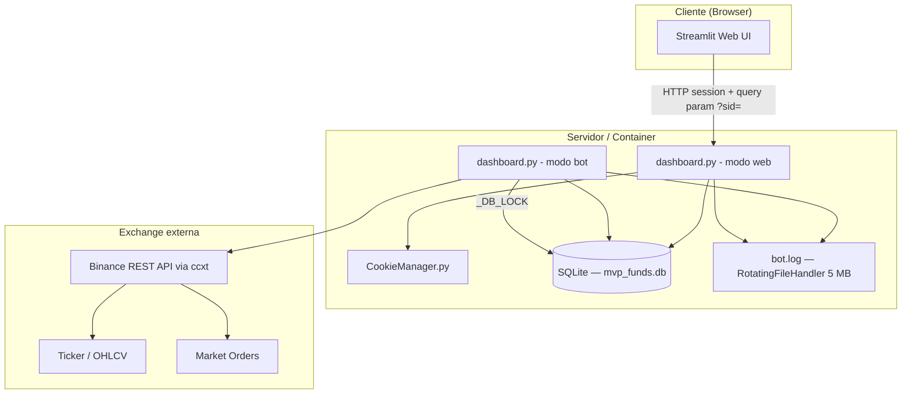
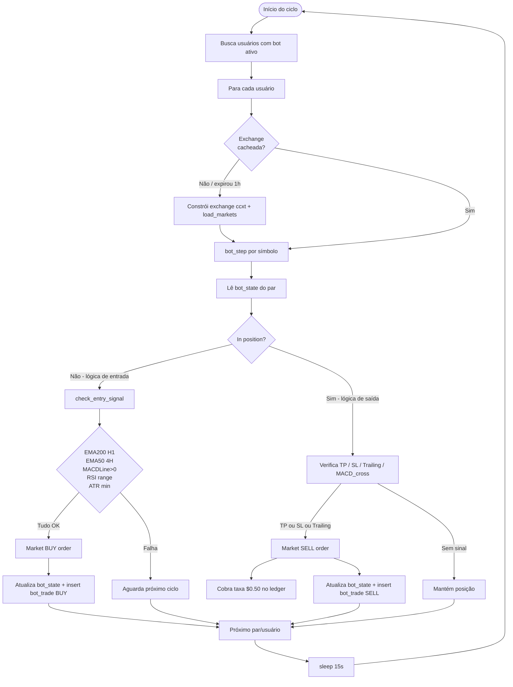
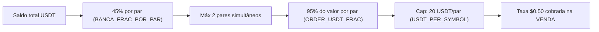
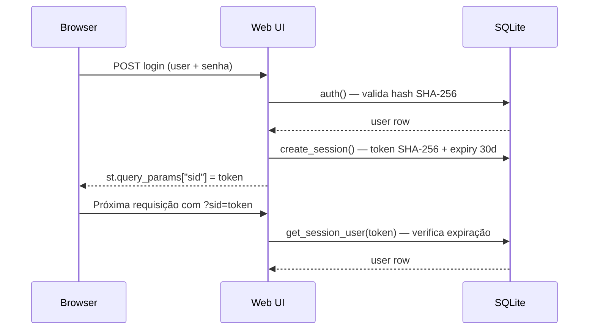
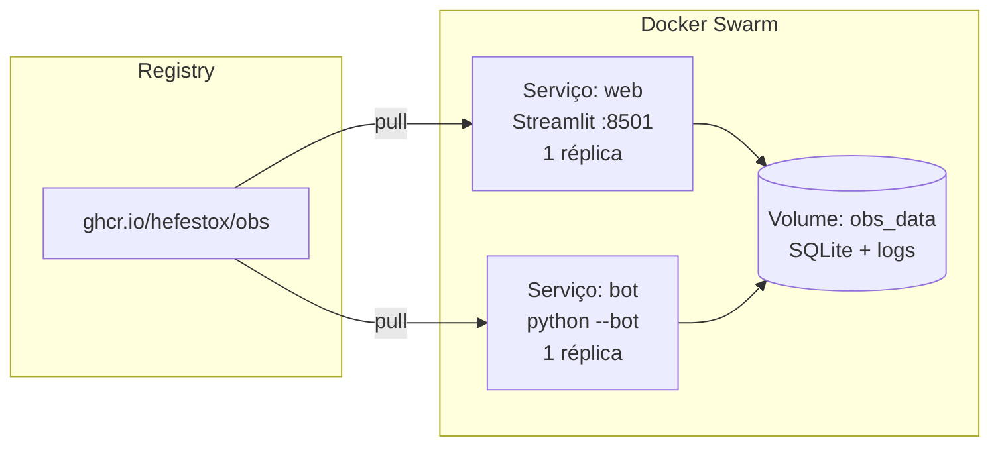
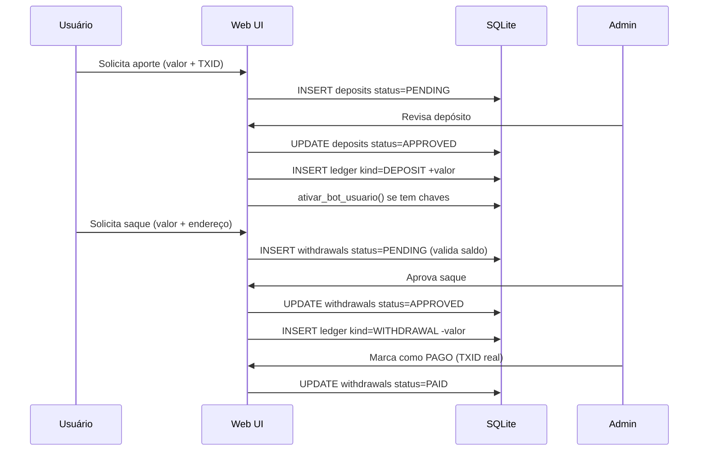

# System Design — OBS Pro Bot v5.0.x

**Data:** 2026-03-21  
**Versão:** 5.0.1  
**Stack:** Python 3.11 · Streamlit · ccxt · SQLite · Docker / Docker Swarm  

---

## 1. Visão geral

O **OBS Pro Bot** é uma plataforma SaaS de trading algorítmico de criptomoedas. Permite que múltiplos usuários conectem suas chaves API de exchanges (Binance), definam capital e delegam ao bot a execução automática de compras e vendas com base em indicadores técnicos.

O sistema opera em dois modos a partir do mesmo código-fonte (`dashboard.py`):

| Modo | Comando | Responsabilidade |
|---|---|---|
| **Web UI** | `streamlit run dashboard.py` | Interface do usuário, gestão de conta, painel de bot |
| **Bot loop** | `python dashboard.py --bot` | Loop de trading autônomo em background |

---

## 2. Arquitetura de componentes



---

## 3. Modelo de dados (SQLite)

```mermaid
erDiagram
    users {
        INTEGER id PK
        TEXT username UK
        TEXT pass_hash
        TEXT role
        TEXT created_at
        TEXT referrer_code
        TEXT my_code UK
    }
    user_keys {
        INTEGER user_id PK FK
        TEXT exchange
        TEXT api_key
        TEXT api_secret
        INTEGER testnet
        TEXT updated_at
    }
    deposits {
        INTEGER id PK
        INTEGER user_id FK
        REAL amount_usdt
        TEXT txid
        TEXT deposit_address
        TEXT status
        TEXT created_at
        TEXT reviewed_at
        INTEGER reviewed_by
        TEXT note
    }
    withdrawals {
        INTEGER id PK
        INTEGER user_id FK
        REAL amount_request_usdt
        REAL fee_rate
        REAL fee_usdt
        REAL amount_net_usdt
        TEXT network
        TEXT address
        TEXT paid_txid
        TEXT status
        TEXT created_at
        TEXT reviewed_at
        INTEGER reviewed_by
        TEXT note
    }
    ledger {
        INTEGER id PK
        INTEGER user_id FK
        TEXT kind
        REAL amount_usdt
        TEXT ref_table
        INTEGER ref_id
        TEXT created_at
    }
    bot_state {
        INTEGER id PK
        INTEGER user_id FK
        TEXT symbol
        INTEGER enabled
        REAL usdt
        REAL asset
        INTEGER in_position
        REAL entry_price
        REAL entry_qty
        TEXT entry_time
        TEXT last_step_ts
        TEXT last_error
        TEXT last_sl_time
        INTEGER daily_losses
        TEXT daily_loss_date
        TEXT updated_at
    }
    bot_trades {
        INTEGER id PK
        INTEGER user_id FK
        TEXT time
        TEXT symbol
        TEXT side
        REAL price
        REAL qty
        REAL fee_usdt
        REAL usdt_balance
        REAL asset_balance
        TEXT reason
        REAL pnl_usdt
        TEXT order_id
        REAL rsi_entry
        TEXT ema_signal
    }
    sessions {
        TEXT token PK
        INTEGER user_id FK
        TEXT created_at
        TEXT expires_at
    }

    users ||--o{ user_keys : "1:1"
    users ||--o{ deposits : ""
    users ||--o{ withdrawals : ""
    users ||--o{ ledger : ""
    users ||--o{ bot_state : ""
    users ||--o{ bot_trades : ""
    users ||--o{ sessions : ""
```

### Notas de persistência

- Todo acesso de escrita adquire `_DB_LOCK` (`threading.Lock`) antes de executar.
- `DB_PATH` é configurável via variável de ambiente (padrão: `mvp_funds.db`).
- WAL mode + `busy_timeout=30s` para concorrência segura entre web e bot.
- O ledger é a fonte primária do saldo do usuário — nunca calcule saldo diretamente de deposits/withdrawals.

---

## 4. Fluxo do bot loop (por ciclo de 15s)



---

## 5. Sinais de entrada e saída

### 5.1 Condições de entrada (todas obrigatórias)

| Filtro | Regra |
|---|---|
| **EMA 200 (H1)** | Preço > EMA200 na vela de 1h — tendência de alta |
| **EMA 50 (4H)** | Preço > EMA50 na vela de 4h — confirmação macro |
| **MACD linha** | MACD line > 0 — momentum positivo |
| **RSI (5m)** | 47 ≤ RSI ≤ 62 — zona de aceleração sem sobrecompra |
| **ATR (5m)** | ATR% ≥ 0,15% — mercado não é lateral |
| **Horário** | Configurável (`USE_TIME_FILTER`, desativado por padrão) |

### 5.2 Condições de saída

| Gatilho | Regra |
|---|---|
| **Take Profit** | Preço ≥ entry × (1 + 0,75%) |
| **Stop Loss** | Preço ≤ entry × (1 − 0,45%) |
| **Trailing Stop** | Ativa após ganho ≥ 0,45%; distância de 0,20% do pico |
| **Min Hold** | Posição mantida por no mínimo 420s antes de qualquer saída técnica |
| **Cooldown pós-SL** | 1200s de espera após stop loss antes de nova entrada |

---

## 6. Gestão de risco e capital



---

## 7. Autenticação e sessões



- Tokens de sessão: SHA-256 de `user_id|timestamp|SESSION_SECRET`.
- Expiry: 30 dias.
- `SESSION_SECRET` deve vir de variável de ambiente — nunca hardcoded em produção.

> ⚠️ **Atenção de segurança:** `DEFAULT_ADMIN_PASS` está hardcoded no código como valor padrão fallback (`LU87347748`). Em produção, sobrescrever obrigatoriamente via env var `DEFAULT_ADMIN_PASS`.

---

## 8. Implantação

### 8.1 Variáveis de ambiente obrigatórias

| Variável | Descrição |
|---|---|
| `SESSION_SECRET` | Chave de assinatura de tokens de sessão |
| `DEFAULT_ADMIN_USER` | Username do admin inicial |
| `DEFAULT_ADMIN_PASS` | Senha do admin (sobrescreve o padrão hardcoded) |
| `DB_PATH` | Caminho do banco SQLite (padrão: `mvp_funds.db`) |
| `BOT_LOG_PATH` | Caminho do log do bot (padrão: `bot.log`) |

### 8.2 Docker Compose (desenvolvimento local)

```yaml
# docker-compose.yml
services:
  web:    # Streamlit UI — porta 8501
  bot:    # Loop do bot — python dashboard.py --bot
```

Volume compartilhado `obs_data:/app/data` para banco e logs entre containers.

### 8.3 Docker Swarm (produção)

```bash
docker stack deploy -c docker-stack.yml obs
```

Imagem publicada em: `ghcr.io/hefestox/obs:latest`



---

## 9. Interface do usuário (abas)

| Aba | Perfil | Descrição |
|---|---|---|
| 📊 Painel BOT | user / admin | Status por par, toggle liga/desliga, métricas de performance, histórico de trades |
| 👤 Minha Conta | user / admin | Saldo no ledger, código de indicação |
| 🔑 Chaves API | user / admin | Salvar API Key + Secret da Binance (Spot only) |
| 💰 Aporte | user / admin | Solicitar depósito com TXID (aguarda aprovação admin) |
| 💸 Saque | user / admin | Solicitar retirada (taxa 5%, aprovação admin) |
| 📄 Extrato | user / admin | Movimentações do ledger, exportação CSV |
| ⚙️ Administração | admin | Gerenciar usuários, aprovar/rejeitar aportes e saques, controlar bots |

---

## 10. Fluxo financeiro (aportes e saques)



---

## 11. Dimensionamento atual e premissas

| Dimensão | Capacidade atual |
|---|---|
| Banco de dados | SQLite com WAL — adequado para dezenas de usuários simultâneos |
| Pares de trading | 2 pares (BTC/USDT, ETH/USDT) — expansível via `ALL_SYMBOLS` |
| Ciclo do bot | 15 segundos por ciclo completo |
| Cache de exchange | Reconstroído a cada 1h (evita MemoryError do `load_markets`) |
| Logs | Rotação automática: 5MB × 2 arquivos de backup |
| Sessões | SQLite, expiram em 30 dias |
| Threads | `_DB_LOCK` protege escrita; leituras podem ser concorrentes |

**Limitação conhecida:** SQLite não escala para centenas de usuários simultâneos. Candidate a migração para PostgreSQL (dependência `psycopg2-binary` já incluída no projeto).

---

## 12. Próximos passos recomendados

1. **Segurança:** Remover `DEFAULT_ADMIN_PASS` hardcoded — exigir sempre via env var.
2. **Testes:** Criar `tests/` com pytest cobrindo `bot_step`, indicadores e funções de banco.
3. **PostgreSQL:** Migrar de SQLite para PostgreSQL para suportar mais usuários.
4. **Webhook:** Adicionar notificações por Telegram/Discord em trades executados.
5. **Rate limiting:** Proteger endpoints de login contra força bruta.
