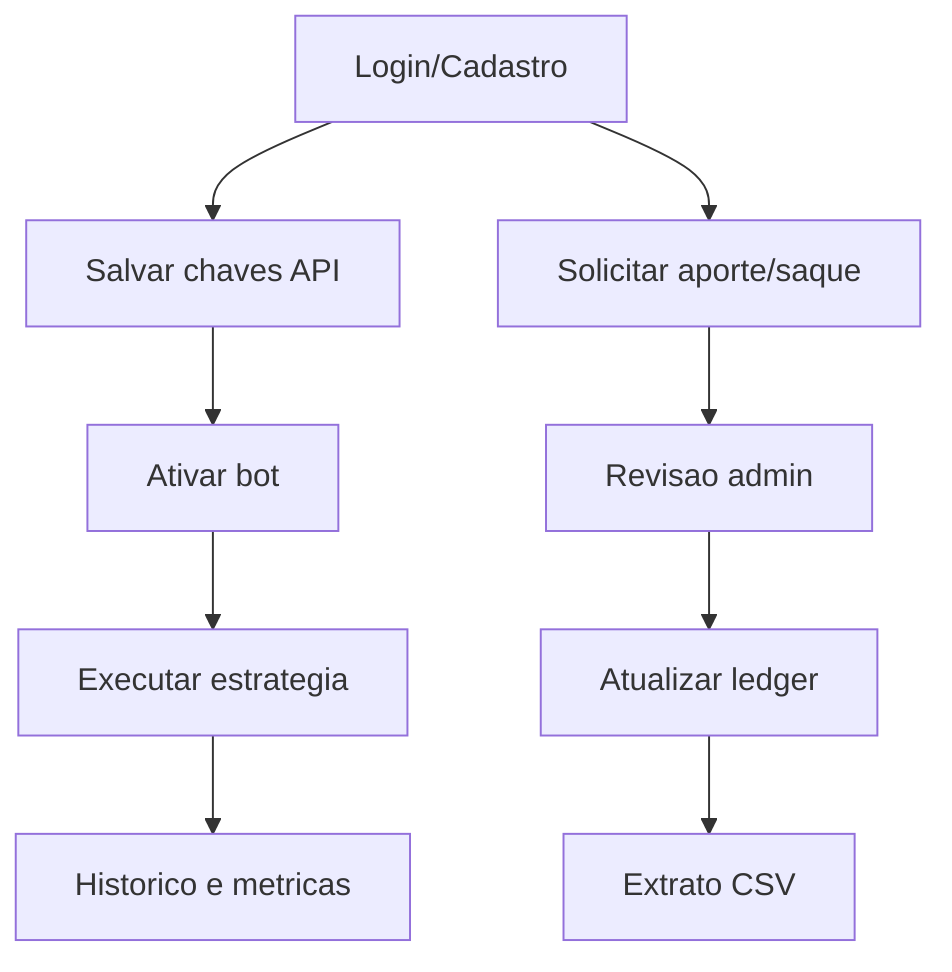

# User Stories - OBS (AS-IS)

## Objetivo
Consolidar historias de usuario do sistema atual (Streamlit + bot), considerando apenas funcionalidades existentes no codigo.

## Backlog por epico

| Epico | Historias |
|---|---|
| Autenticacao | US-001, US-002, US-003 |
| Chaves API | US-010 |
| Bot Trading | US-020, US-021, US-022, US-023 |
| Aportes e Saques | US-030, US-031, US-032, US-033, US-034, US-035 |
| Administracao | US-040 |
| Operacao e Observabilidade | US-050, US-051 |
| Resiliencia Operacional do Bot | US-060, US-061, US-062, US-063, US-064 |



## Historias detalhadas

### US-001 - Criar conta
Como visitante, quero criar conta, para acessar a plataforma.

**Criterios de aceite**
```gherkin
Scenario: Cadastro valido
  Given usuario e senha informados
  When clico em "Criar conta"
  Then conta criada com role user
```
**Regras:** usuario unico; senha obrigatoria; codigo de indicacao opcional e validado.  
**Prioridade:** Must  
**Dependencias:** tabela users.

### US-002 - Fazer login
Como usuario cadastrado, quero autenticar, para usar funcionalidades protegidas.

```gherkin
Scenario: Login valido
  Given credenciais corretas
  When clico em "Entrar"
  Then sessao criada com token
```
**Regras:** hash SHA-256; sessao persistida em `sessions`.  
**Prioridade:** Must  
**Dependencias:** US-001.

### US-003 - Encerrar sessao
Como usuario autenticado, quero sair, para encerrar acesso.

```gherkin
Scenario: Logout
  Given sessao ativa
  When clico em "Sair"
  Then token removido
```
**Regras:** expiracao de sessao em 30 dias.  
**Prioridade:** Must  
**Dependencias:** US-002.

### US-010 - Cadastrar chaves API
Como usuario, quero salvar API Key/Secret, para operar o bot.

```gherkin
Scenario: Salvar chaves
  Given API Key e Secret preenchidos
  When salvo formulario
  Then dados persistidos em user_keys
```
**Regras:** key/secret obrigatorios; suporte a testnet.  
**Prioridade:** Must  
**Dependencias:** US-002.

### US-020 - Ativar/desativar bot
Como usuario com chaves validas, quero ligar/desligar bot, para controlar operacao.

```gherkin
Scenario: Ativar bot
  Given chaves cadastradas
  When ativo toggle
  Then bot_state.enabled = 1
```
**Regras:** sem chaves o bot nao opera.  
**Prioridade:** Must  
**Dependencias:** US-010.

### US-021 - Comprar por sinal de entrada
Como usuario operador, quero compra apenas com sinal valido, para evitar entrada fora da estrategia.

```gherkin
Scenario: Entrada valida
  Given preco > EMA200 H1
  And EMA9 > EMA21 no 5m
  And RSI entre 40 e 65
  When ciclo do bot roda
  Then ordem BUY deve ser executada
```
**Regras:** cooldown apos SL; uso de fracao do saldo.  
**Prioridade:** Must  
**Dependencias:** US-020.

### US-022 - Vender por TP/SL/sinais
Como usuario operador, quero saida automatica por regras, para proteger risco e lucro.

```gherkin
Scenario: Saida por take profit
  Given posicao aberta
  When preco atinge TP
  Then ordem SELL executada
```
**Regras:** TP +1%; SL -0.5%; saida por RSI>=70 ou EMA9<EMA21.  
**Prioridade:** Must  
**Dependencias:** US-021.

### US-023 - Visualizar performance
Como usuario operador, quero ver winrate e PnL, para acompanhar desempenho.

```gherkin
Scenario: Exibir metricas
  Given trades existentes
  When acesso painel
  Then exibir winrate e PnL realizado
```
**Regras:** metricas derivadas de `bot_trades`.  
**Prioridade:** Should  
**Dependencias:** US-022.

### US-030 - Solicitar aporte
Como usuario, quero informar valor e TXID, para solicitar credito interno.

```gherkin
Scenario: Aporte valido
  Given valor > 0 e TXID informado
  When envio comprovante
  Then deposito criado como PENDING
```
**Regras:** TXID obrigatorio.  
**Prioridade:** Must  
**Dependencias:** US-002.

### US-031 - Revisar aporte (admin)
Como admin, quero aprovar/rejeitar aporte, para controlar credito.

```gherkin
Scenario: Aprovar aporte
  Given deposito PENDING
  When admin aprova
  Then status APPROVED e lancamento DEPOSIT no ledger
```
**Regras:** revisao unica por deposito.  
**Prioridade:** Must  
**Dependencias:** US-030.

### US-032 - Solicitar saque
Como usuario, quero solicitar saque, para retirar saldo.

```gherkin
Scenario: Saque valido
  Given saldo suficiente
  And rede e endereco informados
  When solicito saque
  Then saque criado como PENDING
```
**Regras:** taxa `WITHDRAW_FEE_RATE`; saldo suficiente obrigatorio.  
**Prioridade:** Must  
**Dependencias:** saldo em ledger.

### US-033 - Revisar saque (admin)
Como admin, quero aprovar/rejeitar saques, para governar debito interno.

```gherkin
Scenario: Aprovar saque
  Given saque PENDING
  When admin aprova
  Then status APPROVED e lancamento WITHDRAWAL no ledger
```
**Regras:** apenas PENDING pode ser revisado.  
**Prioridade:** Must  
**Dependencias:** US-032.

### US-034 - Marcar saque como pago
Como admin, quero registrar TXID de pagamento, para concluir o fluxo.

```gherkin
Scenario: Marcar pago
  Given saque APPROVED
  And TXID informado
  When marco como pago
  Then status PAID
```
**Regras:** exige APPROVED + TXID obrigatorio.  
**Prioridade:** Must  
**Dependencias:** US-033.

### US-035 - Exportar extrato CSV
Como usuario, quero baixar extrato, para auditar movimentacoes.

```gherkin
Scenario: Baixar extrato
  Given lancamentos no ledger
  When clico em baixar CSV
  Then arquivo extrato.csv e gerado
```
**Regras:** extrato filtrado por usuario autenticado.  
**Prioridade:** Should  
**Dependencias:** US-031/US-033.

### US-040 - Usar painel administrativo
Como admin, quero ver usuarios, pendencias e status dos bots, para supervisionar operacao.

```gherkin
Scenario: Acesso admin
  Given usuario admin autenticado
  When abre aplicacao
  Then visualizar aba Administracao
```
**Regras:** recursos restritos a role admin.  
**Prioridade:** Must  
**Dependencias:** US-002.

### US-050 - Subir web+bot via Docker
Como operador tecnico, quero subir stack em dois servicos, para manter operacao continua.

```gherkin
Scenario: Subida da stack
  Given docker compose configurado
  When executo up
  Then web e bot iniciam com volume compartilhado
```
**Regras:** persistencia em `/app/data`; restart policy ativa.  
**Prioridade:** Must  
**Dependencias:** Docker Compose.

### US-051 - Monitorar logs e ciclos
Como operador/admin, quero acompanhar logs do bot, para monitorar saude operacional.

```gherkin
Scenario: Geracao de logs
  Given bot em execucao
  When loop processa ciclos
  Then logs gravados em BOT_LOG_PATH
```
**Regras:** log em arquivo e stdout; auto-refresh opcional na UI.  
**Prioridade:** Could  
**Dependencias:** US-050.

### US-060 - Aplicar cooldown pos-SL
Como usuario operador, quero que o bot aguarde uma janela apos stop-loss, para evitar reentrada imediata em condicoes adversas.

```gherkin
Scenario: Bloquear entrada durante cooldown
  Given houve saida recente por stop-loss
  When o bot avalia nova entrada
  Then o sistema bloqueia ordem BUY ate expirar cooldown
```
**Regras:** cooldown de 300s apos SL; durante cooldown nao pode abrir nova posicao.  
**Prioridade:** Must  
**Dependencias:** US-021.

### US-061 - Controlar contador de losses
Como usuario operador, quero visualizar contador de perdas, para acompanhar risco e consistencia da estrategia.

```gherkin
Scenario: Incrementar losses
  Given trade encerrado com PnL negativo
  When sistema computa metricas
  Then contador de losses e incrementado
```
**Regras:** losses sao derivados de trades de saida com resultado negativo.  
**Prioridade:** Should  
**Dependencias:** US-022, US-023.

### US-062 - Testar conectividade API
Como usuario, quero testar minhas chaves API, para validar conectividade antes de operar o bot.

```gherkin
Scenario: Teste de API bem-sucedido
  Given chaves API validas cadastradas
  When executo teste de conectividade
  Then sistema informa sucesso na autenticacao
```
**Regras:** teste deve retornar resultado explicito de sucesso/falha com motivo.  
**Prioridade:** Should  
**Dependencias:** US-010.

### US-063 - Aplicar retry de exchange
Como operador, quero que o bot realize retentativas em falhas transitórias, para aumentar resiliencia operacional.

```gherkin
Scenario: Retry em falha transitória
  Given falha temporaria na API da exchange
  When bot executa chamada de mercado
  Then sistema aplica retry ate sucesso ou limite
```
**Regras:** retry apenas para erros transitórios; limite maximo de tentativas obrigatorio.  
**Prioridade:** Should  
**Dependencias:** US-021, US-022, US-051.

### US-064 - Sincronizar relogio com exchange
Como operador, quero que o bot sincronize horario com a exchange, para reduzir erros de timestamp em requisições assinadas.

```gherkin
Scenario: Sincronizacao de tempo
  Given bot iniciando com conectividade ativa
  When consulta horario do servidor da exchange
  Then sistema calcula e aplica offset de tempo
```
**Regras:** sincronizacao antes de operacoes sensiveis; manter ultimo offset valido em falha temporaria.  
**Prioridade:** Could  
**Dependencias:** US-063.

## Matriz de rastreabilidade

| User Story | Evidencia no codigo |
|---|---|
| US-001, US-002, US-003 | `dashboard.py` (`create_user`, `auth`, `create_session`, `get_session_user`, `delete_session`) |
| US-010 | `dashboard.py` (`save_user_keys`, `get_user_keys`) |
| US-020, US-021, US-022, US-023 | `dashboard.py` (estado e estrategia do bot, metricas) |
| US-030, US-031 | `dashboard.py` (`create_deposit`, `admin_review_deposit`) |
| US-032, US-033, US-034 | `dashboard.py` (`create_withdrawal`, `admin_review_withdrawal`, `admin_mark_withdraw_paid`) |
| US-035 | `dashboard.py` (extrato + download CSV) |
| US-040 | `dashboard.py` (aba admin condicional por role) |
| US-050, US-051 | `Dockerfile`, `docker-compose.yml`, `README.md`, logging em `dashboard.py` |
| US-060, US-061 | `dashboard.py` (cooldown pós-SL, contadores de performance e losses) |
| US-062, US-063, US-064 | `dashboard.py` (teste de API, retry de integração e sync de relógio) |
