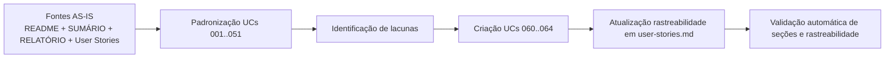

# Revisão de UCs - 2026-03-08 23:58

## Contexto e objetivo
Esta revisão teve como objetivo padronizar e tornar testáveis todos os casos de uso em `docs/cases/*.md`, preservando IDs existentes e títulos compatíveis, além de cobrir lacunas identificadas na análise AS-IS.

## Escopo técnico e arquivos modificados
- **Padronização completa** de todos os UCs existentes (`UC-001` a `UC-051`) para formato único e verificável.
- **Criação de novos UCs** para lacunas operacionais críticas:
  - `UC-060` Cooldown pós-stop-loss
  - `UC-061` Contador de losses
  - `UC-062` Teste de conectividade API
  - `UC-063` Retry de integração com exchange
  - `UC-064` Sincronização de relógio com exchange
- **Atualização de rastreabilidade** em `docs/user-stories.md` com inclusão de `US-060` a `US-064`.

## ADR resumido (decisão, alternativas, trade-offs)
- **Decisão**: adotar template único obrigatório com 12 seções fixas e critérios de aceite em Gherkin tabular.
- **Alternativa considerada**: manter estrutura heterogênea por UC e apenas corrigir arquivos críticos.
- **Trade-offs**:
  - **Pró**: maior consistência, auditabilidade e automação de validação.
  - **Contra**: aumento de volume documental e necessidade de manutenção disciplinada dos artefatos.

## Evidências de validação (checagens realizadas)
1. Validação automatizada de todos os arquivos `docs/cases/uc-*.md`.
2. Presença das seções obrigatórias em todos os UCs.
3. Verificação de rastreabilidade mínima por arquivo (`História` + `Épico`).

**Resultado das checagens**
- Total de UCs verificados: **22**
- UCs com seções faltantes: **0**
- UCs com rastreabilidade básica inconsistente: **0**

## Riscos, impacto e plano de rollback
- **Riscos**
  - Divergência futura entre implementação e documentação se não houver rotina de revisão contínua.
  - Dependência de atualização conjunta entre UCs e User Stories.
- **Impacto esperado**
  - Melhoria imediata na clareza de escopo e testabilidade.
  - Ganho de rastreabilidade para QA e auditoria funcional.
- **Plano de rollback**
  1. Reverter alterações dos markdowns para o último estado versionado via Git.
  2. Reaplicar incrementalmente apenas UCs críticos (UC-021/022/030/031/033 e UC-060..064).
  3. Reexecutar validações automatizadas de seções e rastreabilidade.

## Próximos passos
1. Validar conteúdo dos novos UCs (060..064) com stakeholders de operação.
2. Alinhar time de desenvolvimento para eventual implementação/ajuste das regras ainda não cobertas em código.
3. Integrar validação de estrutura de UCs no pipeline de documentação (lint/check).
4. Criar matriz cruzada UC ⇄ US ⇄ evidência de código por release.

