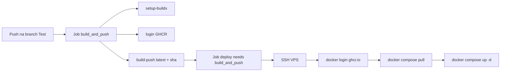

# Contexto e Objetivo

Foi solicitada a modernização do fluxo de CI/CD para publicar imagens no GHCR e realizar deploy em VPS via SSH, além de ajustar o `docker-compose.yml` para consumir imagens remotas com políticas mais seguras de configuração de credenciais.

## Escopo Técnico e Arquivos Modificados

- `.github/workflows/main.yml`
- `docker-compose.yml`
- `.env.example` (novo)
- `.gitignore` (novo)
- `README.md`

## ADR (resumido)

### Decisão
Adotar pipeline com jobs separados (`build_and_push` e `deploy`) no GitHub Actions, com `needs` explícito, build via Buildx e publicação de tags `latest` + `sha` no GHCR. No runtime, usar `docker compose pull && docker compose up -d` na VPS.

### Alternativas consideradas
1. Build local na VPS com `docker compose up --build`.
2. Build em action com `docker build` manual e push por shell script.

### Trade-offs
- **Pró:** rastreabilidade por tag SHA, deploy mais previsível e rápido (sem build na VPS), separação clara de responsabilidades no workflow.
- **Contra:** dependência de secrets adicionais (`GHCR_USERNAME`, `GHCR_TOKEN`) e de login no registry durante deploy.

## Evidências de Validação

### 1) `docker compose config`
Comando executado (com variáveis obrigatórias injetadas):

```bash
SESSION_SECRET=testsecret DEFAULT_ADMIN_USER=admin DEFAULT_ADMIN_PASS=admin123 IMAGE_TAG=latest docker compose config
```

Trecho relevante da saída:

```yaml
services:
  web:
    image: ghcr.io/hefestox/obs:latest
    pull_policy: always
  bot:
    image: ghcr.io/hefestox/obs:latest
    pull_policy: always
```

### 2) Verificação textual do workflow
Checagem de chaves/jobs/actions obrigatórias por inspeção textual com `grep`.

Trecho relevante:

```text
1:name: Deploy to Teste
3:on:
11:jobs:
12:  build_and_push:
21:        uses: docker/setup-buildx-action@v3
24:        uses: docker/login-action@v3
31:        uses: docker/build-push-action@v6
40:  deploy:
43:    needs: [build_and_push]
```

## Riscos, Impacto e Rollback

- **Risco:** secrets ausentes/inválidos no GitHub (`SSH_*`, `GHCR_*`) impedirem deploy.
- **Impacto:** falha de pipeline sem alteração no ambiente de produção até correção dos secrets.
- **Rollback:**
  1. Reverter commit do workflow/compose.
  2. Executar deploy anterior manualmente na VPS.
  3. Fixar `IMAGE_TAG=latest` temporariamente em `.env` para retomada rápida.

## Próximos Passos Recomendados

1. Configurar todos os secrets no repositório GitHub.
2. Garantir que o caminho `/app/OBS` exista na VPS com `.env` válido.
3. Adicionar proteção de branch + ambiente de deploy com aprovação manual (se necessário).
4. Opcional: assinar imagens e adicionar scan de vulnerabilidades no pipeline.

## Diagrama (Mermaid)


