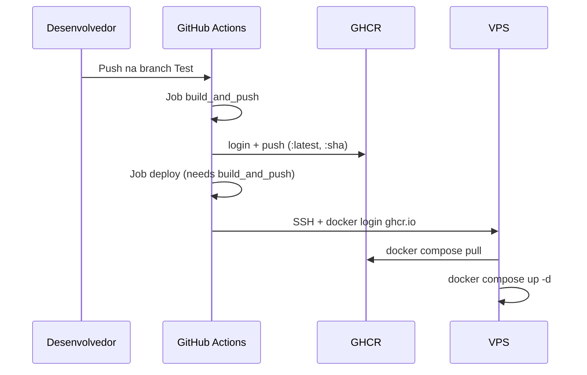

# Contexto e objetivo

Ajuste complementar no pipeline de publicação para garantir aderência ao formato `ghcr.io/<owner>/<repo>` de forma dinâmica e em minúsculas, além de consolidar evidências finais de validação (`docker compose config` e inspeção textual do workflow).

## Escopo técnico e arquivos modificados

- `.github/workflows/main.yml`
  - Inclusão de etapa para normalização do nome da imagem com base em `${{ github.repository }}` para minúsculas.
  - Tags de publicação atualizadas para usar nome dinâmico `${{ steps.image.outputs.name }}` com `:latest` e `:${{ github.sha }}`.
- `README.md`
  - Correção textual das tags para `ghcr.io/<owner>/<repo>`.

## ADR resumido

### Decisão
Utilizar `${{ github.repository }}` normalizado para minúsculas no workflow para gerar o nome da imagem no GHCR, evitando hardcode do nome do repositório.

### Alternativas consideradas
1. Hardcode de `ghcr.io/hefestox/obs` no workflow.
2. Uso de `github.repository_owner` + string fixa do repositório.

### Trade-offs
- **Pró:** reduz acoplamento ao nome atual do repo e evita falhas por case sensitivity no GHCR.
- **Contra:** adiciona um passo de shell no workflow para normalização.

## Evidências de validação

### 1) docker compose config
Comando:

```bash
SESSION_SECRET=testsecret DEFAULT_ADMIN_USER=admin DEFAULT_ADMIN_PASS=admin123 IMAGE_TAG=latest docker compose config
```

Saída relevante:

```yaml
services:
  bot:
    image: ghcr.io/hefestox/obs:latest
    pull_policy: always
  web:
    image: ghcr.io/hefestox/obs:latest
    pull_policy: always
```

### 2) Inspeção textual do workflow YAML
Comando:

```bash
grep -nE '^(name:|on:|jobs:|  build_and_push:|  deploy:|\s+uses: docker/setup-buildx-action@|\s+uses: docker/login-action@|\s+uses: docker/build-push-action@|\s+needs:)' .github/workflows/main.yml
```

Saída:

```text
1:name: Deploy to Teste
3:on:
11:jobs:
12:  build_and_push:
21:        uses: docker/setup-buildx-action@v3
30:        uses: docker/login-action@v3
37:        uses: docker/build-push-action@v6
46:  deploy:
49:    needs: [build_and_push]
```

## Riscos, impacto e rollback

- **Risco:** `GHCR_USERNAME/GHCR_TOKEN` incorretos impedirem `docker login ghcr.io` na VPS.
- **Impacto:** deploy falha sem rebuild remoto; aplicação mantém versão atual em execução.
- **Rollback:**
  1. Reverter commit do workflow/compose.
  2. Rodar manualmente na VPS com tag anterior válida (`IMAGE_TAG=<tag_anterior> docker compose up -d`).

## Próximos passos recomendados

1. Configurar ambiente protegido de deploy no GitHub (com aprovação manual, se necessário).
2. Incluir validação YAML automatizada (actionlint) no CI.
3. Adicionar assinatura/scan de imagens no pipeline.

## Diagrama Mermaid


