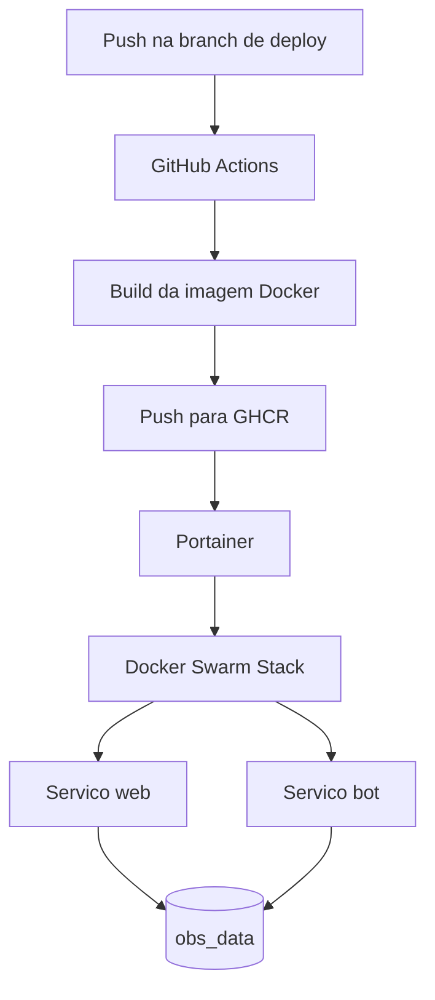
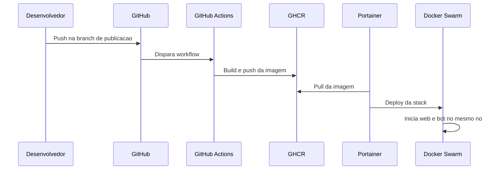

# Publicacao do OBS em Docker Swarm via Portainer

## Objetivo

Publicar o projeto atual em um cluster Docker Swarm administrado pelo Portainer acessivel em `https://170.83.175.196:9443/`, usando imagens publicadas no GHCR e uma stack implantada pelo Portainer.

## Resumo executivo

O repositorio ja possui os elementos base para isso:

- `Dockerfile` para build da imagem.
- `docker-compose.yml` com os servicos `web` e `bot`.
- workflow em `.github/workflows/main.yml` que publica imagem no GHCR.

Para publicar em Swarm com Portainer, o fluxo recomendado e:

1. O GitHub Actions faz apenas `build` e `push` da imagem para o GHCR.
2. O Portainer consome essa imagem e realiza o `deploy` da stack no Swarm.
3. O arquivo de stack usado no Portainer deve ser adaptado para Swarm.

## Pontos criticos do projeto atual

Antes da publicacao, estes pontos precisam ser entendidos:

1. O projeto usa SQLite em `/app/data/mvp_funds.db` e log em `/app/data/bot.log`.
2. Os servicos `web` e `bot` compartilham o mesmo volume `obs_data`.
3. Em Docker Swarm, um volume local nomeado nao e compartilhado automaticamente entre nos diferentes.
4. Se `web` e `bot` forem agendados em nos diferentes, o banco e o log podem divergir ou quebrar o comportamento esperado.
5. O bind mount `.:/project:cached` do `docker-compose.yml` nao deve ser usado na stack de producao em Swarm.

Conclusao pratica: nesta arquitetura atual, `web` e `bot` devem rodar no mesmo no do cluster, ou o armazenamento deve ser migrado para um volume compartilhado de rede.

## Arquitetura recomendada



## Estrategia recomendada de publicacao

### Opcao preferencial

Usar o GitHub apenas para publicar a imagem no GHCR e usar o Portainer para:

- armazenar as credenciais do registry;
- definir a stack;
- atualizar a stack quando houver nova imagem;
- centralizar logs e estado do deploy.

### Opcao a evitar neste cenario

Manter o job de deploy por SSH do workflow atual para uma stack gerenciada por Portainer. Isso cria duas fontes de verdade para o deploy.

## Passos no GitHub

## 1. Validar o workflow de build

O workflow atual em `.github/workflows/main.yml` ja faz o push da imagem para o GHCR. Para uso com Portainer, o ideal e manter apenas esta responsabilidade:

- checkout;
- login no GHCR;
- build da imagem;
- push das tags `latest` e `sha`.

### Recomendacao de ajuste

Se o deploy passar a ser feito pelo Portainer, trate o job `deploy` por SSH como legado. Ele pode ser removido ou desativado para evitar conflito operacional.

## 2. Definir a branch de publicacao

Hoje o workflow dispara em push para a branch `Test`.

Defina explicitamente qual sera a branch de entrega para o ambiente publicado, por exemplo:

- `main` para producao;
- `Test` para homologacao.

Se o ambiente do Portainer vai refletir producao, a recomendacao e publicar a partir de `main`.

## 3. Configurar permissao do pacote no GHCR

No GitHub:

1. Acesse o repositorio.
2. Abra a area de packages no GHCR.
3. Verifique se a imagem `ghcr.io/<owner>/<repo>` foi criada.
4. Escolha uma das abordagens:

- pacote publico: mais simples para o Portainer consumir;
- pacote privado: exige autenticacao do Portainer no registry.

### Recomendacao

Se nao houver exigencia de sigilo da imagem, deixe o pacote publico. Se a imagem precisar ser privada, use PAT apenas com escopo minimo de leitura.

## 4. Criar token para o Portainer ler o GHCR

Se a imagem for privada, crie um token no GitHub para ser usado no Portainer:

- tipo: classic PAT ou fine-grained token;
- permissao minima: `read:packages`;
- se o repositorio for privado e o pacote herdar permissao do repo, pode ser necessario tambem acesso de leitura ao repositorio.

Guarde:

- usuario GitHub;
- token do GHCR.

## 5. Segredos necessarios no GitHub

Se o workflow continuar somente com build e push no GHCR, normalmente basta:

- `GITHUB_TOKEN` nativo do GitHub Actions;
- permissao `packages: write` no workflow.

Se o job de deploy por SSH for removido, estes secrets deixam de ser obrigatorios para este fluxo:

- `SSH_HOST`;
- `SSH_USER`;
- `SSH_PRIVATE_KEY`;
- `GHCR_USERNAME`;
- `GHCR_TOKEN`.

## Passos no Portainer

## 1. Acessar o Portainer

Abra:

- `https://170.83.175.196:9443/`

Se o certificado TLS for autogerado, o navegador pode exibir alerta. Isso nao impede a administracao, mas o ideal e futuramente instalar um certificado confiavel.

## 2. Validar o endpoint do Swarm

No Portainer:

1. Entre em `Environments`.
2. Confirme que o cluster Docker Swarm esta cadastrado.
3. Confirme que o status do endpoint esta `up`.
4. Valide qual no sera usado para armazenar o volume do projeto.

### Recomendacao operacional

Como o projeto usa SQLite em volume local, identifique um no fixo para receber ambos os servicos.

## 3. Cadastrar o registry do GHCR

No Portainer:

1. Acesse `Registries`.
2. Clique em `Add registry`.
3. Selecione `Custom registry`.
4. Preencha:

- Name: `ghcr`
- Registry URL: `ghcr.io`
- Username: seu usuario GitHub
- Password: PAT com `read:packages`

5. Salve.

Se a imagem estiver publica, esse passo pode ser opcional, mas ainda assim e util para padronizacao.

## 4. Criar secrets e variaveis da aplicacao

O projeto exige estas variaveis:

- `SESSION_SECRET`
- `DEFAULT_ADMIN_USER`
- `DEFAULT_ADMIN_PASS`
- `DB_PATH=/app/data/mvp_funds.db`
- `BOT_LOG_PATH=/app/data/bot.log`

No Portainer, voce pode informar essas variaveis diretamente na stack. Se quiser mais controle:

- use secrets do Swarm para senhas;
- use environment variables para configuracoes nao sensiveis.

## 5. Criar a stack no Portainer

No Portainer:

1. Abra o ambiente Swarm.
2. Acesse `Stacks`.
3. Clique em `Add stack`.
4. Nome sugerido: `obs`.
5. Escolha uma das fontes:

- `Web editor`, colando o YAML da stack;
- `Repository`, apontando para o repositorio Git, se desejar GitOps.

### Recomendacao

Para a primeira publicacao, use `Web editor` com um arquivo de stack especifico para Swarm. Depois que o processo estiver estavel, voce pode migrar para `Repository`.

## Exemplo de stack para Swarm

Este exemplo adapta o compose atual para o contexto de Swarm.

Pontos importantes do exemplo:

- remove o bind mount `.:/project:cached`;
- fixa `replicas: 1` em ambos os servicos;
- aplica `placement.constraints` para manter `web` e `bot` no mesmo no;
- publica a porta da interface em `8501`.

Substitua `SEU_NODE_HOSTNAME` pelo hostname do no que mantera o volume local.

```yaml
version: "3.9"

services:
  web:
    image: ghcr.io/hefestox/obs:latest
    command: streamlit run dashboard.py --server.address=0.0.0.0 --server.port=8501
    environment:
      DB_PATH: /app/data/mvp_funds.db
      BOT_LOG_PATH: /app/data/bot.log
      SESSION_SECRET: altere-para-um-valor-forte
      DEFAULT_ADMIN_USER: admin
      DEFAULT_ADMIN_PASS: altere-para-um-valor-forte
    ports:
      - target: 8501
        published: 8501
        protocol: tcp
        mode: ingress
    volumes:
      - obs_data:/app/data
    deploy:
      replicas: 1
      restart_policy:
        condition: any
      placement:
        constraints:
          - node.hostname == SEU_NODE_HOSTNAME

  bot:
    image: ghcr.io/hefestox/obs:latest
    command: python dashboard.py --bot
    environment:
      DB_PATH: /app/data/mvp_funds.db
      BOT_LOG_PATH: /app/data/bot.log
      SESSION_SECRET: altere-para-um-valor-forte
      DEFAULT_ADMIN_USER: admin
      DEFAULT_ADMIN_PASS: altere-para-um-valor-forte
    volumes:
      - obs_data:/app/data
    deploy:
      replicas: 1
      restart_policy:
        condition: any
      placement:
        constraints:
          - node.hostname == SEU_NODE_HOSTNAME

volumes:
  obs_data:
    driver: local
```

## 6. Fazer o deploy da stack

Ao salvar a stack no Portainer:

1. habilite autenticacao no registry, se o Portainer exibir essa opcao;
2. confirme que a imagem aponta para `ghcr.io/<owner>/<repo>:latest` ou para uma tag SHA;
3. publique a stack.

Depois valide:

1. os dois servicos iniciaram;
2. ambos estao no mesmo no;
3. o volume `obs_data` foi criado;
4. a interface responde na porta publicada.

## 7. Publicar a aplicacao externamente

O endereco `https://170.83.175.196:9443/` e do Portainer, nao da aplicacao OBS.

Para expor o OBS, voce precisa escolher uma destas abordagens:

### Abordagem minima

Publicar diretamente a porta `8501` do servico `web`.

Resultado esperado:

- `http://170.83.175.196:8501/`

### Abordagem recomendada

Colocar um reverse proxy na frente do servico `web`, por exemplo:

- Traefik;
- Nginx Proxy Manager;
- Caddy.

Isso permite:

- dominio proprio;
- HTTPS valido;
- roteamento padronizado;
- possivel autenticacao adicional na borda.

## Fluxo completo de operacao



## Configuracao recomendada no Portainer para atualizacao

Voce pode operar de duas formas.

### Modo manual controlado

1. GitHub publica a nova imagem.
2. Voce abre a stack no Portainer.
3. Atualiza para a tag desejada, preferencialmente a SHA do commit.
4. Executa `Update the stack`.

### Modo GitOps pelo repositorio

1. O Portainer observa um repositorio Git.
2. A stack referencia uma tag de imagem.
3. Ao mudar o arquivo da stack no Git, o Portainer reaplica o deploy.

Para este projeto, o modo manual controlado tende a ser mais simples no inicio.

## Recomendacoes de seguranca

1. Nao use `latest` em producao permanente. Prefira tag por SHA.
2. Use senha forte para `DEFAULT_ADMIN_PASS`.
3. Use `SESSION_SECRET` aleatorio e longo.
4. Restrinja o acesso ao Portainer por IP ou VPN, se possivel.
5. Prefira pacote privado no GHCR se a imagem contiver logica sensivel.
6. Proteja a branch de publicacao no GitHub.

## Checklist de publicacao

### GitHub

- Workflow de build funcionando.
- Imagem publicada no GHCR.
- Pacote visivel ou credenciais prontas.
- Branch de publicacao definida.

### Portainer

- Endpoint Swarm operacional.
- Registry GHCR cadastrado.
- Stack criada com YAML adaptado para Swarm.
- Variaveis obrigatorias preenchidas.
- `web` e `bot` fixados no mesmo no.

### Validacao final

- Stack `obs` em estado `running`.
- Servico `web` respondendo.
- Servico `bot` executando sem reinicio em loop.
- Volume `obs_data` persistindo dados.
- Logs acessiveis pelo Portainer.

## Decisoes recomendadas para este projeto

Para o estado atual da aplicacao, a combinacao mais segura e simples e:

1. Manter o GitHub Actions apenas para build e push no GHCR.
2. Criar uma stack dedicada de Swarm no Portainer.
3. Fixar `web` e `bot` no mesmo no por causa do SQLite.
4. Publicar a interface inicialmente na porta `8501`.
5. Em um segundo momento, colocar um reverse proxy com HTTPS valido.

## Proximos aprimoramentos tecnicos

1. Criar um arquivo dedicado de producao, por exemplo `docker-stack.yml`.
2. Migrar o banco de SQLite para PostgreSQL para permitir escalabilidade real em cluster.
3. Externalizar logs para um stack de observabilidade.
4. Automatizar o update da stack por tag de release.
