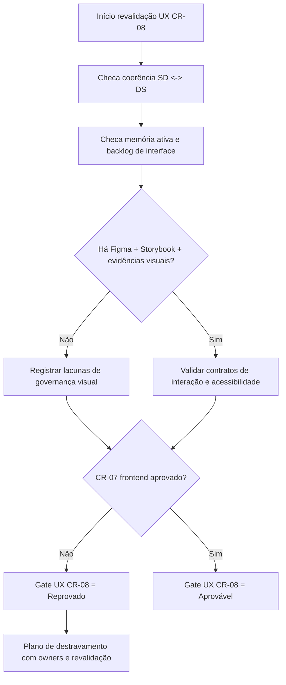

# Parecer UX — Revalidacao do Gate CR-08

## Escopo

- Branch avaliada: `feature/p0-hardening-core`.
- Tipo de revalidacao: **documental**, usando apenas artefatos existentes no repositório.
- Objetivo: revalidar o gate UX para CR-08 a partir da coerência entre ARD/Design System e evidências de review já versionadas.

## Evidências analisadas

- Memória compartilhada e histórico:
  - `.github/agents/memoria/MEMORIA-COMPARTILHADA.md`
  - `.github/agents/memoria/historico/2026-03-22-2354-revalidacao-cr07-e-consolidacao-cr06-cr07-obs.md`
  - `.github/agents/memoria/historico/2026-03-22-1305-execucao-cr06-design-system-streamlit.md`
  - `.github/agents/memoria/historico/2026-03-21-2213-sintese-decisoria-ux-gate-obs.md`
- Arquitetura e Design System:
  - `docs/system-design.md`
  - `docs/design-system.md`
  - `docs/declaracao-escopo-aplicacao.md`
- Review correlato obrigatório:
  - `review/2026-03-22-2358-qa-validacao-frontend-cr07-revalidacao.md`
  - `review/2026-03-22-2353-execucao-cr06-cr07-consolidacao-tech-lead.md`
  - `review/2026-03-22-0336-plano-corretivo-p0-p1-convergencia-gates.md`

## Coerência SD<->DS

- **Coerente (parcial)** no vínculo arquitetural:
  - ARD referencia explicitamente `docs/design-system.md` e registra pendências visuais (Figma/Storybook/evidências reais).
  - Design System descreve componentes, estados e fluxos reais do Streamlit e mantém status “em implementação”.
- **Coerente (parcial)** com o estado de gates no PRD:
  - `G2` marcado como parcial (CR-06 concluído com pendências visuais).
  - `G3` permanece reprovado por CR-07 revalidado.
- **Não convergente para aceite UX final**:
  - ausência de evidências visuais de proposta e pós-implementação no repositório;
  - ausência de referência Figma;
  - ausência de estrutura Storybook versionada.

## Divergências/Lacunas

| Lacuna de governança visual | Evidência no repo | Impacto UX | Recomendação objetiva |
|---|---|---|---|
| Figma ausente | `docs/system-design.md` e `docs/design-system.md` registram “pendente” | Sem baseline oficial de proposta para comparação e decisão de interação | Vincular arquivo/projeto Figma oficial no ARD/DS (ou exceção formal aprovada pelo Tech Lead) |
| Storybook ausente | `docs/system-design.md` e `docs/design-system.md` registram “pendente”; inexistência de `.storybook` no repo | Sem catálogo navegável de estados/variações; maior risco de divergência entre implementação e contrato UX | Publicar estrutura mínima Storybook por fluxos críticos (auth, painel, aporte/saque, admin) |
| Evidências visuais reais/propostas ausentes | `docs/design-system.md` explicita ausência de imagens de proposta e capturas reais | Impossibilita validação comparativa visual e auditoria de regressão de interface | Versionar pacote mínimo de screenshots por fluxo e estado crítico |
| Contratos de interação incompletos para loading/acessibilidade auditável | DS registra “carregamento parcial” e pendência de baseline WCAG/foco/teclado | Comportamento pode ficar imprevisível em espera/erro e para usuários assistivos | Definir contrato formal de estados de loading + checklist de acessibilidade verificável |
| Gate frontend QA ainda bloqueado | `review/2026-03-22-2358-qa-validacao-frontend-cr07-revalidacao.md` = reprovado | UX não consegue fechar cadeia de qualidade frontend para CR-08 | Resolver CR-07 (Cypress + evidências + governança visual) antes da convergência final CR-08 |

## Status gate UX

**Status recomendado: REPROVADO.**

Justificativa objetiva:
- existe evolução documental (CR-06 parcial), porém a governança visual obrigatória permanece incompleta;
- o gate QA frontend correlato (CR-07) segue reprovado por ausência de evidências essenciais, impedindo convergência de qualidade de interface no CR-08.

## Plano de destravamento

1. **Figma**: publicar referência oficial (ou exceção formal aprovada) e sincronizar em `docs/system-design.md` + `docs/design-system.md`.
2. **Storybook.js**: estruturar baseline no repositório com stories dos componentes críticos e estados (sucesso/erro/vazio/loading).
3. **Evidências visuais**: anexar capturas versionadas de proposta (quando houver) e da implementação real por fluxo.
4. **Contratos UX auditáveis**: fechar matriz de interação (gatilho -> resposta UI -> resultado) e checklist de acessibilidade (foco, teclado, contraste, leitura assistiva).
5. **Revalidação conjunta**: após itens 1–4, reexecutar CR-07 (QA frontend) e então CR-08 para convergência final.

## Critérios de revalidação

- CR-08 UX só pode migrar para **Aprovado com ressalvas** ou **Aprovado** quando:
  1. ARD e DS mantiverem vínculo explícito e atualizado sem contradições;
  2. houver referência rastreável de Figma e Storybook (ou exceções formais aprovadas);
  3. houver pacote de evidências visuais versionado (proposta e/ou real);
  4. contratos de interação críticos estiverem documentados por estado;
  5. CR-07 deixar de estar reprovado no frontend.

