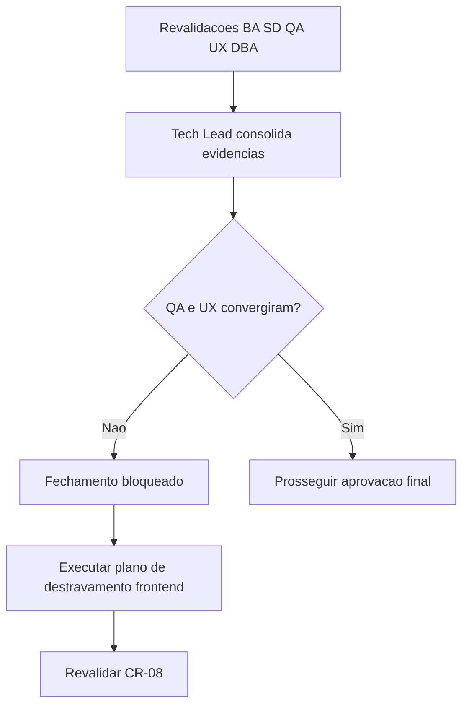

# Revisao Consolidada do Tech Lead - CR-08 (Convergencia de gates)

## Identificacao

- Projeto ou produto: OBS Pro Bot
- Responsavel Tech Lead: AI Tech Lead
- Data da revisao: 2026-03-22
- Escopo revisado: convergencia CR-08 com revalidacao BA, SD, QA, UX e DBA + regra de testes via container
- Agents envolvidos: Business Analyst, Senior Developer, QA Expert, UX Expert, DBA, Tech Lead
- Status da revisao: Concluida com ressalvas

## Resumo executivo

- Objetivo da entrega: consolidar readiness de fechamento apos plano corretivo P0/P1 e revalidacoes CR-08.
- Contexto consolidado: branch `feature/p0-hardening-core`, PRD/ARD atualizados, DS publicado, revalidacao QA frontend ainda bloqueada.
- Resultado executivo da revisao: sem convergencia total de gates obrigatorios para aceite final.
- Recomendacao do Tech Lead: manter fechamento formal como reprovado ate destravamento do gate QA/UX frontend e normalizacao documental de template QA.

## PRD e ARD

- PRD aplicavel?: Sim
- Referencia do PRD: `docs/declaracao-escopo-aplicacao.md`
- ARD aplicavel?: Sim
- Referencia do ARD: `docs/system-design.md`

| Artefato | Item revisado | Consistencia com entrega | Lacunas encontradas | Observacoes |
|---|---|---|---|---|
| PRD | Gates G0..G5, dependencias BA/SD/QA/UX/DBA, rastreabilidade | Parcialmente consistente | G3 reprovado, G4 pendente; template QA frontend referenciado em caminho padrao ainda nao normalizado | PRD reflete status real de bloqueios frontend |
| ARD | Secao de DS, criterios/rastreabilidade, plano de capacidade DBA | Parcialmente consistente | Figma/Storybook/evidencias visuais ausentes; pendencias P1 (append-only e backup/restore) | Handoff DBA CR-08 incorporado no ARD |

## Divergencias entre PRD, ARD, implementacao e evidencias de validacao

| Divergencia | Origem | Impacto | Resolucao adotada | Status |
|---|---|---|---|---|
| Gate QA frontend sem Cypress e sem evidencias visuais | QA/UX vs evidencias de execucao | Alto (bloqueia aceite) | Manter CR-07/CR-08 reprovados no frontend ate evidencia objetiva | Aberta |
| Ausencia de Figma e Storybook rastreaveis | ARD/DS vs governanca UX | Alto (governanca visual incompleta) | Manter gate UX reprovado com plano de destravamento | Aberta |
| Template QA frontend esperado em `templates/...` nao encontrado na raiz | Governanca documental | Medio (rastreabilidade/automacao) | Registrar desvio e exigir normalizacao ou excecao formal | Aberta |
| P1 de dados (append-only, backup/restore testado, capacidade operacional) | DBA vs operacao real | Medio/alto (auditoria/recuperacao) | Gate DBA mantido em aprovado com ressalvas | Parcial |
| Aderencia de System Design ao template padrao sem preenchimento direto | BA/ARD | Medio | Excecao registrada; manter crosswalk e governanca | Parcial |

- Conclusao especifica sobre divergencias entre PRD e ARD: ha coerencia estrutural suficiente para operacao atual, com lacunas explicitadas no frontend e em capacidade de dados.
- Conclusao especifica sobre divergencias entre artefatos, implementacao e evidencias de validacao: backend/core tem evidencias tecnicas suficientes; frontend/governanca permanece sem evidencias obrigatorias para aceite.

## Registro consolidado das atividades por agent

| Agent | Atividade executada | Artefatos gerados | Decisoes associadas | Status |
|---|---|---|---|---|
| Business Analyst | Revalidou PRD↔ARD↔gates e aderencia de template SD | `review/2026-03-22-2359-ba-revalidacao-cr08.md`; ajuste em `docs/declaracao-escopo-aplicacao.md` | Gate BA condicional | Concluido |
| Senior Developer | Revalidou readiness tecnico e executou validacoes containerizadas | `review/2026-03-22-0001-sd-revalidacao-cr08.md` | Gate SD aprovado com ressalvas | Concluido |
| QA Expert | Revalidou QA global (backend + frontend/governanca) | `review/2026-03-22-0006-qa-revalidacao-global-cr08.md` | Gate QA reprovado; sem escalonamento (>3 nao atingido) | Concluido |
| UX Expert | Revalidou coerencia SD<->DS e governanca visual | `review/2026-03-21-2359-ux-revalidacao-gate-cr08.md` | Gate UX reprovado | Concluido |
| DBA | Revalidou integridade/capacidade e handoff ao ARD | `review/2026-03-23-0012-parecer-dba-cr08-revalidacao-gate.md`; ajuste em `docs/system-design.md` | Gate DBA aprovado com ressalvas | Concluido |
| Tech Lead | Consolidou evidencias, divergencias e decisao executiva CR-08 | Este documento | Fechamento final permanece bloqueado | Concluido |

## Decisoes e motivacoes

| Decisao | Motivacao | Alternativas consideradas | Dono | Impacto |
|---|---|---|---|---|
| Manter fechamento CR-08 sem aprovacao final | Gates QA e UX seguem reprovados | Aprovar com excecao de frontend (descartado) | Tech Lead | Preserva governanca e reduz risco de aceite sem evidencia |
| Formalizar regra de validacao via container | Solicitante definiu regra operacional obrigatoria | Validacao hibrida host+container (descartado) | Tech Lead + SD + QA | Padroniza reproducibilidade de evidencias |
| Aceitar DBA apenas com ressalvas | P0 transacional atendido; P1 criticos pendentes | Reprovar DBA total (descartado por evidencias P0) | DBA + Tech Lead | Mantem progresso sem ocultar riscos |

## Itens impactados

| Item impactado | Tipo | Mudanca observada | Risco associado | Mitigacao |
|---|---|---|---|---|
| `docs/declaracao-escopo-aplicacao.md` | PRD | Status de gates e dependencias atualizados | Divergencia se nao sincronizar com novos pareceres | Revalidacao em cada rodada de gate |
| `docs/system-design.md` | ARD | Handoff DBA CR-08 incorporado | Pendencias de frontend e P1 dados permanecem | Plano CR-09/CR-10 + UX/QA frontend |
| `review/2026-03-22-0006-qa-revalidacao-global-cr08.md` | QA | Consolidacao de bloqueios frontend | Bloqueio de aceite final | Executar condicoes objetivas de destravamento |
| `review/2026-03-21-2359-ux-revalidacao-gate-cr08.md` | UX | Reprovacao com plano de destravamento | Governanca visual incompleta | Figma/Storybook/evidencias visuais |
| `review/2026-03-23-0012-parecer-dba-cr08-revalidacao-gate.md` | DBA | Metas e gatilhos de capacidade formalizados | Execucao operacional pendente | Implementar plano P1 com evidencia |

## Pontos validados

| Ponto validado | Origem da evidencia | Resultado | Observacoes |
|---|---|---|---|
| Branch segue Gitflow | `feature/p0-hardening-core` | OK | Prefixo `feature/` aderente |
| Compilacao Python em container | `docker compose -f docker-compose.yml run --rm ... python -m py_compile ...` | OK | Execucao via `docker-compose.yml` |
| Gate P0 com cobertura em container | `docker compose -f docker-compose.yml run --rm ... python -m pytest -q tests/test_p0_hardening.py --cov=dashboard --cov-fail-under=20` | 11 passed, 24.14% | Threshold de 20% atendido |
| Suite completa em container | `docker compose -f docker-compose.yml run --rm ... python -m pytest -q` | 11 passed | Backend/core validado |
| QA frontend revalidado | `review/2026-03-22-2358-qa-validacao-frontend-cr07-revalidacao.md` + `review/2026-03-22-0006-qa-revalidacao-global-cr08.md` | Reprovado | Bloqueio central da rodada |

## Pendencias, bloqueios e riscos residuais

| Tipo | Descricao | Impacto | Owner | Proxima acao |
|---|---|---|---|---|
| Bloqueio | Ausencia de Cypress E2E com evidencia de execucao | Alto | QA + SD | Implementar suite minima e anexar relatorios |
| Bloqueio | Ausencia de Figma e Storybook rastreaveis | Alto | UX + SD | Publicar links/estrutura ou excecao formal aprovada |
| Bloqueio | Ausencia de evidencias visuais versionadas | Alto | UX + QA | Versionar pacote de capturas/videos por fluxo critico |
| Pendencia | Template QA frontend em caminho divergente do esperado (`templates/...`) | Medio | Tech Lead + QA | Normalizar caminho ou registrar excecao formal |
| Pendencia | Append-only financeiro, backup/restore testado e capacidade operacional | Medio/alto | DBA + Tech Lead | Executar CR-09/CR-10 e revalidar gate DBA |

## Impacto global da entrega

- Impacto no negocio: evita fechamento com risco elevado em qualidade de interface e governanca visual.
- Impacto tecnico: backend/core estabilizado em P0 com evidencias containerizadas reproduziveis.
- Impacto operacional: release formal permanece bloqueada por condicoes objetivas nao atendidas.
- Impacto em UX: DS publicado, mas governanca visual continua incompleta.
- Impacto em dados: integridade P0 validada; resiliencia e auditoria plena ainda pendentes em P1.

## Encaminhamento para fechamento

- Pronto para aprovacao final?: Nao
- Dependencias para `templates/aprovacao-final-tech-lead-template.md`: destravar bloqueios de QA/UX frontend e normalizar governanca de template QA.
- Arquivo concreto desta revisao consolidada para referencia no fechamento final: `review/2026-03-22-0009-revisao-consolidada-tech-lead-cr08.md`
- Resumo das divergencias resolvidas que devem constar no fechamento final: validacao container-first e handoff DBA de capacidade incorporado no ARD.
- Bloqueios remanescentes que precisam constar no fechamento final: Cypress/Figma/Storybook/evidencias visuais + template QA path + pendencias P1 DBA.
- Observacoes finais do Tech Lead: sem convergencia completa de gates obrigatorios, o aceite formal deve permanecer bloqueado.

