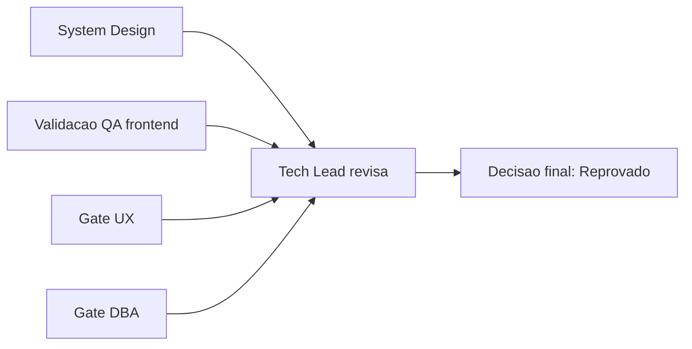

# Aprovacao Final do Tech Lead - CR-08 (convergencia de gates)

## Identificacao

- Projeto ou produto: OBS Pro Bot
- Responsavel Tech Lead: AI Tech Lead
- Data da aprovacao: 2026-03-22
- Escopo avaliado: fechamento formal da rodada CR-08 apos revalidacoes BA/SD/QA/UX/DBA e evidencias de testes via container
- Uso do template padrao neste fechamento?: Sim
- Em caso de nao, justificativa explicita para excecao: N/A
- Status final: Reprovado

## Artefatos obrigatorios revisados

- Revisao consolidada do Tech Lead: Sim
- Link ou referencia do arquivo concreto da revisao consolidada do Tech Lead: `review/2026-03-22-0009-revisao-consolidada-tech-lead-cr08.md`
- System Design revisado: Sim
- Template padrao de System Design utilizado?: Nao
- Em caso de nao, justificativa explicita: `docs/system-design.md` permanece em formato proprio com cobertura das secoes obrigatorias; excecao previamente registrada em `review/2026-03-22-0331-aprovacao-final-tech-lead.md`
- PRD aplicavel?: Sim
- Referencia do PRD revisado: `docs/declaracao-escopo-aplicacao.md`
- ARD aplicavel?: Sim
- Referencia do ARD revisado: `docs/system-design.md`
- Resumo das divergencias resolvidas entre PRD, ARD, implementacao e evidencias de validacao:
  - validacoes tecnicas de compilacao/testes confirmadas em container;
  - handoff DBA de capacidade incorporado no ARD para CR-08.
- Bloqueios remanescentes aceitos ou justificados: nao aceitos para fechamento (QA/UX frontend bloqueados).
- Validacao QA frontend aplicavel?: Sim
- Template QA frontend utilizado?: Parcial
- Documento de validacao QA frontend referenciado no fechamento final: `review/2026-03-22-2358-qa-validacao-frontend-cr07-revalidacao.md` e `review/2026-03-22-0006-qa-revalidacao-global-cr08.md`
- Trecho, link ou evidencia reaproveitada da validacao QA frontend: status reprovado por ausencia de Cypress, Figma, Storybook e evidencias visuais versionadas
- Em caso de nao, justificativa explicita: o template existe em `.github/agents/templates/qa-validacao-frontend-template.md`; normalizacao para `templates/...` ainda pendente
- Documento de Design System referenciado?: Sim
- Evidencias adicionais consultadas:
  - `review/2026-03-22-2359-ba-revalidacao-cr08.md`
  - `review/2026-03-22-0001-sd-revalidacao-cr08.md`
  - `review/2026-03-21-2359-ux-revalidacao-gate-cr08.md`
  - `review/2026-03-23-0012-parecer-dba-cr08-revalidacao-gate.md`

## Gates aplicados

| Gate | Aplicavel | Resultado | Evidencia | Observacoes |
|---|---|---|---|---|
| Business Analyst / System Design | Sim | Condicional | `review/2026-03-22-2359-ba-revalidacao-cr08.md` | Coerencia PRD/ARD parcial com pendencias interdisciplinares |
| QA Expert / Validacao frontend | Sim | Reprovado | `review/2026-03-22-0006-qa-revalidacao-global-cr08.md` | Bloqueio principal da rodada |
| UX Expert / Interface | Sim | Reprovado | `review/2026-03-21-2359-ux-revalidacao-gate-cr08.md` | Governanca visual incompleta |
| DBA / Persistencia | Sim | Aprovado com ressalvas | `review/2026-03-23-0012-parecer-dba-cr08-revalidacao-gate.md` | P0 ok; P1 pendente |

## Criterios de aceite consolidados

| Criterio | Status | Evidencia | Observacoes |
|---|---|---|---|
| Revisao consolidada do Tech Lead registrada | Atendido | `review/2026-03-22-0009-revisao-consolidada-tech-lead-cr08.md` | Template oficial utilizado |
| Referencia concreta ao arquivo da revisao consolidada | Atendido | Este documento + revisao consolidada CR-08 | Rastreabilidade mantida |
| Requisitos claros e rastreaveis | Parcial | `docs/declaracao-escopo-aplicacao.md` | G3/G4 ainda nao convergidos |
| PRD revisado quando aplicavel | Atendido | `docs/declaracao-escopo-aplicacao.md` | Status de gates explicito |
| ARD revisado quando aplicavel | Atendido | `docs/system-design.md` | Handoff DBA incorporado |
| Divergencias entre PRD, ARD, implementacao e evidencias tratadas | Parcial | Revisao consolidada CR-08 | Parte resolvida; bloqueios frontend abertos |
| System Design aderente ao template padrao | Parcial | `docs/system-design.md` + justificativa de excecao | Nao preenchido diretamente no template |
| Vinculo entre System Design e Design System | Atendido (parcial) | `docs/system-design.md` -> `docs/design-system.md` | Vinculo existe, governanca visual incompleta |
| Validacao QA frontend registrada | Atendido (com bloqueio) | `review/2026-03-22-2358-qa-validacao-frontend-cr07-revalidacao.md` | Resultado reprovado |
| Referencia direta ao documento de validacao QA frontend | Atendido | Pareceres QA CR-07/CR-08 | Mantem bloqueio de aceite |
| Riscos residuais aceitaveis | Nao atendido | Revisao consolidada CR-08 | Riscos de frontend nao mitigados |

## Riscos residuais e rollback

- Riscos residuais aceitos:
  - riscos P1 de dados sob monitoramento (append-only/backup-capacidade) com gate DBA em ressalvas.
- Riscos residuais nao aceitos:
  - ausencia de Cypress E2E com evidencia;
  - ausencia de Figma/Storybook rastreaveis;
  - ausencia de evidencias visuais versionadas;
  - divergencia de caminho esperado do template QA frontend.
- Plano de rollback:
  1. Manter decisao de fechamento CR-08 como reprovado.
  2. Nao encaminhar merge como entrega aprovada ate convergencia dos bloqueios.
  3. Executar plano de destravamento e realizar nova rodada de revalidacao.
- Dependencias criticas para monitoramento:
  - `Cypress` + evidencias QA frontend;
  - governanca visual (Figma/Storybook/evidencias);
  - normalizacao de template QA frontend;
  - execucao de CR-09/CR-10 (dados P1).

## Decisao final

- Decisao do Tech Lead: Reprovado
- Condicoes para fechamento:
  - convergencia dos gates QA e UX para aprovado (ou aprovado com ressalvas formalmente aceitas);
  - evidencias frontend obrigatorias anexadas;
  - normalizacao documental de template QA frontend;
  - plano P1 de dados com evidencias executadas.
- Pendencias remanescentes:
  - Cypress E2E sem execucao/evidencia;
  - Figma/Storybook/evidencias visuais ausentes;
  - template QA frontend sem normalizacao de caminho;
  - append-only/backup-capacidade em aberto.
- Escalonamentos necessarios:
  - nao aplicavel por enquanto para regra de >3 ciclos QA->Dev (contagem atual: 3 reprovacoes registradas).
- Sintese final do impacto global da entrega:
  - backend/core tecnicamente estavel no P0 com validacoes containerizadas;
  - aceite executivo segue bloqueado por governanca e qualidade frontend.
- Justificativa consolidada para eventual desvio do template padrao:
  - Nao houve desvio neste documento; template de aprovacao final foi seguido.

