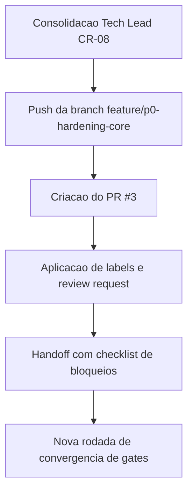

# Operacao de PR CR-08 - publicacao, review e handoff

## Contexto e objetivo

Este registro documenta a operacionalizacao da entrega CR-08 apos consolidacao tecnica e de governanca:
- branch Gitflow publicada;
- Pull Request aberto;
- labels de review aplicadas;
- review request configurado;
- checklist de handoff preparado para fluxo de aprovacao.

Objetivo: manter trilha auditavel entre consolidacao Tech Lead, submissao no GitHub e estado de review formal.

## Escopo tecnico e arquivos modificados

- `review/2026-03-22-0038-operacao-pr-cr08-handoff.md`
- `.github/agents/memoria/MEMORIA-COMPARTILHADA.md`
- `.github/agents/memoria/historico/2026-03-22-0039-operacao-pr-cr08-review-request-obs.md`

Mudancas aplicadas:
- registro formal da operacao de PR da entrega CR-08;
- sincronizacao da memoria compartilhada com estado de PR e governanca de review;
- registro historico curto orientado a decisao.

## ADR resumido

### Decisao
Publicar a entrega em PR unico na branch `feature/p0-hardening-core` com label de review e review request ativo, mantendo fechamento executivo CR-08 como reprovado ate convergencia de gates.

### Alternativas consideradas
1. Aguardar convergencia total antes de abrir PR.
2. Abrir PR com status explicito de bloqueios e trilha completa de evidencia.

### Trade-offs
- Alternativa 1 reduz ruido de review, mas atrasa rastreabilidade colaborativa.
- Alternativa 2 acelera revisao formal e visibilidade de bloqueios, mantendo controle por gates.

Decisao adotada: alternativa 2.

## Evidencias de validacao

Comandos executados:

```bash
git push -u origin feature/p0-hardening-core
gh pr create --base main --head feature/p0-hardening-core --title "feat(core): harden auth and consolidate CR-08 governance" --body-file /tmp/pr_body_cr08.md
gh api repos/hefestox/OBS/issues/3/labels -X POST --input - <<'JSON'
{"labels":["enhancement"]}
JSON
gh api repos/hefestox/OBS/pulls/3/requested_reviewers -X POST --input - <<'JSON'
{"reviewers":["salesadriano"]}
JSON
gh pr view 3 --json number,url,state,labels,reviewRequests
```

Resultado:
- PR criado com sucesso: `https://github.com/hefestox/OBS/pull/3`.
- Labels ativas no PR: `enhancement`, `needs-review`.
- Review request ativo para `hefestox`.
- Tentativa de solicitar review para `salesadriano` rejeitada com `HTTP 422` (autor do PR), comportamento esperado da API.

## Riscos, impacto e rollback

### Riscos
- PR aberto com fechamento executivo reprovado pode ser interpretado como pronto para merge sem leitura dos gates.
- Review request limitado ao conjunto permitido (autor nao pode ser reviewer).

### Impacto
- Aumenta visibilidade e rastreabilidade da entrega no fluxo GitHub.
- Mantem controle de decisao via artefatos de revisao/aprovacao final do Tech Lead.

### Plano de rollback
1. Fechar o PR #3 sem merge caso o fluxo de gates exija novo ciclo interno.
2. Abrir novo PR consolidado apos resolucao dos bloqueios frontend/QA/UX.

## Proximos passos recomendados

1. Publicar comentario de handoff no PR #3 com checklist de bloqueios e condicoes de destravamento.
2. Executar plano CR-09/CR-10 e revalidar QA/UX frontend para nova rodada de fechamento.
3. Manter evidencia de testes somente via `docker-compose.yml` em toda nova submissao.

## Diagrama (Mermaid)


