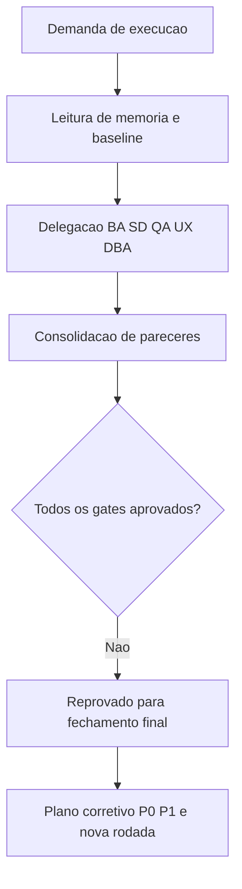

# Revisao Consolidada do Tech Lead - Governanca Inicial OBS

## Identificacao

- Projeto ou produto: OBS Pro Bot
- Responsavel Tech Lead: AI Tech Lead
- Data da revisao: 2026-03-22
- Escopo revisado: triagem inicial de governanca, sem implementacao de codigo
- Agents envolvidos: Business Analyst, Senior Developer, QA Expert, UX Expert, DBA, Tech Lead
- Status da revisao: Concluida com ressalvas

## Resumo executivo

- Objetivo da entrega: consolidar evidencias de triagem multidisciplinar e decidir readiness de fechamento.
- Contexto consolidado: branch limpa em `main`; memoria compartilhada lida; PRD/ARD disponiveis em `docs/`.
- Resultado executivo da revisao: gates obrigatorios nao convergiram para aceite.
- Recomendacao do Tech Lead: nao aprovar fechamento final; abrir ciclo corretivo com prioridades P0/P1.

## PRD e ARD

- PRD aplicavel?: Sim
- Referencia do PRD: `docs/declaracao-escopo-aplicacao.md`
- ARD aplicavel?: Sim
- Referencia do ARD: `docs/system-design.md`

| Artefato | Item revisado | Consistencia com entrega | Lacunas encontradas | Observacoes |
|---|---|---|---|---|
| PRD | Requisitos F-001..F-057, NFRs e criterios de aceite | Parcial | Rastreabilidade requisito -> evidencias de teste ausente | Documento bem estruturado para escopo e objetivo |
| ARD | Arquitetura, fluxo bot, ERD, deploy | Parcial | Varios pontos descritos nao estao cobertos por validacao executada | Documento cobre arquitetura macro e dados |

## Matriz de rastreabilidade

| Item de governanca | Evidencia primaria | Gate responsavel | Status |
|---|---|---|---|
| Requisitos claros e rastreaveis | `docs/declaracao-escopo-aplicacao.md` | BA | Aprovado com ressalvas |
| Aderencia arquitetural | `docs/system-design.md` | BA/SD | Parcial |
| Validacao independente de testes | `.github/workflows/main.yml` + ausencia de suite pytest | QA | Reprovado |
| Frontend com governanca UX/QA | ausencia de referencia explicita DS + ausencia de QA frontend preenchido | UX/QA | Reprovado |
| Persistencia e integridade financeira | `dashboard.py` + parecer DBA | DBA | Reprovado |
| Seguranca basica de credenciais/senhas | `dashboard.py` (defaults hardcoded, SHA-256) | SD/DBA | Reprovado |

## Divergencias entre PRD, ARD, implementacao e evidencias de validacao

| Divergencia | Origem | Impacto | Resolucao adotada | Status |
|---|---|---|---|---|
| Env vars obrigatorias no design vs defaults hardcoded no codigo | ARD x implementacao | Alto (seguranca/operacao) | Bloqueio para aceite final; priorizar correcao P0 | Aberta |
| Criterios de aceite com testes vs ausencia de suite pytest/CI funcional | PRD x evidencias | Alto (regressao) | Gate QA reprovado; exigir plano minimo P0 | Aberta |
| Frontend exige vinculo com Design System e QA frontend, sem evidencia documental completa | Protocolo x docs/evidencias | Alto (UX/governanca) | Gate UX/QA reprovado; exigir artefatos obrigatorios | Aberta |
| `USE_RSI_EXIT` declarado como dead code | PRD x implementacao | Medio (ambiguidade funcional) | Manter registrado como debito tecnico ate tratamento | Aberta |
| Fluxo financeiro demanda robustez; risco de atomicidade/concorrencia apontado pelo DBA | PRD/ARD x implementacao | Alto (integridade de dados) | Gate DBA reprovado; exigir ajustes transacionais | Aberta |

- Conclusao especifica sobre divergencias entre PRD e ARD: documentos sao coerentes no macro, mas com lacunas de rastreabilidade bidirecional.
- Conclusao especifica sobre divergencias entre artefatos, implementacao e evidencias de validacao: ha bloqueios objetivos para aceite.

## Registro consolidado das atividades por agent

| Agent | Atividade executada | Artefatos gerados | Decisoes associadas | Status |
|---|---|---|---|---|
| Business Analyst | Triagem de requisitos, consistencia PRD/ARD, lacunas de rastreabilidade | Parecer BA | Gate BA com ressalvas | Concluido |
| Senior Developer | Triagem tecnica de stack, risco, seguranca e readiness de testes | Parecer SD | Gate SD reprovado por riscos P0 e falta de testes | Concluido |
| QA Expert | Triagem de cobertura, criterio de aceite e evidencias de validacao | Parecer QA | Gate QA reprovado por ausencia de validacao independente | Concluido |
| UX Expert | Triagem de governanca UX para frontend (DS, evidencias visuais, QA frontend) | Parecer UX | Gate UX reprovado por ausencia de baseline documental | Concluido |
| DBA | Triagem de persistencia, concorrencia, integridade e auditoria | Parecer DBA | Gate DBA reprovado por risco de integridade/concorrencia | Concluido |
| Tech Lead | Consolidacao final, decisao de aceite e plano de proxima etapa | Este documento | Fechamento final bloqueado ate tratar pendencias | Concluido |

## Registro cronologico das atividades

| Ordem | Responsavel | Motivacao | Artefato/Evidencia | Efeito observado |
|---|---|---|---|---|
| 1 | Tech Lead | Ler memoria persistente e baseline | `.github/agents/memoria/MEMORIA-COMPARTILHADA.md` | Contexto validado |
| 2 | Tech Lead -> BA | Confirmar PRD/ARD e rastreabilidade | Parecer BA | Escopo aceito com ressalvas |
| 3 | Tech Lead -> SD | Validar risco tecnico e readiness | Parecer SD | Bloqueio tecnico identificado |
| 4 | Tech Lead -> QA | Validar testes independentes e evidencias | Parecer QA | Gate reprovado |
| 5 | Tech Lead -> UX | Validar coerencia de frontend/documentacao UX | Parecer UX | Gate reprovado |
| 6 | Tech Lead -> DBA | Validar integridade e capacidade de dados | Parecer DBA | Gate reprovado |
| 7 | Tech Lead | Consolidar decisoes e status de aceite | `review/2026-03-22-0328-revisao-consolidada-tech-lead.md` | Pronto para encaminhamento formal (reprovado) |

## Decisoes e motivacoes

| Decisao | Motivacao | Alternativas consideradas | Dono | Impacto |
|---|---|---|---|---|
| Nao aprovar fechamento final nesta rodada | 4 gates obrigatorios em reprovacao | Aprovar com risco residual alto (descartado) | Tech Lead | Evita aceite sem evidencia |
| Tratar seguranca e testes como P0 | Risco alto de incidente/regressao | Postergar para proxima release (descartado) | SD + QA + DBA | Reduz risco imediato |
| Exigir baseline UX/QA frontend | Frontend sem trilha documental completa | Excecao sem justificativa (descartado) | UX + QA | Aumenta previsibilidade de experiencia |

## Itens impactados

| Item impactado | Tipo | Mudanca observada | Risco associado | Mitigacao |
|---|---|---|---|---|
| `docs/declaracao-escopo-aplicacao.md` | PRD operacional | Usado como base de rastreabilidade | Divergencia com evidencias de teste | Plano QA P0 |
| `docs/system-design.md` | ARD | Usado como base de arquitetura | Divergencia parcial com implementacao real | Ajuste de coerencia doc-codigo |
| `dashboard.py` | Implementacao | Evidencias de defaults hardcoded e SHA-256 | Risco de seguranca e governanca | Correcao P0/P1 |
| `.github/workflows/main.yml` | CI | Valida sintaxe e estrutura, sem suite funcional | Risco de regressao | Adicionar job de testes |

## Pontos validados

| Ponto validado | Origem da evidencia | Resultado | Observacoes |
|---|---|---|---|
| Branch alinhada e sem alteracoes locais | `git status --short --branch` | OK | Base limpa para consolidacao documental |
| PRD aplicavel e estruturado | `docs/declaracao-escopo-aplicacao.md` | OK com ressalvas | Boa cobertura de escopo e criterios |
| ARD aplicavel e estruturado | `docs/system-design.md` | OK com ressalvas | Boa visao macro de arquitetura |
| Pipeline de sintaxe ativo | `.github/workflows/main.yml` | Parcial | Nao substitui testes funcionais |
| Gates especializados executados | pareceres BA/SD/QA/UX/DBA | Executado | Resultado sem convergencia para aceite |

## Pendencias, bloqueios e riscos residuais

| Tipo | Descricao | Impacto | Owner | Proxima acao |
|---|---|---|---|---|
| Bloqueio | Ausencia de suite de testes independentes | Alto | QA + SD | Definir e executar plano P0 de testes |
| Bloqueio | Segredos/defaults hardcoded e hash de senha fraco | Alto | SD + DBA | Corrigir seguranca basica e revisar docs |
| Bloqueio | Falta de baseline UX (Design System + QA frontend) | Alto | UX + QA + BA | Publicar artefatos e validacao frontend |
| Pendencia | Divergencia PRD/ARD/implementacao sem resolucao | Medio | Tech Lead + BA | Registrar plano de convergencia |
| Risco residual | Persistencia SQLite sob crescimento e concorrencia | Medio | DBA | Plano de evolucao e monitoramento |

## Impacto global da entrega

- Impacto no negocio: melhora previsibilidade por bloqueio preventivo de aceite sem evidencia.
- Impacto tecnico: backlog corretivo priorizado para seguranca, testes e integridade.
- Impacto operacional: fechamento formal adiado ate convergencia dos gates.
- Impacto em UX: exige formalizacao de Design System e validacao frontend.
- Impacto em dados: exige melhorias de atomicidade, auditoria e escalabilidade.

## Encaminhamento para fechamento

- Pronto para aprovacao final?: Nao
- Dependencias para `templates/aprovacao-final-tech-lead-template.md`: resolucao dos bloqueios P0/P1 e revalidacao dos gates.
- Arquivo concreto desta revisao consolidada para referencia no fechamento final: `review/2026-03-22-0328-revisao-consolidada-tech-lead.md`
- Resumo das divergencias resolvidas que devem constar no fechamento final: nenhuma resolvida nesta rodada.
- Bloqueios remanescentes que precisam constar no fechamento final: QA, UX, DBA e SD reprovados.
- Observacoes finais do Tech Lead: sem convergencia de evidencias, nao ha aceite tecnico.

