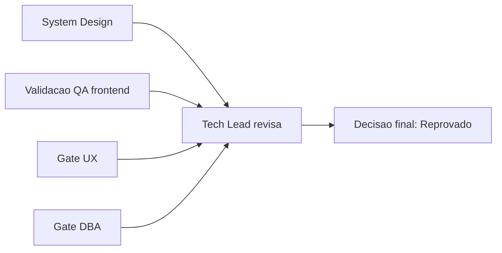

# Aprovacao Final do Tech Lead - OBS Pro Bot (Rodada inicial)

## Identificacao

- Projeto ou produto: OBS Pro Bot
- Responsavel Tech Lead: AI Tech Lead
- Data da aprovacao: 2026-03-22
- Escopo avaliado: fechamento formal da rodada inicial de governanca, sem implementacao de codigo
- Uso do template padrao neste fechamento?: Sim
- Em caso de nao, justificativa explicita para excecao: N/A
- Status final: Reprovado

## Artefatos obrigatorios revisados

- Revisao consolidada do Tech Lead: Sim
- Link ou referencia do arquivo concreto da revisao consolidada do Tech Lead: `review/2026-03-22-0328-revisao-consolidada-tech-lead.md`
- System Design revisado: Sim
- Template padrao de System Design utilizado?: Nao
- Em caso de nao, justificativa explicita: documento existente em formato proprio do projeto (`docs/system-design.md`), sem evidencia de preenchimento direto do template padrao nesta rodada
- PRD aplicavel?: Sim
- Referencia do PRD revisado: `docs/declaracao-escopo-aplicacao.md`
- ARD aplicavel?: Sim
- Referencia do ARD revisado: `docs/system-design.md`
- Resumo das divergencias resolvidas entre PRD, ARD, implementacao e evidencias de validacao: nenhuma divergencia critica resolvida nesta rodada; divergencias apenas registradas
- Bloqueios remanescentes aceitos ou justificados: nao aceitos para fechamento (QA, UX, DBA e SD reprovados)
- Validacao QA frontend aplicavel?: Sim
- Template QA frontend utilizado?: Nao
- Documento de validacao QA frontend referenciado no fechamento final: nao identificado
- Trecho, link ou evidencia reaproveitada da validacao QA frontend: parecer UX/QA consolidado na revisao Tech Lead de 2026-03-22-0328
- Em caso de nao, justificativa explicita: inexistencia de artefato preenchido conforme `templates/qa-validacao-frontend-template.md`
- Documento de Design System referenciado?: Nao
- Evidencias adicionais consultadas:
  - `.github/agents/memoria/MEMORIA-COMPARTILHADA.md`
  - `.github/agents/memoria/historico/2026-03-22-0329-consolidacao-gates-iniciais-obs.md`
  - `.github/workflows/main.yml`
  - `dashboard.py`

## Gates aplicados

| Gate | Aplicavel | Resultado | Evidencia | Observacoes |
|---|---|---|---|---|
| Business Analyst / System Design | Sim | Aprovado com ressalvas | Revisao consolidada 2026-03-22-0328 | Coerencia macro com lacunas de rastreabilidade |
| QA Expert / Validacao frontend | Sim | Reprovado | Revisao consolidada 2026-03-22-0328 | Sem suite independente e sem QA frontend formal |
| UX Expert / Interface | Sim | Reprovado | Revisao consolidada 2026-03-22-0328 | Sem vinculo formal com Design System e evidencias visuais |
| DBA / Persistencia | Sim | Reprovado | Revisao consolidada 2026-03-22-0328 | Riscos de integridade/concorrencia e auditoria |

## Criterios de aceite consolidados

| Criterio | Status | Evidencia | Observacoes |
|---|---|---|---|
| Revisao consolidada do Tech Lead registrada | Atendido | `review/2026-03-22-0328-revisao-consolidada-tech-lead.md` | Documento completo publicado |
| Referencia concreta ao arquivo da revisao consolidada | Atendido | Este documento + revisao 0328 | Rastreabilidade mantida |
| Requisitos claros e rastreaveis | Parcial | `docs/declaracao-escopo-aplicacao.md` | Falta cobertura por evidencias de teste |
| PRD revisado quando aplicavel | Atendido | `docs/declaracao-escopo-aplicacao.md` | PRD operacional aplicavel |
| ARD revisado quando aplicavel | Atendido | `docs/system-design.md` | ARD aplicavel com ressalvas |
| Divergencias entre PRD, ARD, implementacao e evidencias tratadas | Nao atendido | Revisao 0328 (divergencias abertas) | Bloqueio para aceite |
| System Design aderente ao template padrao | Nao atendido | Ausencia de evidencia de uso direto do template | Excecao nao formalizada |
| Vinculo entre System Design e Design System | Nao atendido | Parecer UX/QA na revisao 0328 | Bloqueio frontend |
| Validacao QA frontend registrada | Nao atendido | Ausencia de artefato no template QA frontend | Bloqueio frontend |
| Referencia direta ao documento de validacao QA frontend | Nao atendido | N/A | Bloqueio frontend |
| Riscos residuais aceitaveis | Nao atendido | Revisao 0328 + memoria compartilhada | Riscos altos nao mitigados |

## Riscos residuais e rollback

- Riscos residuais aceitos:
  - nenhum risco alto aceito para fechamento nesta rodada.
- Riscos residuais nao aceitos:
  - seguranca: defaults hardcoded e hash de senha inadequado;
  - qualidade: ausencia de testes independentes e CI funcional de comportamento;
  - UX/governanca frontend: falta de Design System e QA frontend formal;
  - dados: riscos de integridade, concorrencia e trilha de auditoria.
- Plano de rollback:
  1. Manter status de fechamento como reprovado.
  2. Nao promover merge de entrega como "aceita" ate convergencia dos gates.
  3. Reabrir ciclo corretivo P0/P1 com nova revisao consolidada.
- Dependencias criticas para monitoramento:
  - plano de testes independente (QA + SD);
  - hardening de seguranca e dados (SD + DBA);
  - baseline UX documental (UX + QA + BA).

## Decisao final

- Decisao do Tech Lead: Reprovado para fechamento final nesta rodada.
- Condicoes para fechamento:
  - convergencia de QA, UX, DBA e SD para status aprovado;
  - tratamento das divergencias PRD/ARD/implementacao/evidencias;
  - registro de validacao QA frontend e referencia explicita ao Design System.
- Pendencias remanescentes:
  - plano corretivo P0/P1 ainda nao executado;
  - sem evidencias novas de validacao independente apos consolidacao inicial.
- Escalonamentos necessarios:
  - ainda nao aplicavel ao criterio de >3 ciclos QA->Dev nesta rodada.
- Sintese final do impacto global da entrega:
  - rastreabilidade documental concluida;
  - aceite tecnico formal bloqueado por riscos criticos nao mitigados.
- Justificativa consolidada para eventual desvio do template padrao:
  - nenhum desvio neste documento; template de aprovacao final seguido.

