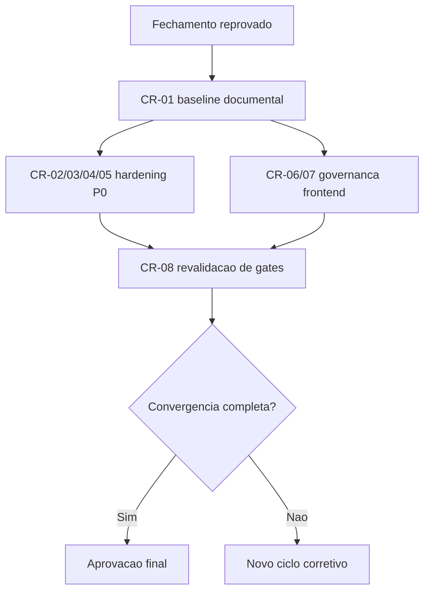

# Plano Corretivo P0/P1 - Convergencia de Gates OBS Pro Bot

## Contexto e objetivo

Consolidar um plano executavel para destravar o fechamento tecnico reprovado na rodada inicial.

Referencias de origem:
- `review/2026-03-22-0328-revisao-consolidada-tech-lead.md`
- `review/2026-03-22-0331-aprovacao-final-tech-lead.md`
- `.github/agents/memoria/MEMORIA-COMPARTILHADA.md`

Objetivo tecnico desta entrega:
- transformar bloqueios em backlog P0/P1 com owners, dependencias e criterios de aceite verificaveis;
- definir evidencias obrigatorias para nova rodada de validacao;
- estabelecer ordem de execucao para convergencia dos gates BA, SD, QA, UX e DBA.

## Escopo tecnico e arquivos modificados

- `review/2026-03-22-0336-plano-corretivo-p0-p1-convergencia-gates.md`
- `.github/agents/memoria/MEMORIA-COMPARTILHADA.md`
- `.github/agents/memoria/historico/2026-03-22-0337-plano-corretivo-p0-p1-convergencia-gates-obs.md`

Mudancas aplicadas:
- consolidacao de plano P0/P1 com backlog e rastreabilidade;
- definicao de DoR/DoD e criterios de gate por dominio;
- registro de decisao Tech Lead para execucao da proxima rodada.

## ADR resumido

### Decisao

Executar plano incremental em ondas:
1) baseline documental e rastreabilidade;
2) hardening tecnico P0 (seguranca, atomicidade, testes);
3) governanca frontend UX/QA;
4) revalidacao cruzada e novo fechamento formal.

### Alternativas consideradas

1. Big-bang em uma unica entrega tecnica e documental.
2. Incrementos por dominio com gates intermediarios (escolhida).

### Trade-offs

- Big-bang reduz overhead de coordenacao, mas aumenta risco de regressao e atraso no aceite.
- Incremental melhora governanca e evidencias, com custo adicional de orquestracao.

## Backlog corretivo consolidado (P0/P1)

| ID | Item | Prioridade | Dono principal | Apoio obrigatorio | Dependencias | Criterio de aceite verificavel |
|---|---|---|---|---|---|---|
| CR-01 | Saneamento PRD/ARD + matriz de rastreabilidade | P0 | BA | Tech Lead | - | PRD/ARD atualizados com divergencias, owners e status; matriz requisito -> implementacao -> teste publicada |
| CR-02 | Segredos por env + remocao de hardcoded sensivel | P0 | SD | DBA | CR-01 | App sem segredos hardcoded em producao; falha controlada quando env obrigatoria ausente; evidencia em CI |
| CR-03 | Hash de senha forte + sessao segura | P0 | SD | DBA + QA | CR-02 | Fluxo auth validado com hash forte e testes de regressao passando |
| CR-04 | Atomicidade financeira deposito/saque + ledger | P0 | SD + DBA | QA | CR-02 | Status financeiro e ledger no mesmo boundary transacional; testes de falha/rollback e concorrencia aprovados |
| CR-05 | Suite de testes independente + CI bloqueante | P0 | QA + SD | Tech Lead | CR-03, CR-04 | Testes P0 com 100% pass; pipeline bloqueante ativa; evidencias versionadas |
| CR-06 | Design System minimo + referencia explicita no System Design | P0 | UX + BA | QA + SD | CR-01 | Documento DS publicado e referenciado explicitamente em `docs/system-design.md` |
| CR-07 | Validacao QA frontend no template oficial | P0 | QA | UX | CR-06 | Artefato de QA frontend preenchido com evidencias, bloqueios e status final |
| CR-08 | Revalidacao de gates e novo fechamento Tech Lead | P0 | Tech Lead | BA + SD + QA + UX + DBA | CR-01..CR-07 | Nova revisao consolidada e nova aprovacao final com convergencia dos gates |
| CR-09 | Trilha de auditoria financeira append-only + conciliacao | P1 | DBA + SD | QA | CR-04 | Eventos financeiros rastreaveis por actor/correlation_id e rotina de reconciliacao com evidencia |
| CR-10 | Backup/restore testavel + plano de capacidade/expansao | P1 | DBA + BA | Tech Lead | CR-09 | Runbook com RPO/RTO, teste de restore e gatilhos SQLite -> PostgreSQL documentados |

## DoR / DoD resumido por onda

### Onda 1 - Base documental e rastreabilidade
- DoR: artefatos 0328 e 0331 aprovados para referencia.
- DoD: CR-01 concluido e publicado.

### Onda 2 - Hardening tecnico P0
- DoR: CR-01 concluido.
- DoD: CR-02, CR-03, CR-04, CR-05 concluídos com evidencias executaveis.

### Onda 3 - Frontend governanca UX/QA
- DoR: CR-01 concluido.
- DoD: CR-06 e CR-07 concluidos com referencia cruzada em PRD/ARD/QA.

### Onda 4 - Fechamento formal
- DoR: todos os P0 concluidos.
- DoD: CR-08 concluido com status final apto ao aceite.

## Evidencias de validacao

Comandos executados nesta consolidacao:

```bash
git --no-pager status --short --branch
ls -1 review | sort
```

Resultado:
- Revisoes anteriores validadas e usadas como baseline.
- Plano corretivo consolidado em artefato tecnico auditavel.
- Validacao automatizada de codigo **nao executada** nesta entrega (escopo documental/orquestracao).

## Riscos, impacto e rollback

### Riscos

- atraso na convergencia se owners nao executarem em ordem de dependencia;
- reprovacao recorrente se evidencias forem insuficientes para gates.

### Impacto

- reduz ambiguidade do proximo ciclo;
- aumenta previsibilidade de aceite com criterios verificaveis por gate.

### Plano de rollback

1. Manter status de fechamento como reprovado.
2. Suspender novo fechamento enquanto CR-08 nao for atingido.
3. Replanejar backlog P0/P1 caso algum item se mostre inviavel tecnicamente.

## Proximos passos recomendados

1. Executar CR-01 imediatamente para destravar todas as frentes.
2. Iniciar CR-02..CR-05 em branch Gitflow `feature/p0-hardening-core`.
3. Rodar CR-06..CR-07 em paralelo controlado apos CR-01.
4. Reabrir revisao consolidada Tech Lead com evidencias reais de execucao.

## Diagrama (Mermaid)



