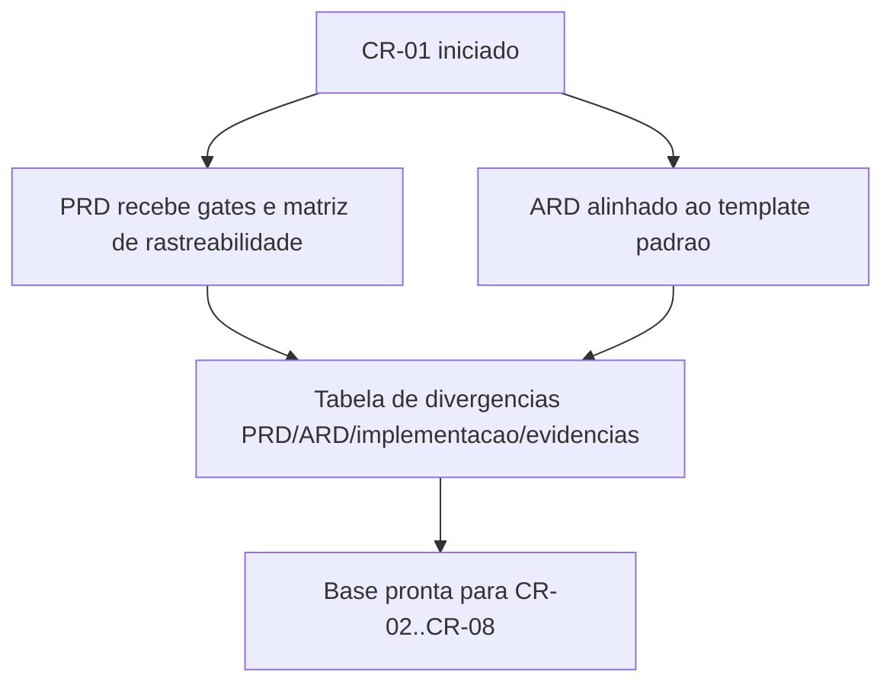

# Execucao CR-01 - Saneamento PRD/ARD e rastreabilidade

## Contexto e objetivo

Esta entrega executa o item **CR-01** do plano corretivo integrado (`review/2026-03-22-0336-plano-corretivo-p0-p1-convergencia-gates.md`), com foco em remover ambiguidade documental que bloqueia convergencia de gates.

Objetivo tecnico:
- consolidar requisitos e gates formais no PRD;
- alinhar o ARD ao template padrao sem perder detalhamento tecnico existente;
- explicitar divergencias entre PRD/ARD/implementacao/evidencias;
- estabelecer matriz de rastreabilidade cruzada.

## Escopo tecnico e arquivos modificados

- `docs/declaracao-escopo-aplicacao.md`
- `docs/system-design.md`

Mudancas aplicadas:
- PRD:
  - adicao de `10.1 Gates de aceite formal`;
  - adicao de `10.2 Dependencias formais BA/SD/QA/UX/DBA`;
  - adicao de `10.3 Rastreabilidade requisito -> evidencia esperada`;
  - adicao de `10.4 Matriz curta PRD <-> ARD`;
  - adicao da secao `13. Divergencias PRD/ARD/implementacao/evidencias`.
- ARD:
  - incorporacao de secoes equivalentes ao `templates/system-design-template.md` no topo;
  - secao obrigatoria de referencia ao Design System com status e lacunas;
  - matriz curta PRD <-> ARD;
  - tabela de divergencias com owner e status;
  - preservacao do anexo tecnico existente para evitar perda de contexto.

## ADR resumido

### Decisao

Adotar estrutura hibrida no ARD: cabecalho e secoes de governanca no formato do template padrao, mantendo o corpo tecnico original como anexo.

### Alternativas consideradas

1. Reescrever integralmente o ARD no template e remover secoes atuais.
2. Adicionar estrutura de template no topo e preservar secoes tecnicas existentes (escolhida).

### Trade-offs

- Reescrita total elevaria risco de perda de contexto historico.
- Estrutura hibrida aumenta tamanho do documento, mas preserva rastreabilidade e continuidade.

## Evidencias de validacao

Comandos executados:

```bash
git --no-pager diff -- docs/declaracao-escopo-aplicacao.md docs/system-design.md | head -n 240
```

Resultado:
- diff confirma insercao das secoes de gate, rastreabilidade e divergencias no PRD;
- diff confirma alinhamento estrutural do ARD ao template padrao, incluindo secao obrigatoria de Design System;
- nenhuma alteracao de codigo de aplicacao foi executada nesta etapa.

## Riscos, impacto e rollback

### Riscos

- documentos mais extensos podem exigir curadoria adicional nas proximas rodadas;
- risco de desatualizacao se evidencias de QA/UX/DBA nao forem anexadas em seguida.

### Impacto

- melhora previsibilidade de aceite por criterios verificaveis;
- reduz ambiguidade para execucao dos proximos CRs;
- cria base auditavel para consolidacao Tech Lead.

### Plano de rollback

1. Reverter alteracoes de `docs/declaracao-escopo-aplicacao.md` e `docs/system-design.md`.
2. Restaurar versoes anteriores dos documentos.
3. Reexecutar CR-01 com escopo reduzido e revisao orientada por diff.

## Proximos passos recomendados

1. Iniciar CR-02/CR-03 (hardening de segredos e autenticacao).
2. Preparar evidencias de QA para preencher os gates G3/G4.
3. Receber handoff DBA de capacidade para remover pendencia estrutural do ARD.
4. Consolidar referencia oficial de Design System para fechar pendencia UX no ARD.

## Diagrama (Mermaid)



