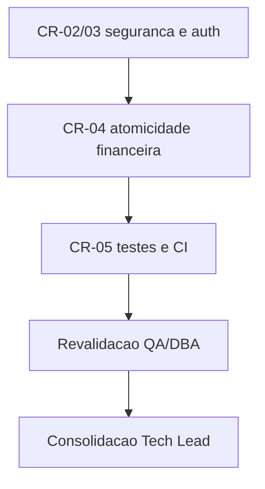

# Execucao CR-02 a CR-05 - Hardening Core (seguranca, dados e testes)

## Contexto e objetivo

Esta entrega consolida a execucao tecnica dos itens:
- CR-02 (segredos/config),
- CR-03 (autenticacao),
- CR-04 (atomicidade financeira),
- CR-05 (testes e gate de CI),

conforme `review/2026-03-22-0336-plano-corretivo-p0-p1-convergencia-gates.md`.

## Resumo executivo

- Contexto: fechamento inicial reprovado por gaps em SD/QA/DBA.
- Decisao: executar hardening minimo P0 no core.
- Impacto: risco transacional e de autenticacao reduzido com evidencias automatizadas.
- Dono: SD (implementacao), QA/DBA (revalidacao), Tech Lead (consolidacao).

## Registro consolidado das atividades por agent

| Agent | Atividade executada | Artefatos | Status |
|---|---|---|---|
| Senior Developer | Implementou hardening P0 no `dashboard.py`, testes e CI | `dashboard.py`, `tests/test_p0_hardening.py`, `.github/workflows/main.yml`, `requirements.txt` | Concluido |
| QA Expert | Revalidou suite P0 e gate de teste | Parecer QA revalidado | Aprovado com ressalvas |
| DBA | Revalidou atomicidade e concorrencia minima | Parecer DBA revalidado | Aprovado com ressalvas |
| Tech Lead | Consolidou evidencias e status de gate | Este documento + memoria/historico | Concluido |

## Matriz de rastreabilidade (CR -> evidencia)

| Item | Mudanca aplicada | Evidencia de validacao | Status |
|---|---|---|---|
| CR-02 | `DEFAULT_ADMIN_PASS` e `SESSION_SECRET` por env; `DB_PATH` via env | diff em `dashboard.py`; `py_compile` OK | Concluido |
| CR-03 | bcrypt + migracao legacy SHA-256 no login; token de sessao seguro | testes de hash/migracao e sessao em `tests/test_p0_hardening.py` | Concluido |
| CR-04 | transacao atomica em `admin_review_deposit`/`admin_review_withdrawal`; saldo de saque em secao critica com reserva de pendentes | testes de rollback/sucesso/concorrrencia (11 testes) | Concluido |
| CR-05 | job `test-python` no CI com gate P0 + suite completa | `.github/workflows/main.yml`, `pytest -q` e gate P0 com cobertura | Concluido |

## Decisoes, motivacoes e itens impactados

| Decisao | Motivacao | Itens impactados | Efeito |
|---|---|---|---|
| Usar bcrypt com migracao progressiva | reduzir risco de hash fraco sem quebrar usuarios legados | `dashboard.py` auth/create_user/init_db | hardening de autenticacao |
| Usar token de sessao via `secrets.token_urlsafe` | remover determinismo em token | `dashboard.py` create_session | sessao mais robusta |
| Tornar revisoes financeiras atomicas | evitar falha parcial status/ledger | `dashboard.py` funcoes de review financeiro | integridade transacional |
| Reservar pendencias no saque | mitigar race em concorrencia minima | `dashboard.py` create_withdrawal | evita overspend em disputa |
| Gate P0 explicito em CI | assegurar verificacao repetivel | `.github/workflows/main.yml` | qualidade bloqueante no PR |

## Evidencias de validacao

Comandos executados:

```bash
python3 -m py_compile dashboard.py CookieManager.py
PYTHONPATH=.venv/lib/python3.11/site-packages /usr/bin/python3 -m pytest -q tests/test_p0_hardening.py --cov=dashboard --cov-fail-under=20
PYTHONPATH=.venv/lib/python3.11/site-packages /usr/bin/python3 -m pytest -q
```

Resultados observados:
- `py_compile`: sucesso.
- Gate P0: `11 passed`, cobertura total de `dashboard.py`: **24.14%** (threshold configurado: 20).
- Suite completa: `11 passed`.

## Pontos validados e impacto global

- Pontos validados:
  - migracao legacy -> bcrypt no login;
  - token de sessao nao deterministico + validade/invalidade;
  - rollback atomico em deposito e saque;
  - caminho de sucesso `APPROVED + ledger`;
  - concorrencia minima de saque (duas threads, apenas uma persistencia).
- Impacto global:
  - reducao de risco tecnico imediato para fechamento;
  - gates QA/DBA passam para **aprovado com ressalvas**.

## Riscos residuais e plano de rollback

### Riscos residuais
- cobertura ainda baixa para o modulo completo (24.14%);
- concorrencia testada em escopo minimo (2 threads);
- P1 pendente para auditoria append-only e capacidade de banco.

### Plano de rollback
1. Reverter alteracoes de `dashboard.py`, `tests/test_p0_hardening.py`, `requirements.txt`, `.github/workflows/main.yml`.
2. Reexecutar `py_compile` e `pytest` para confirmar retorno ao baseline anterior.
3. Reabrir CR-02..CR-05 com escopo reduzido caso necessario.

## Diagrama (Mermaid)



